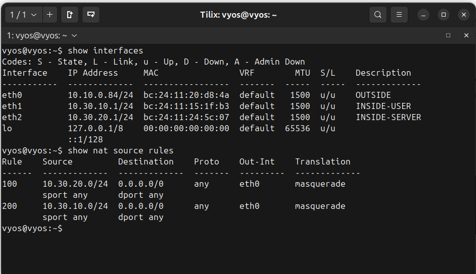

# Enterprise Windows Infrastructure — Infrastructure Overview

## Purpose

This document provides a high-level overview of the infrastructure architecture used in the **Enterprise Windows Infrastructure Lab**.

The objective of this environment is to simulate a **small enterprise IT infrastructure** with realistic systems and operational components commonly found in corporate environments.

The lab environment demonstrates practical experience with:

- enterprise Windows server infrastructure
- Active Directory identity management
- network segmentation and routing
- enterprise service deployment
- IT operations workflows
- hybrid identity integration with cloud services

This infrastructure is designed as a **portfolio project** to demonstrate practical system administration and enterprise IT support capabilities.

---

# Enterprise Scenario

The lab environment simulates the infrastructure of a **small organization with approximately 50 employees**.

The simulated company includes the following departments:

- Human Resources
- Engineering
- IT Operations

The infrastructure provides services typically required in enterprise environments:

- centralized identity management
- shared file storage
- enterprise printing services
- internal web applications
- patch management
- helpdesk operations
- centralized logging
- backup and recovery
- hybrid identity integration with Microsoft 365

---

# Infrastructure Scope

| Component | Quantity |
|----------|----------|
| Servers | 9 |
| Client Systems | 2 |
| Network Segments | 2 |
| Domain Controllers | 2 |
| Enterprise Services | 6 |
| Operations Systems | 3 |
| Hybrid Identity Integration | Microsoft 365 |

---

# Technology Stack

| Category | Technology |
|--------|--------|
| Hypervisor | Proxmox VE |
| Router / Gateway | VyOS |
| Identity Management | Active Directory Domain Services |
| File Services | SMB / NTFS |
| Print Services | Windows Print Server |
| Patch Management | Windows Server Update Services (WSUS) |
| Web Services | IIS |
| Logging | Windows Event Forwarding |
| Ticketing System | GLPI / osTicket / Zammad |
| Backup | Windows Server Backup |
| Hybrid Identity | Azure AD Connect |
| Cloud Services | Microsoft 365 / Exchange Online |

---

# Skills Demonstrated

This project demonstrates practical experience with enterprise infrastructure operations:

- Active Directory administration
- Group Policy management
- Windows Server role deployment
- enterprise file share permissions
- centralized print services
- patch management with WSUS
- centralized logging with Windows Event Forwarding
- helpdesk workflow systems
- network segmentation and routing
- infrastructure documentation and architecture design
- hybrid identity integration with Microsoft 365

---

# Virtualization Platform

All infrastructure systems are deployed as virtual machines running on a **Proxmox VE hypervisor**.

| Component | Description |
|----------|-------------|
| Hypervisor | Proxmox VE |
| Virtualization | KVM |
| Host Hardware | Dell PowerEdge R610 |

The virtualization platform provides:

- virtual machine lifecycle management
- storage management
- virtual networking
- VM snapshots
- infrastructure resource allocation

All Windows servers and client systems used in the lab are deployed as **virtual machines on the Proxmox platform**.

---

# Infrastructure Architecture Overview

The infrastructure is organized into several logical layers.

1. Virtualization Infrastructure
2. Network Infrastructure
3. Identity Infrastructure
4. Core Infrastructure Services
5. Operations Infrastructure
6. Client Systems
7. Hybrid Cloud Integration

This layered architecture reflects common design patterns used in enterprise IT environments.

---

# Architecture Diagram

The following diagram illustrates the **high-level architecture of the lab environment**.

### Diagram Placement

Insert the **main architecture diagram** here.

Recommended diagram tools:

- draw.io
- diagrams.net
- Lucidchart

```
[ DIAGRAM PLACEHOLDER ]

File:
infrastructure-architecture.png

Location:
diagrams/infrastructure-architecture.png
```

The diagram should illustrate:

- VyOS router
- user network
- server network
- domain controllers
- infrastructure services
- operations systems
- Microsoft 365 integration

---

# Network Architecture

The environment uses **segmented networks** to simulate a corporate infrastructure design.

## Network Segments

| Network | Purpose | Subnet |
|-------|--------|-------|
| User Network | End-user workstations | 10.30.10.0/24 |
| Server Network | Infrastructure servers | 10.30.20.0/24 |

Traffic between networks is routed through the **VyOS router**, which acts as the internal gateway.

---

## Network Gateway

| Component | Role |
|----------|------|
| VyOS Router | Routing, gateway, firewall |

The router is responsible for:

- routing between internal networks
- firewall rule enforcement
- traffic control between network segments
- acting as the gateway for internal infrastructure

---


Screenshot:


---

# Identity Infrastructure

Identity services are provided by **Active Directory Domain Services (AD DS)**.

## Domain Information

| Property | Value |
|--------|------|
| Domain Name | corp.lab |
| Forest Functional Level | Windows Server 20016 |
| Domain Functional Level | Windows Server 2016 |

Active Directory provides:

- centralized authentication
- directory services
- policy management
- domain-based identity control

---

## Domain Controllers

| Server | Role |
|------|------|
| DC1 | Primary Domain Controller |
| DC2 | Secondary Domain Controller |

Responsibilities include:

- authentication services
- DNS services
- directory replication
- Group Policy enforcement

The presence of two domain controllers provides **basic redundancy for authentication services**.

---

#

---

# Core Infrastructure Servers

Core infrastructure servers provide essential enterprise services.

| Server | Role |
|------|------|
| FS1 | File server |
| PS1 | Print server |
| WSUS1 | Patch management |
| APP1 | Internal web application server |

---

## File Server (FS1)

The file server provides centralized file storage for departments.

Responsibilities:

- shared file storage
- departmental folders
- NTFS permission management
- SMB network shares

Example shares:

```
\\FS1\Public
\\FS1\HR
\\FS1\Engineering
```

---

## Print Server (PS1)

The print server centralizes printer management.

Responsibilities:

- shared printer deployment
- driver management
- printer access control
- printer deployment via Group Policy

Example printers:

```
\\PS1\HR-Printer
\\PS1\Engineering-Printer
```

---

## Patch Management Server (WSUS1)

WSUS provides centralized Windows update management.

Responsibilities:

- approve updates
- distribute patches to domain systems
- monitor update compliance

This allows **controlled patch deployment**, which is common in enterprise environments.

---

## Application Server (APP1)

APP1 hosts internal company web services.

Responsibilities:

- IIS web server
- internal intranet portal
- internal documentation systems
- DNS-based internal service access

---

### Screenshot Placement

Insert screenshots of **Windows Server role configuration**.

```
[ SCREENSHOT PLACEHOLDER ]

Screenshot:
server-manager-roles.png

Location:
screenshots/services/server-roles.png
```

---

# Operations Infrastructure

Operational systems simulate enterprise IT support infrastructure.

| Server | Role |
|------|------|
| HELPDESK1 | Helpdesk ticketing system |
| LOG1 | Centralized logging |
| BACKUP1 | Backup infrastructure |

---

## Helpdesk Platform (HELPDESK1)

The helpdesk platform simulates internal IT support workflows.

Functions include:

- incident tracking
- ticket management
- issue documentation
- support workflow management

Possible platforms:

- GLPI
- osTicket
- Zammad

---

## Logging Infrastructure (LOG1)

The logging server collects infrastructure event logs.

Responsibilities:

- centralized event collection
- Windows Event Forwarding
- log investigation
- incident analysis

---

## Backup Infrastructure (BACKUP1)

Backup services ensure infrastructure recoverability.

Responsibilities:

- backup of critical servers
- configuration backup
- disaster recovery preparation
- data protection

---

### Screenshot Placement

Insert screenshot showing **helpdesk or logging system interface**.

```
[ SCREENSHOT PLACEHOLDER ]

Screenshot:
helpdesk-dashboard.png

Location:
screenshots/operations/helpdesk-dashboard.png
```

---

# Client Systems

The environment includes enterprise endpoint systems.

| Client | OS |
|------|------|
| WIN10-01 | Windows 10 |
| WIN11-01 | Windows 11 |

These systems:

- join the Active Directory domain
- receive Group Policy
- access shared resources
- use enterprise printers
- receive WSUS updates

---

### Screenshot Placement

Insert screenshot of **successful domain join**.

```
[ SCREENSHOT PLACEHOLDER ]

Screenshot:
domain-join-success.png

Location:
screenshots/clients/domain-join.png
```

---

# Hybrid Identity Integration

The environment integrates **on-premises Active Directory with Microsoft 365**.

## Components

| Service | Purpose |
|------|------|
| Azure AD Connect | Synchronizes AD identities to Azure AD |
| Microsoft 365 | Cloud productivity platform |
| Exchange Online | Enterprise email services |

This architecture reflects **modern hybrid enterprise identity environments**, where organizations operate with both on-premises infrastructure and cloud services.

---

### Diagram Placement

Insert **Hybrid Identity Architecture Diagram**.

```
[ DIAGRAM PLACEHOLDER ]

File:
hybrid-identity.png

Location:
diagrams/hybrid-identity.png
```

---

# Security Architecture

The infrastructure includes several security controls commonly used in enterprise environments.

Implemented controls include:

- network segmentation
- Active Directory authentication
- NTFS access control
- Group Policy security enforcement
- centralized logging
- firewall enforcement on the VyOS router

These mechanisms simulate real-world enterprise security practices.

---

# Summary

The **Enterprise Windows Infrastructure Lab** simulates a realistic enterprise IT environment composed of:

- segmented network architecture
- Active Directory identity services
- enterprise file and print infrastructure
- centralized patch management
- operational IT support systems
- centralized logging and backup services
- hybrid identity integration with Microsoft 365

This infrastructure demonstrates practical system administration capabilities across **Windows infrastructure, networking, identity management, and IT operations**.

---

# Related Documentation

Detailed documentation for individual infrastructure components is provided in the following sections.

| Document | Description |
|--------|-------------|
| architecture/server-inventory.md | Infrastructure server inventory |
| network/network-architecture.md | Network design and routing |
| identity/active-directory-overview.md | Active Directory architecture |
| services/file-server.md | File server configuration |
| services/print-server.md | Print infrastructure |
| services/wsus.md | Patch management |
| operations/helpdesk.md | Helpdesk platform |
| operations/logging.md | Centralized logging |
| operations/backup.md | Backup infrastructure |
