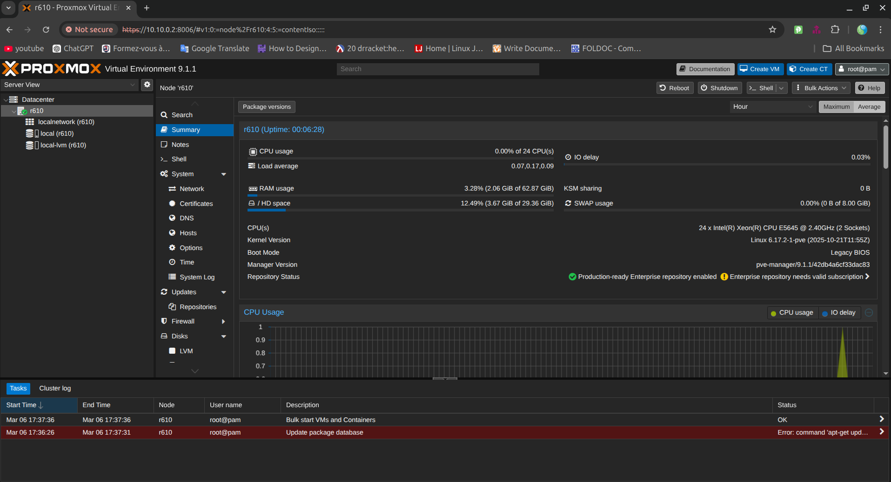
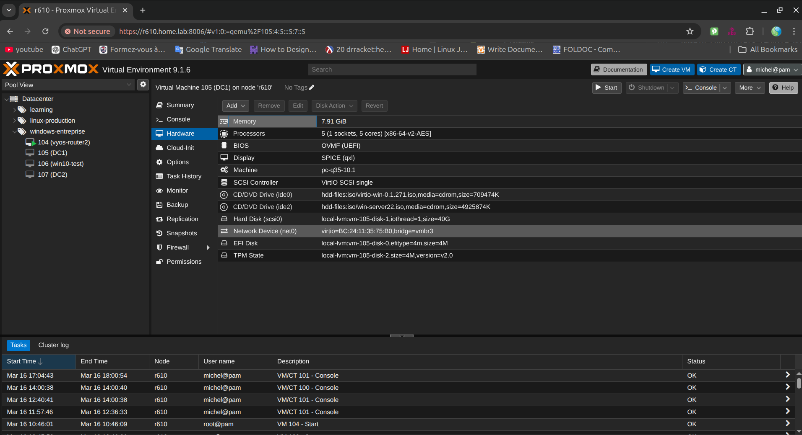
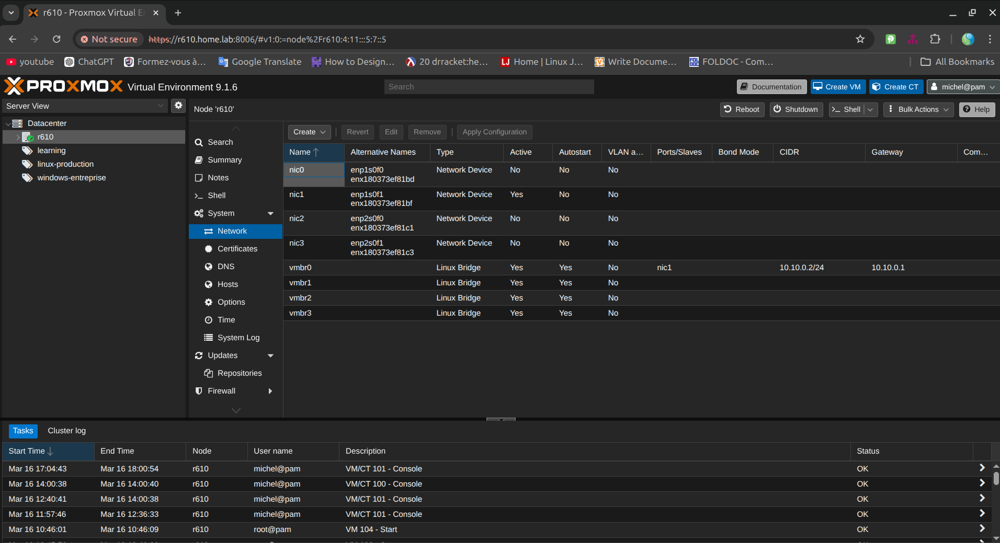
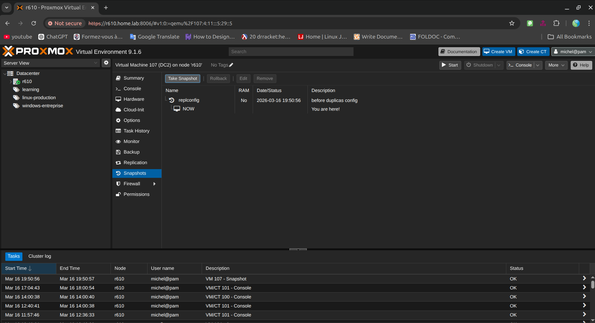

# Virtualization Platform

## Overview

This document describes the virtualization platform used to host the **Enterprise Windows Infrastructure** lab environment.

The purpose of this document is to explain how the virtual infrastructure is built, how virtual machines are hosted, how networking is presented to guests, and how the platform supports the overall enterprise lab design.


---

# Objective

The virtualization platform provides the foundation for all systems deployed in the lab, including:

- network infrastructure appliances
- Windows domain controllers
- infrastructure application servers
- support and operations servers
- Windows client workstations

The platform supports:

- reliable VM hosting
- enterprise network simulation
- flexible network segmentation
- repeatable server deployment
- snapshot-based testing
- realistic enterprise administration workflows

---

# Hypervisor Platform

The virtualization platform used in this lab is based on a **Type-1 hypervisor**.

Hypervisor implementation:

- Platform: **Proxmox Virtual Environment**
- Virtualization technology: **KVM**
- Management interface: **Web-based Proxmox dashboard**

The hypervisor is responsible for:

- creating and running virtual machines
- allocating CPU, memory, disk, and network resources
- attaching VMs to virtual network bridges
- providing console access for installation and recovery
- supporting snapshots and rollback operations
- centralizing administration of the infrastructure lab



---

# Physical Host Specifications

The virtualization environment runs on a dedicated homelab server.

| Component | Specification |
|-----------|--------------|
| Host Model | Dell PowerEdge R610 |
| CPU | Dual Intel Xeon E5645 |
| Memory | 64 GB RAM |
| Storage | SSD + HDD hybrid storage |
| Hypervisor | Proxmox VE |
| Virtualization Type | KVM |

This configuration allows the environment to host multiple enterprise infrastructure systems on a single platform while remaining realistic for homelab deployment.

---

# Platform Role in the Lab

The virtualization platform is the **base layer of the entire environment**.

All systems in the enterprise lab run as virtual machines hosted on the hypervisor.

This allows the environment to simulate an enterprise network without requiring large amounts of physical hardware.

The virtualization layer enables:

- hosting multiple servers on a single host
- separating infrastructure roles into independent systems
- safely testing configuration changes
- rebuilding systems quickly
- documenting infrastructure deployment standards

---

# Virtual Machine Hosting Model

The environment uses a **multi-VM hosting model**.

Each major infrastructure role is deployed as a separate virtual machine.

Benefits include:

- better fault isolation
- realistic enterprise architecture
- simplified troubleshooting
- clearer service boundaries
- safer testing of configuration changes

---

# Virtual Machine Inventory

The virtualization platform hosts the following systems.

| VM Name | Role | Operating System |
|-------|------|----------------|
| vyos1 | Router / Firewall | VyOS |
| dc1 | Domain Controller | Windows Server 2022 |
| dc2 | Domain Controller | Windows Server 2022 |
| fs1 | File Server | Windows Server 2022 |
| ps1 | Print Server | Windows Server 2022 |
| wsus1 | Patch Management | Windows Server 2022 |
| app1 | IIS Application Server | Windows Server 2022 |
| helpdesk1 | Helpdesk System | Windows Server 2022 |
| log1 | Centralized Logging | Windows Server 2022 |
| backup1 | Backup Server | Windows Server 2022 |
| win10-01 | Domain Client | Windows 10 |
| win11-01 | Domain Client | Windows 11 |

---

## Screenshot — Virtual Machine List

Place a screenshot showing the list of virtual machines in the hypervisor.

Capture:

- VM names
- VM status (running/stopped)
- resource summary

```
screenshots/virtualization/vm-list.png
```

---

# VM Deployment Standard

All virtual machines follow a standardized deployment model.

Each VM includes:

- defined hostname
- assigned role
- operating system documentation
- network placement
- documented CPU allocation
- documented RAM allocation
- documented storage allocation
- consistent naming convention

Example naming convention:

- vyos1
- dc1
- dc2
- fs1
- ps1
- wsus1
- app1
- helpdesk1
- log1
- backup1
- win10-01
- win11-01

The VM name inside the hypervisor must match the hostname inside the operating system.




---

# Resource Allocation Strategy

Resources are assigned according to the role of each system.

### Identity Servers

Domain controllers require moderate CPU and memory resources.

### Storage Servers

File servers, WSUS servers, and backup servers require larger disk allocations.

### Client Systems

Windows client systems must have sufficient resources to simulate realistic workstation usage, including:

- Group Policy application
- domain logins
- software installation
- printer testing
- file share access

All resource allocations are documented in the server inventory.

---

# Storage Strategy

Storage planning varies depending on the role of each server.

### Domain Controllers

Storage required for:

- operating system
- Active Directory database
- SYSVOL
- log files

### File Server

Storage required for:

- departmental shares
- permission testing
- file storage simulations

### WSUS Server

Storage required for:

- update metadata
- downloaded update packages
- synchronization data

### Backup Server

Storage required for:

- VM backups
- system images
- restore testing


---

# Networking Integration

The virtualization platform provides the networking layer used by the enterprise lab.

Virtual NICs connect VMs to internal lab networks.

Networking capabilities include:

- VM network segmentation
- internal DNS communication
- domain controller connectivity
- router-based network routing
- NAT connectivity for internet access

Routing and firewall control are performed by the **VyOS router VM**, not by the hypervisor itself.

---

# Virtual Network Bridge Design

The hypervisor exposes virtual network bridges that connect VMs to the lab networks.

These bridges allow:

- communication between servers
- communication between client systems
- routing through the VyOS router
- separation of management and infrastructure networks

Detailed network configuration is documented in:

- `environment/hypervisor-networking.md`
- `architecture/network-architecture.md`
- `network/ip-address-plan.md`



---

# Snapshots and Change Control

Snapshots are used for testing and rollback operations.

Snapshots should be taken before:

- Active Directory promotion
- DNS configuration changes
- WSUS deployment
- Group Policy experiments
- helpdesk system installation
- security configuration testing

Snapshots are not a replacement for backups.

Care must be taken when snapshotting domain controllers due to replication state considerations.


---

# Backup and Recovery Considerations

Recovery planning includes:

- VM snapshots for short-term rollback
- guest-level backups for service recovery
- configuration documentation
- restore testing for critical systems

Critical systems include:

- domain controllers
- file server
- WSUS server
- helpdesk server
- backup infrastructure

Backup procedures are documented in the backup section of the repository.

---

# Platform Constraints

As a homelab environment, the platform operates with practical limitations:

- limited RAM compared to enterprise clusters
- single-host virtualization
- finite storage capacity
- performance trade-offs when many VMs run simultaneously

Despite these constraints, the platform realistically demonstrates enterprise infrastructure design and administration practices.

---

# Validation Checklist

The virtualization platform is considered ready when:

- hypervisor installation is complete
- virtual networking is configured
- installation ISO images are available
- VyOS router VM is deployed
- Windows Server VMs can be installed
- client machines can join the domain
- VM resource allocations are documented
- snapshot procedures are defined

---

# Related Documentation

This document should be read together with:

- `environment/hypervisor-networking.md`
- `environment/vm-deployment-standard.md`
- `architecture/infrastructure-overview.md`
- `architecture/network-architecture.md`
- `architecture/server-inventory.md`
- `network/ip-address-plan.md`

---

# Summary

The virtualization platform forms the foundational layer of the **Enterprise Windows Infrastructure** lab.

It provides the compute, storage, and networking capabilities required to deploy and operate the enterprise systems within the environment.

Through the use of virtualization, the lab simulates real-world enterprise infrastructure operations including:

- VM provisioning
- network segmentation
- identity infrastructure deployment
- system administration workflows
- infrastructure troubleshooting
- professional documentation practices

This platform enables the lab to function as a realistic infrastructure engineering environment suitable for portfolio demonstration and technical skill development.
