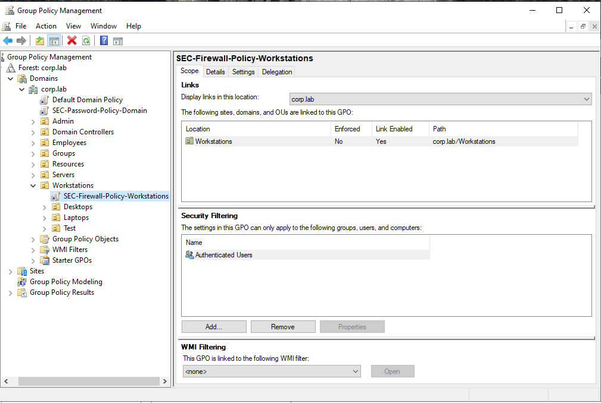
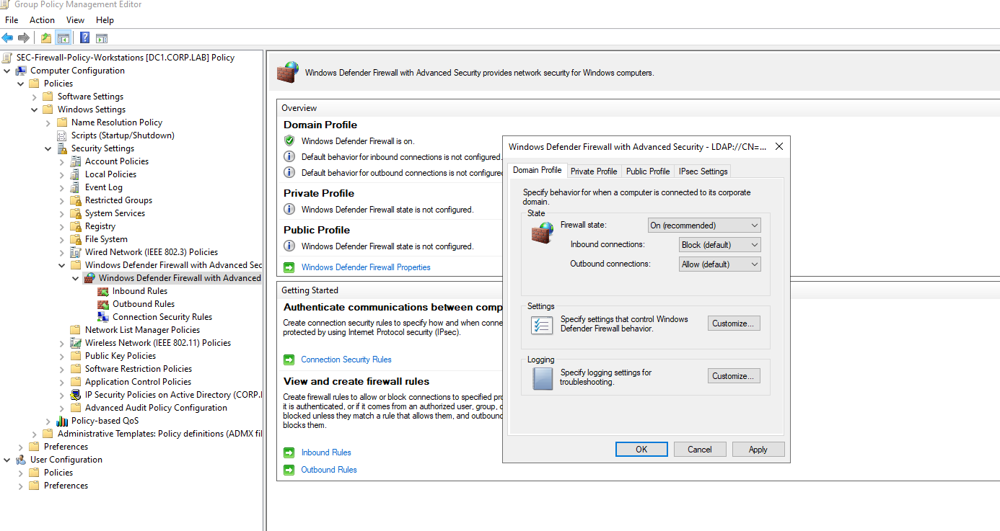
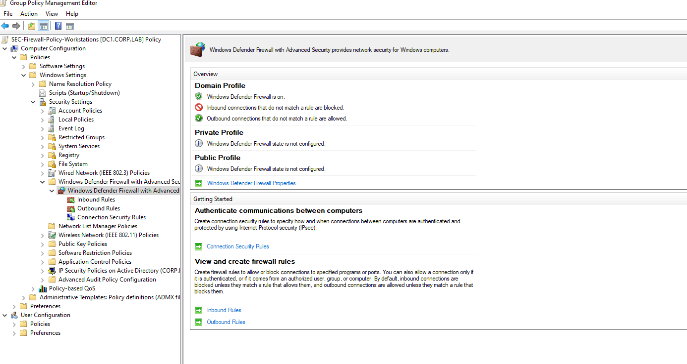
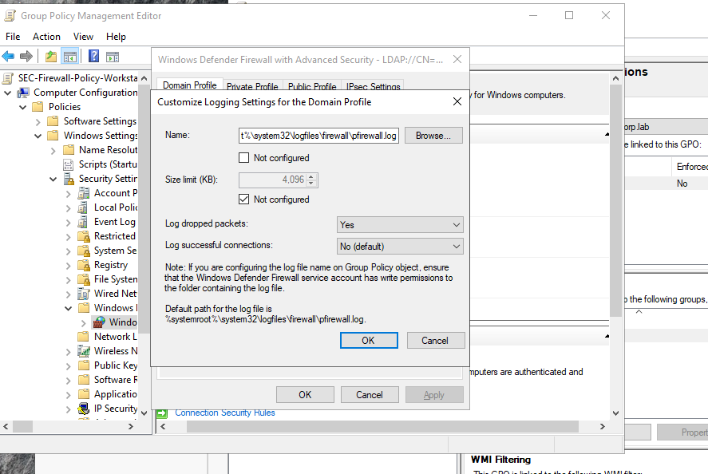
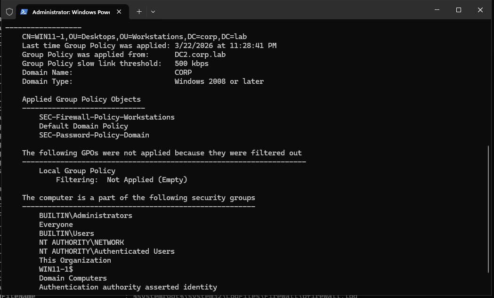
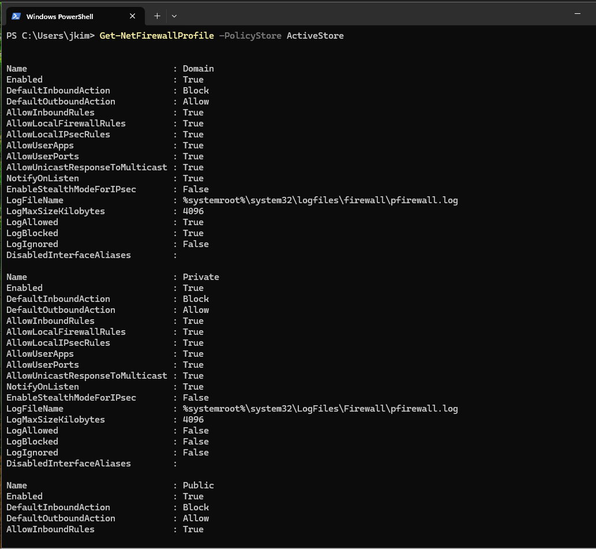
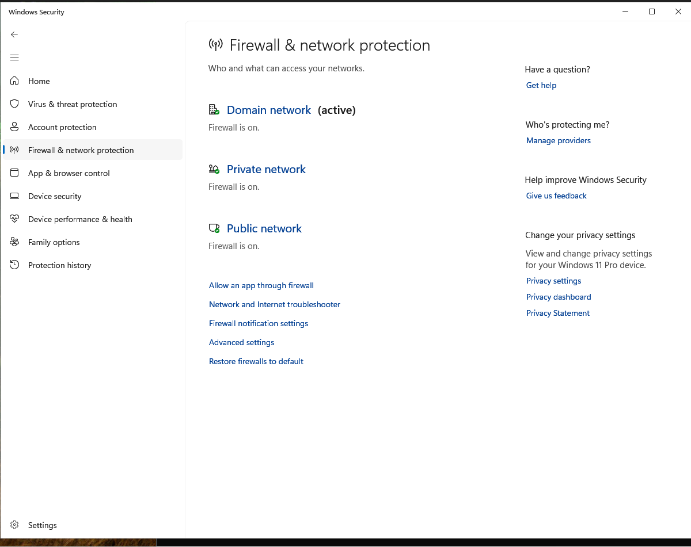

# GPO — Workstation Firewall Policy

## Overview

This document describes the deployment, configuration, and validation of the **Workstation Firewall Group Policy Object (GPO)** in the **corp.lab** domain.

The purpose of this policy is to enforce a **secure network baseline** on all domain-joined workstations by controlling inbound and outbound traffic using **Windows Defender Firewall with Advanced Security**.

This GPO is part of the **endpoint security baseline** and helps reduce the attack surface across the enterprise environment.

---

## Scope

| Parameter          | Value                              |
|------------------|------------------------------------|
| GPO Name         | SEC-Firewall-Policy-Workstations    |
| Domain           | corp.lab                           |
| Linked To        | Workstations OU                    |
| Configuration    | Computer Configuration             |
| Applies To       | Domain-joined workstations         |
| Security Filter  | Authenticated Users                |

---

## Architecture Context

The GPO is linked to the **Workstations OU**, ensuring that all endpoint devices receive consistent firewall configuration.

corp.lab
│
├── Workstations
│ ├── SEC-Firewall-Policy-Workstations 
│ ├── Desktops
│ └── Laptops
│
├── Servers
├── Employees


---

## Configuration

### Path

Computer Configuration
→ Policies
→ Windows Settings
→ Security Settings
→ Windows Defender Firewall with Advanced Security


---

## Firewall Profiles Configuration

### Domain Profile

| Setting                  | Value |
|--------------------------|------|
| Firewall state           | On |
| Inbound connections      | Block (default) |
| Outbound connections     | Allow (default) |



---

### Private Profile

| Setting                  | Value |
|--------------------------|------|
| Firewall state           | On |
| Inbound connections      | Block (default) |
| Outbound connections     | Allow (default) |

---

### Public Profile

| Setting                  | Value |
|--------------------------|------|
| Firewall state           | On |
| Inbound connections      | Block (default) |
| Outbound connections     | Allow (default) |



---

## Logging Configuration

Firewall logging is enabled to support troubleshooting and monitoring.

| Setting                    | Value |
|----------------------------|------|
| Log file path              | %systemroot%\system32\logfiles\firewall\pfirewall.log |
| Log dropped packets        | Yes |
| Log successful connections | No |
| Log size limit             | 4096 KB |



---

## Design Decisions

The firewall policy follows a **default deny inbound / allow outbound model**, which is widely used in enterprise environments.

Key decisions:

- Inbound traffic is blocked by default to prevent unauthorized access to endpoints
- Outbound traffic is allowed to avoid disrupting normal user operations
- Logging of dropped packets is enabled to support incident investigation
- Successful connections are not logged to reduce log noise

This approach balances **security and usability** while maintaining operational visibility.

---

## Firewall Rule Strategy

This policy defines a **baseline firewall posture**.

Application-specific or service-specific rules are managed through:

- additional GPOs (e.g., RDP access, monitoring agents)
- or controlled firewall rules where required

This ensures:

- centralized management
- minimal attack surface
- controlled and auditable exceptions

---


## Validation

### Step 1 — Force Group Policy Update

```powershell
gpupdate /force
```
Step 2 — Verify Applied GPO

```powershell
gpresult /r
```

Result

The GPO **SEC-Firewall-Policy-Workstations** is successfully applied to target machines.


---

## Step 3 — Verify Firewall Configuration

Get-NetFirewallProfile -PolicyStore ActiveStore

### Expected Values

| Setting              | Expected Value |
|----------------------|--------------|
| Enabled              | True         |
| DefaultInboundAction | Block        |
| DefaultOutboundAction| Allow        |




---

## Step 4 — GUI Verification

Navigate to:

Windows Security  
→ Firewall & Network Protection  

### Verify

- Domain network → Firewall **ON**  
- Private network → Firewall **ON**  
- Public network → Firewall **ON**  



---

## Operational Notes

### Troubleshooting Connectivity Issues

#### 1. Check Firewall Logs

C:\Windows\System32\LogFiles\Firewall\pfirewall.log

#### 2. Verify Active Firewall Rules

Get-NetFirewallRule

#### 3. Test Connectivity

Test-NetConnection <target>

#### 4. Analysis

- Identify blocked ports  
- Validate traffic direction (inbound/outbound)  
- Implement controlled allow rules if required  

---

## Impact and Risks

### Impact

- Increased endpoint security across all workstations  
- Reduced exposure to unauthorized inbound connections  
- Improved visibility into dropped traffic  

### Risks

- Legitimate applications may be blocked  
- Network troubleshooting may be required for certain services  

### Mitigation

- Implement controlled firewall exceptions via dedicated GPOs  
- Monitor firewall logs for legitimate blocked traffic  
- Document and validate all rule changes  

---

## Result

The firewall policy is successfully applied to all workstations.

- All firewall profiles are **enabled**  
- Inbound traffic is **blocked by default**  
- Outbound traffic is **allowed**  
- Logging is active for dropped packets  