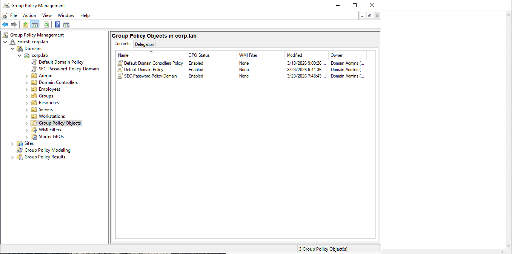
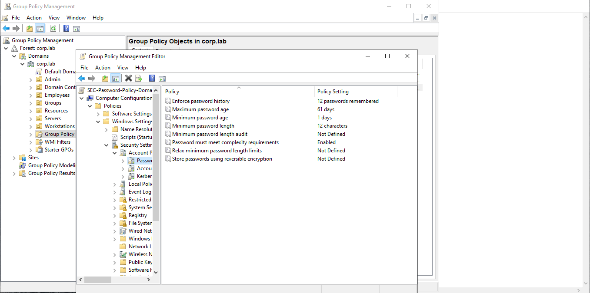
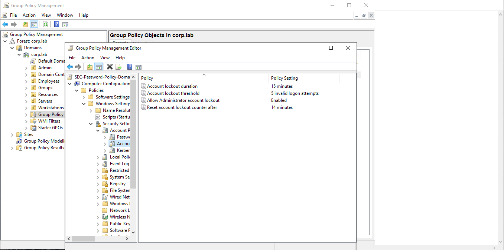
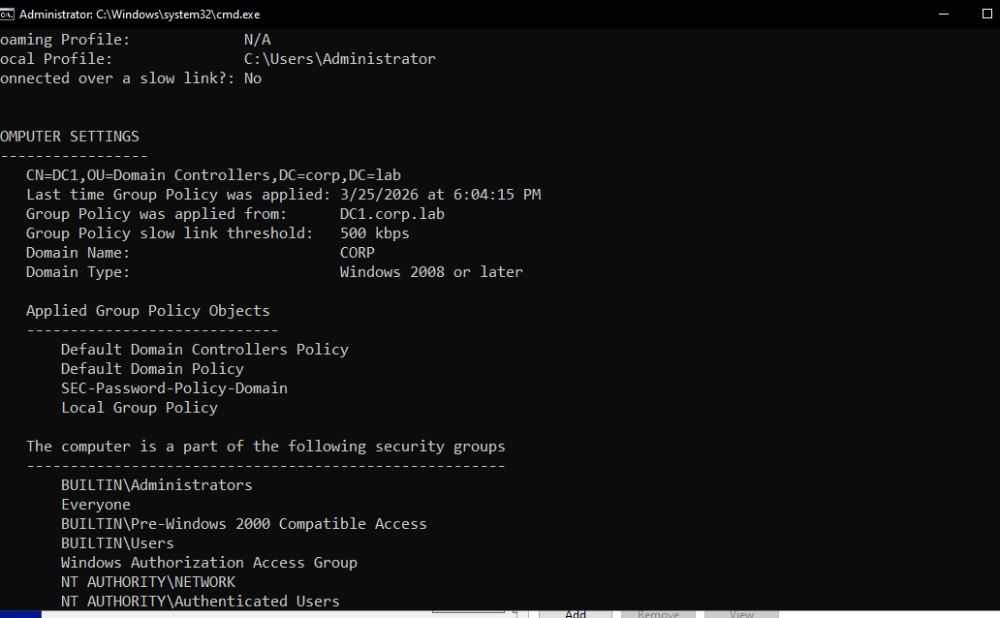
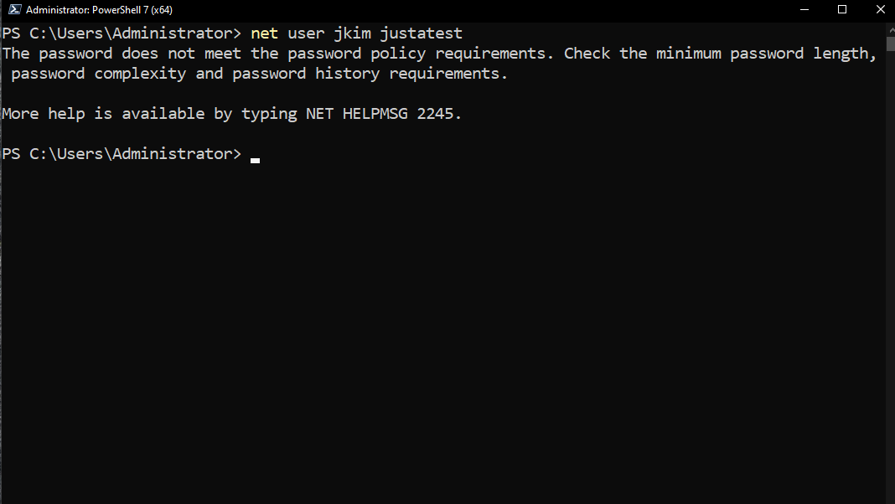
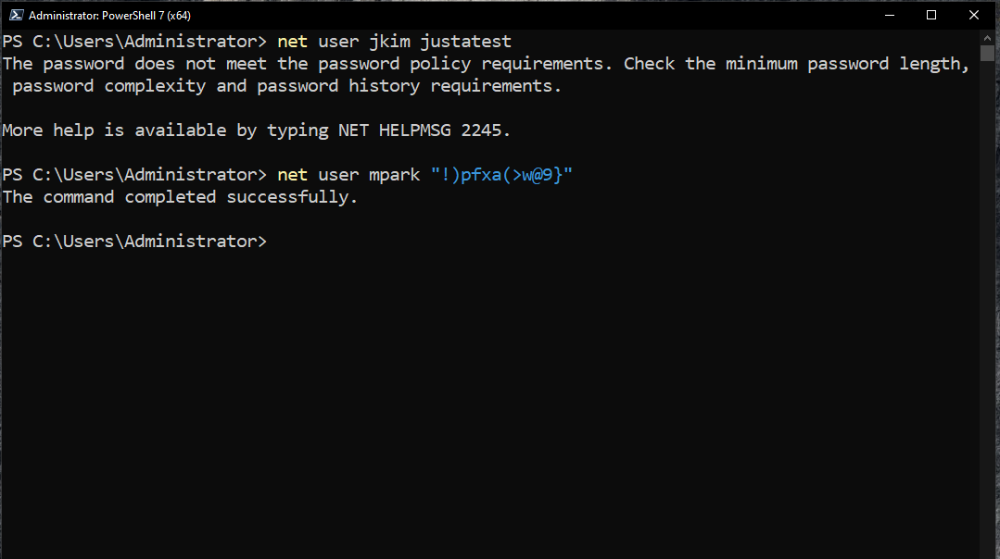

# GPO — Password Policy

## Overview

This document describes the deployment, configuration, and validation of the **Password Policy Group Policy Object (GPO)** in the **corp.lab** domain.

The purpose of this policy is to enforce **secure authentication standards** across all domain users and protect against weak passwords and brute-force attacks.

This GPO establishes the **baseline security posture** for identity management within the enterprise environment.

---

## Scope

| Parameter          | Value                                                                 |
| ------------------ | --------------------------------------------------------------------- |
| GPO Name           | SEC-Password-Policy-Domain                                            |
| Domain             | corp.lab                                                              |
| Linked To          | Domain Root (corp.lab)                                                |
| Configuration Type | Computer Configuration (Domain-level policy)                          |
| Applies To         | All domain user accounts (enforced by Domain Controllers)             |

---

## Architecture Context

The GPO is applied at the **domain level**, ensuring that all user accounts within the domain are subject to consistent password and account lockout policies.

corp.lab
│
├── SEC-Password-Policy-Domain (linked here)
│
├── Employees
├── Servers
├── Workstations

This policy is processed by **Domain Controllers** and applies to all domain users regardless of OU structure.

---

## Configuration

### Path

Computer Configuration
→ Policies
→ Windows Settings
→ Security Settings
→ Account Policies

---

### Password Policy Settings

| Setting                                     | Value                   |
| ------------------------------------------- | ----------------------- |
| Enforce password history                    | 12 passwords remembered |
| Maximum password age                        | 61 days                 |
| Minimum password age                        | 1 day                   |
| Minimum password length                     | 12 characters           |
| Password complexity                         | Enabled                 |
| Store passwords using reversible encryption | Disabled                |

---

### Account Lockout Policy Settings

| Setting                             | Value                    |
| ----------------------------------- | ------------------------ |
| Account lockout threshold           | 5 invalid logon attempts |
| Account lockout duration            | 15 minutes               |
| Reset account lockout counter after | 14 minutes               |
| Allow Administrator account lockout | Enabled                  |

---

## Design Rationale

The selected configuration values balance **security requirements** with **operational usability**:

- A minimum password length of 12 characters significantly increases resistance to brute-force and dictionary attacks
- Password history prevents reuse of previously compromised credentials
- Maximum password age enforces periodic credential rotation
- Account lockout threshold limits repeated authentication attempts while avoiding excessive user disruption
- Lockout duration ensures temporary protection without requiring administrative intervention

---

## Deployment Steps

1. Open **Group Policy Management Console (GPMC)**

2. Navigate to:

Forest → Domains → corp.lab → Group Policy Objects

3. Create a new GPO:

Name: SEC-Password-Policy-Domain

4. Edit the GPO and configure:

- Password Policy
- Account Lockout Policy

5. Link the GPO to:

corp.lab (domain root)

6. Ensure no conflicting password policies exist at the domain level

---

## Validation

### Apply Policy

gpupdate /force

---

### Test Case 1 — Weak Password Rejection

Command:

net user jkim justatest

Result:

- Password rejected
- Error indicating password policy violation

---

### Test Case 2 — Strong Password Acceptance

Command:

net user mpark "!)pFxa(>w@9}"

Expected Result:

- Command completed successfully

---

### Test Case 3 — Account Lockout Behavior

Action:

- Attempt multiple failed logins

Result:

- Account locked after 5 attempts
- Login blocked temporarily

---

## Results

- Password complexity successfully enforced
- Weak passwords rejected
- Strong passwords accepted
- Account lockout policy functioning correctly

The GPO is successfully applied across the domain and validated through multiple test scenarios.

---

## Operational Impact

- Users are required to maintain strong passwords and update them periodically
- Increased likelihood of password reset requests handled by IT support
- Temporary account lockouts may occur due to incorrect password attempts
- Improved overall domain security posture

---

## Troubleshooting Notes

### Issue: Policy Not Applied

**Symptoms:**

- Weak passwords are still accepted

**Checks:**

gpresult /r

**Resolution:**

- Ensure GPO is linked to the domain root
- Run `gpupdate /force`
- Verify Active Directory replication if multiple Domain Controllers exist

---

### Issue: Account Not Locking

**Checks:**

- Confirm account lockout threshold is configured
- Verify no conflicting domain-level policy exists

---

## Security Considerations

- Strong password policy reduces the risk of unauthorized access
- Account lockout protects against brute-force attacks
- Password history prevents credential reuse
- Disabling reversible encryption ensures passwords are not stored in a recoverable format

---

## Notes

- Password policies in Active Directory are **domain-level policies**
- Only one effective password policy applies per domain (unless Fine-Grained Password Policies are used)
- This GPO establishes the **baseline identity security configuration**
- In production environments, Fine-Grained Password Policies may be used for role-based security
