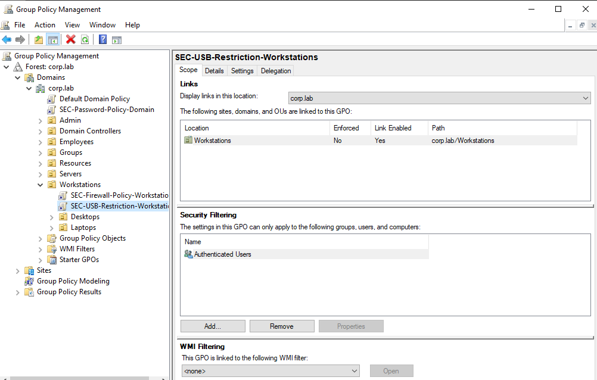
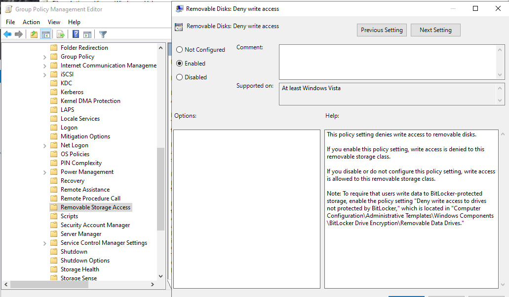
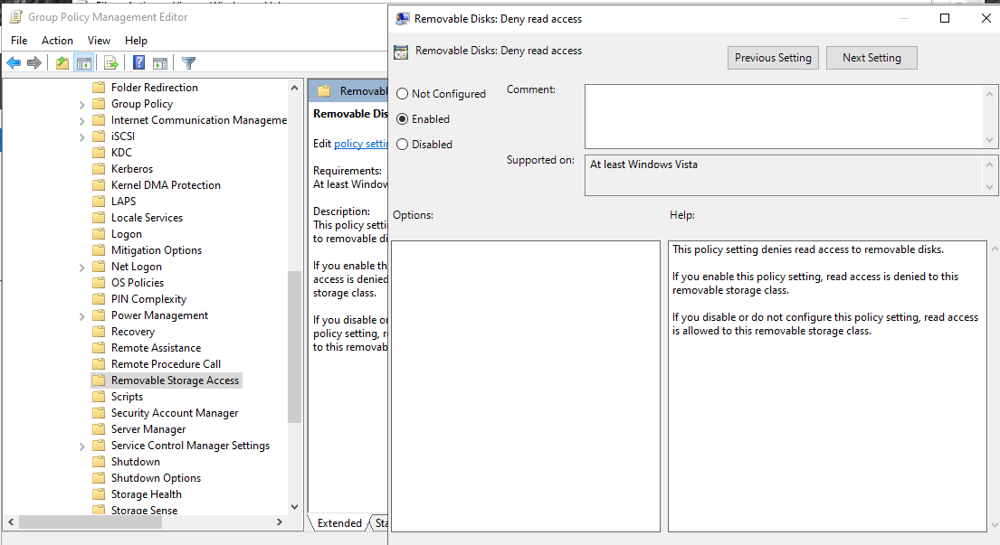
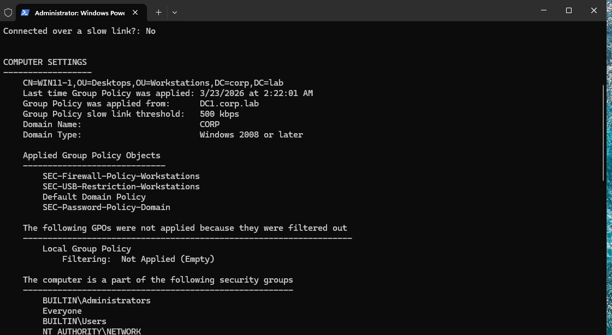
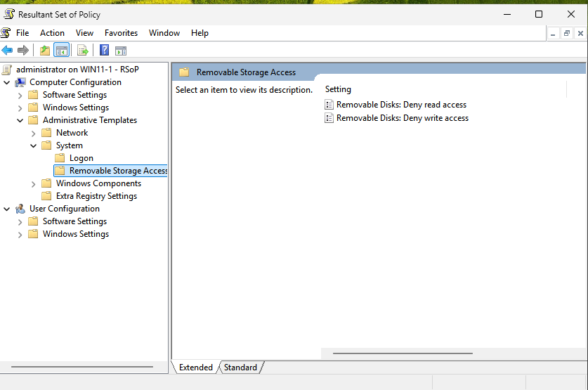
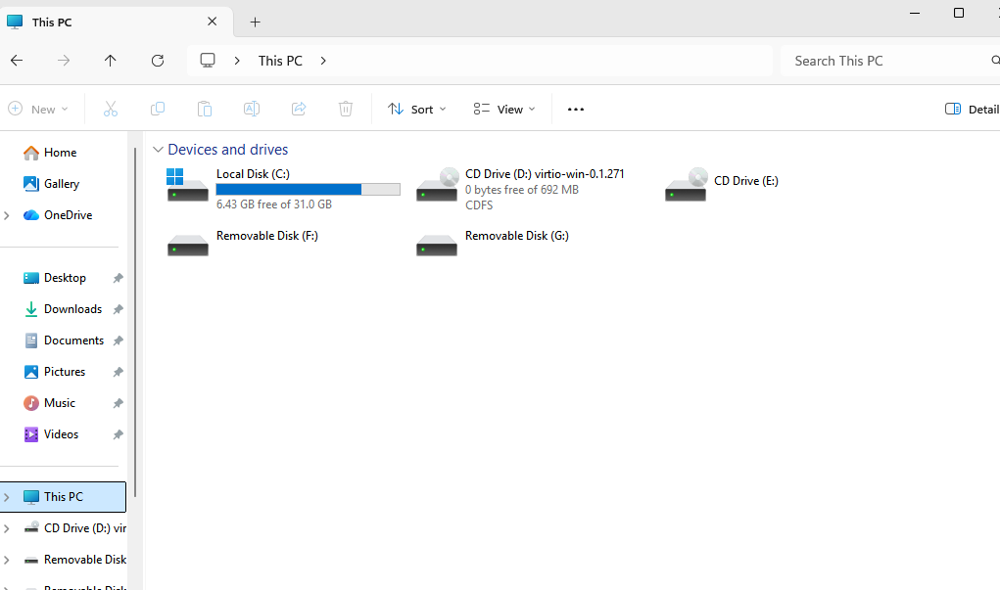
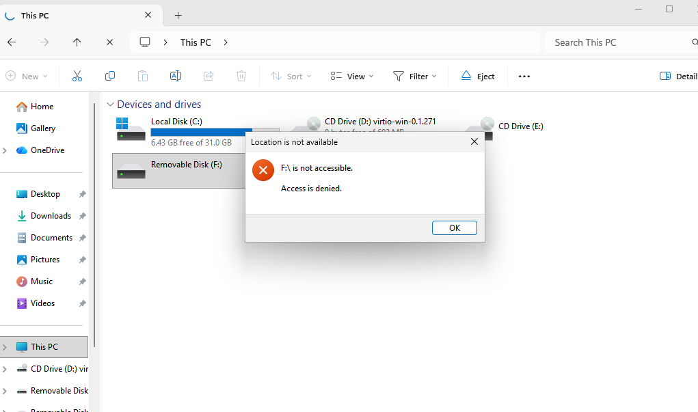

# GPO — USB Storage Restriction Policy

## Overview

This document describes the deployment, configuration, and validation of the **USB Storage Restriction Group Policy Object (GPO)** in the **corp.lab** domain.

The purpose of this policy is to prevent unauthorized data transfer via removable storage devices and reduce the risk of data exfiltration, malware introduction, and policy violations.

This GPO enforces a data protection baseline across all domain-joined workstations.

---

## Scope

| Parameter          | Value                                  |
|------------------|----------------------------------------|
| GPO Name         | SEC-USB-Restriction-Workstations        |
| Domain           | corp.lab                               |
| Linked To        | Workstations OU                        |
| Configuration    | Computer Configuration                 |
| Applies To       | Domain-joined workstations             |
| Security Filter  | Authenticated Users                    |

---

## Architecture Context

The GPO is linked to the Workstations OU, ensuring that all endpoint devices are protected against removable storage usage.

```
corp.lab
│
├── Workstations
│   ├── SEC-USB-Restriction-Workstations (linked here)
│   ├── Desktops
│   └── Laptops
│
├── Servers
├── Employees
```

---

## Configuration

### Path

```
Computer Configuration
 → Policies
 → Administrative Templates
 → System
 → Removable Storage Access
```

---

## Policy Settings

| Setting                                      | Value   |
|---------------------------------------------|--------|
| Removable Disks: Deny read access           | Enabled |
| Removable Disks: Deny write access          | Enabled |





---

## Behavior

When this policy is applied:

- USB storage devices are still detected by the system  
- Users cannot read files from removable disks  
- Users cannot write files to removable disks  
- Access attempts result in **"Access is denied"**

---

## Validation

### Step 1 — Force Group Policy Update

```powershell
gpupdate /force
```

---

### Step 2 — Verify Applied GPO

```powershell
gpresult /r
```

**Result:**

- `SEC-USB-Restriction-Workstations` appears in the applied GPO list



---

### Step 3 — RSOP Verification

```powershell
rsop.msc
```

Navigate to:

```
Computer Configuration
 → Administrative Templates
 → System
 → Removable Storage Access
```

**Expected:**

- Deny read access → Enabled  
- Deny write access → Enabled  




---

### Step 4 — Functional Test

#### Device Detection

- USB device appears in File Explorer  



---

#### Access Test

- Attempt to open the USB drive  

**Result:**

- Error message: **Access is denied**



---

## Validation Summary

| Test                  | Result  |
|-----------------------|--------|
| GPO Applied           | Success |
| RSOP Verification     | Success |
| USB Detection         | Success |
| Read Access           | Denied  |
| Write Access          | Denied  |

---

## Operational Impact

| Area        | Impact |
|------------|--------|
| End Users  | Cannot use USB drives for file transfer |
| IT Support | May require controlled exceptions |
| Security   | Strong protection against data exfiltration |
| Compliance | Aligns with enterprise security policies |

---

## Exception Management

In enterprise environments, exceptions are required for specific roles such as IT administrators.

Recommended approach:

- Create a security group: `SEC-USB-Exception`  
- Create a separate GPO allowing USB access  
- Apply the allow GPO only to the exception group  
- Exclude the group from the restriction GPO (security filtering)  

This ensures controlled and auditable USB usage.

---

## Monitoring and Auditing

USB access attempts can be monitored using:

- Windows Event Viewer  
- Security auditing (Object Access)  

Relevant Event ID:

- **4663 — Object access attempt**

---

## Limitations

This policy applies only to removable disk storage devices.

It does not block:

- MTP devices (e.g., smartphones)  
- USB HID devices (keyboard, mouse)  
- USB network adapters  

Additional controls may be required for full device restriction.

---

## Troubleshooting

### Issue: USB still accessible

**Possible Causes:**

- GPO not applied  
- Computer not in Workstations OU  
- Group Policy not refreshed  

**Verification:**

```powershell
gpresult /r
```

---

### Issue: Policy visible but not enforced

**Possible Causes:**

- Conflicting GPO  
- Local policy override  

**Verification:**

```powershell
rsop.msc
```

---

## Security Considerations

- Prevents data leakage via removable media  
- Reduces risk of malware introduction  
- Enforces corporate data protection policies  

---

## Conclusion

The USB Storage Restriction GPO is successfully deployed and enforced across all domain-joined workstations.

Validation confirms:

- Correct GPO application  
- Enforcement of read/write restrictions  
- Effective endpoint-level data protection  

This policy strengthens the overall security posture of the **corp.lab** enterprise environment.