# GPO — Drive Mapping Policy (USR-DrivesMap-Employees)

## Overview

This document describes the deployment, configuration, and validation of the **Drive Mapping Group Policy Object (GPO)** in the **corp.lab** domain.

The purpose of this policy is to automatically map network drives for users based on organizational needs, ensuring consistent and secure access to shared resources across the enterprise environment.

This GPO enforces a standardized access model, improves user productivity, and aligns with enterprise file service design practices.

---

## Scope

| Parameter          | Value                              |
|------------------|------------------------------------|
| GPO Name         | USR-DrivesMap-Employees            |
| Domain           | corp.lab                           |
| Linked To        | Employees OU                       |
| Configuration    | User Configuration                 |
| Applies To       | Domain users (Employees OU)        |
| Security Filter  | Authenticated Users                |

---

## Architecture Context

The GPO is linked to the **Employees OU**, ensuring that all users in HR, Engineering, and IT automatically receive mapped drives at logon.

```
corp.lab
│
├── Employees
│   ├── USR-DrivesMap-Employees (linked here)
│   ├── HR
│   ├── Engineering
│   ├── IT
│   └── Service Accounts
```
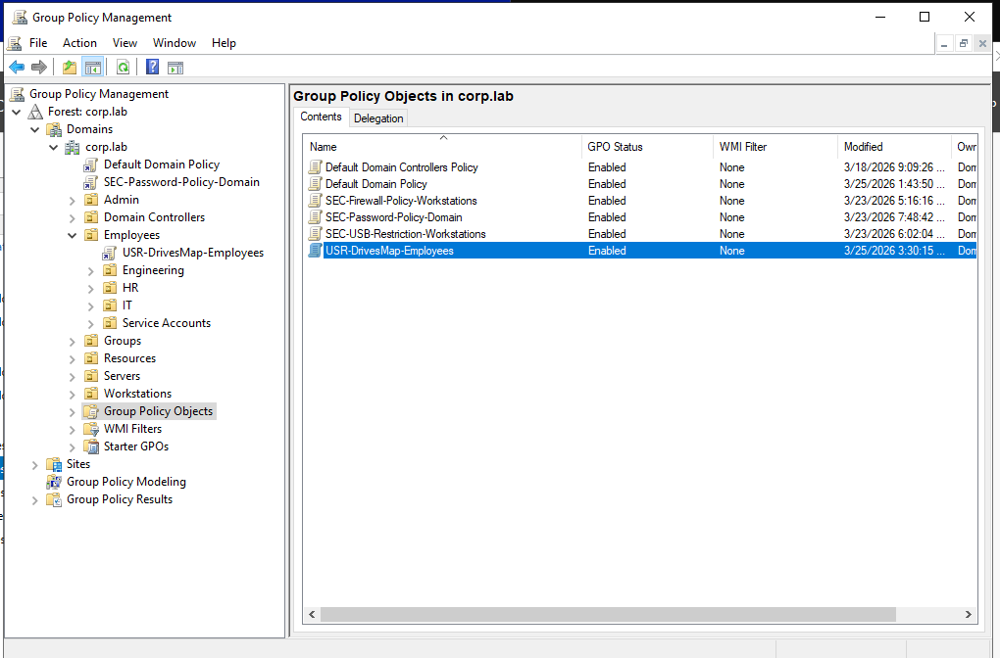
---

## File Server Architecture

| Component        | Value                        |
|-----------------|------------------------------|
| Server Name     | FS1                          |
| Role            | File Server                  |
| Protocol        | SMB (TCP 445)                |
| Root Share      | \\FS1\shares                 |
| FQDN Access     | \\FS1.corp.lab\shares        |

---

## Share Structure

| Share Name     | Path                          | Purpose              |
|----------------|-------------------------------|----------------------|
| SHARES         | \\FS1\shares                  | Root shared folder   |
| HR             | \\FS1\HR               | HR department        |
| Engineering    | \\FS1\Engineering      | Engineering files    |
| IT             | \\FS1\IT               | IT department        |
| Public         | \\FS1\Public           | Shared access        |

---

## Access Model (AGDLP)

The environment follows a **role-based access control model using AGDLP**:

- **Accounts (Users)** → members of  
- **Global Groups (GG-Department)** → assigned to  
- **Domain Local Groups (GG-FS1-XXX-RW)** → granted permissions on  
- **Resources (Shares/Folders)**

### Example

| Resource       | Group Name                | Permission |
|----------------|---------------------------|------------|
| HR Share       | GG-FS1-HR-RW              | Modify     |
| Engineering    | GG-FS1-Engineering-RW     | Modify     |
| IT             | GG-FS1-IT-RW              | Modify     |
| Public         | GG-FS1-Public-RW          | Modify     |

---

## NTFS Permissions

### Root Share (\\FS1\shares)

| Principal       | Permission        |
|----------------|------------------|
| SYSTEM          | Full Control     |
| Administrators  | Full Control     |
| Domain Users    | Read & Execute   |

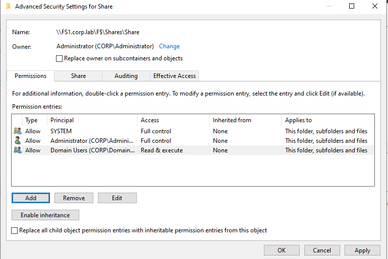

### Department Shares

- Permissions applied via **security groups only**
- No direct user permissions (ensures scalability and auditability)

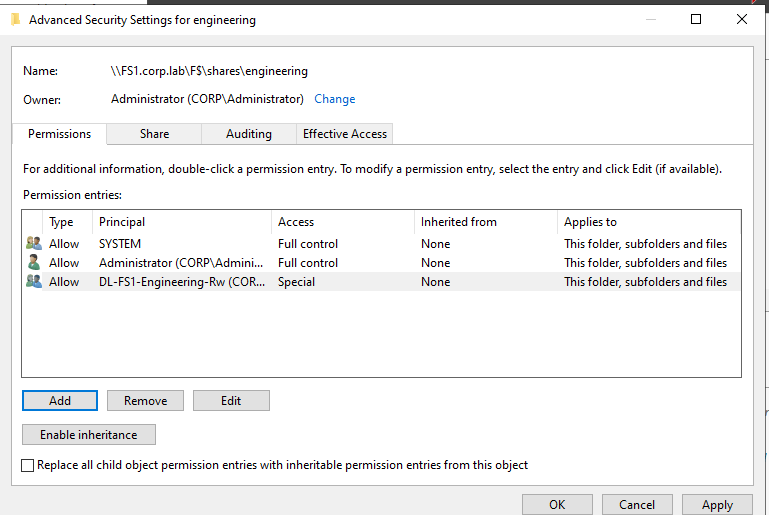
---

## GPO Configuration

### Path

```
User Configuration
 → Preferences
 → Windows Settings
 → Drive Maps
```

---

## Drive Mappings

| Drive Letter | Label        | Path                              | Action  |
|--------------|-------------|-----------------------------------|---------|
| S:           | SHARES      | \\FS1\shares             | Update  |
| O:           | Engineering | \\FS1\Engineering | Update  |
| H:           | HR          | \\FS1\HR          | Update  |
| I:           | IT          | \\FS1\IT          | Update  |
| P:           | Public      | \\FS1\Public      | Update  |

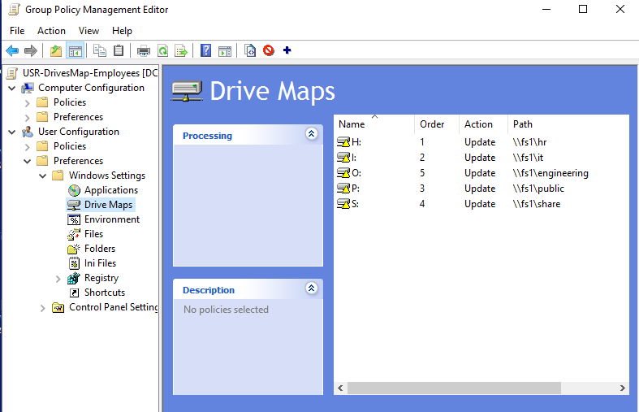
---

## Preferences Configuration Details

### Action Type — Update

- Creates the drive if it does not exist
- Updates it if already present
- Preserves user-defined mappings
- Avoids disruption compared to Replace

---

### Common Settings

- Reconnect: Enabled
- Label as: ***
- Drive letter: Fixed
- Run in logged-on user's security context: Enabled
- Item-level targetting: GL

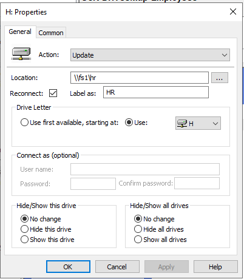

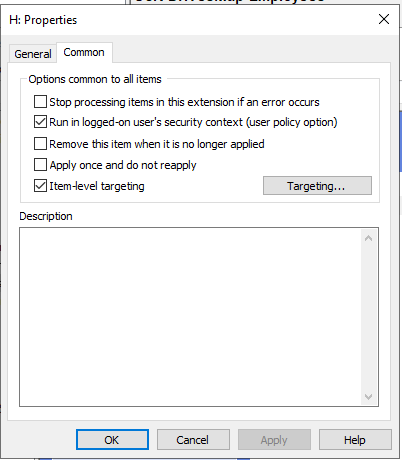
---

## Design Decisions

### 1. Update vs Replace

- **Update** chosen to avoid removing user-defined drives
- Ensures stable user experience across sessions

### 2. Fixed Drive Letters

- Provides consistency across users
- Simplifies support and documentation
- Aligns with enterprise standards

### 3. Access-Based Enumeration (ABE)

- Users only see folders they have access to
- Prevents information disclosure
- Improves usability

### 4. Group-Based Permissions

- Ensures scalability
- Simplifies permission management
- Aligns with enterprise RBAC practices

---

## Dependencies

Drive mapping depends on the following services:

| Dependency        | Description                          |
|------------------|--------------------------------------|
| DNS              | Resolves FS1.corp.lab                |
| SMB (TCP 445)    | File sharing protocol                |
| Active Directory | Authentication and authorization     |
| Network Routing  | Connectivity between client and FS1  |

---

## Validation

### Step 1 — Force Group Policy Update

```powershell
gpupdate /force
```

---

### Step 2 — Verify GPO Application

```powershell
gpresult /r
```

Result:

- **USR-DrivesMap-Employees** appears in Applied GPOs

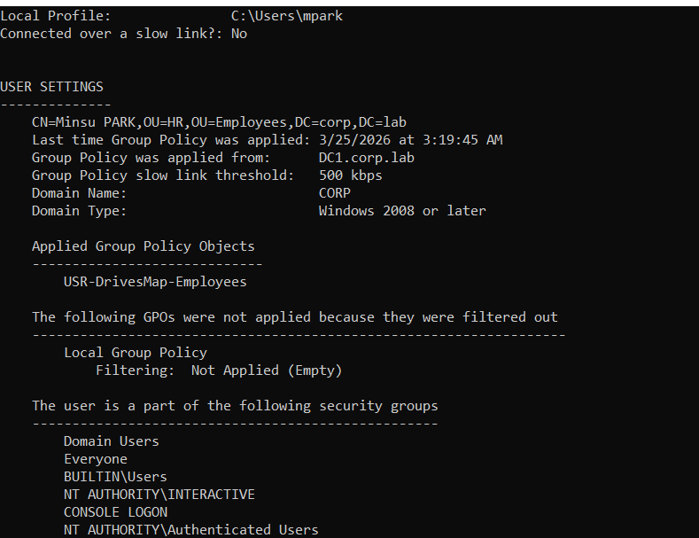

---

### Step 3 — Verify Drive Mapping

```powershell
Get-PSDrive
net use
```

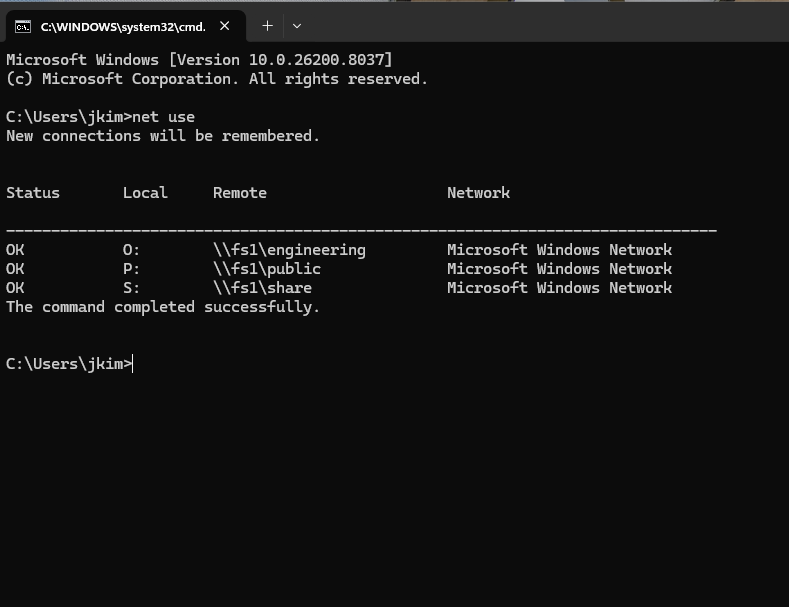


---

### Step 4 — Access Validation

Test:

```
\\FS1\shares
\\FS1\shares\HR
```

Expected:

- Access granted based on group membership
- Unauthorized folders hidden (ABE working)

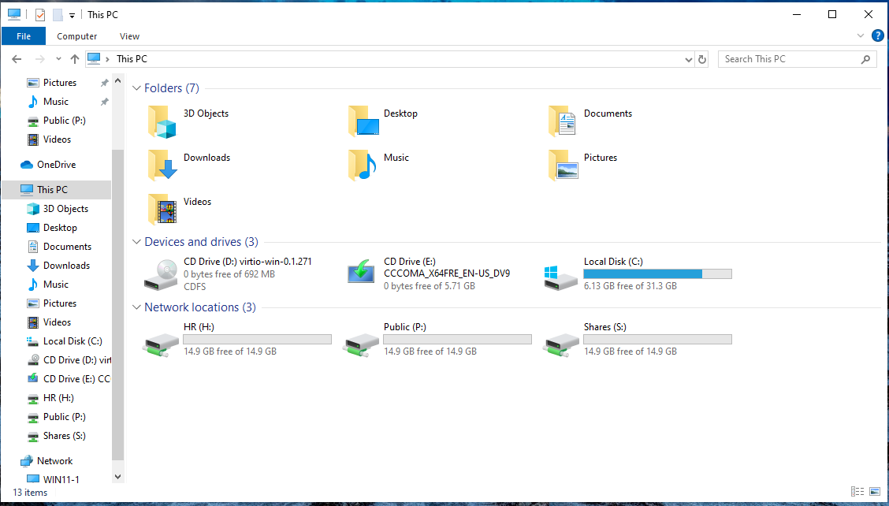

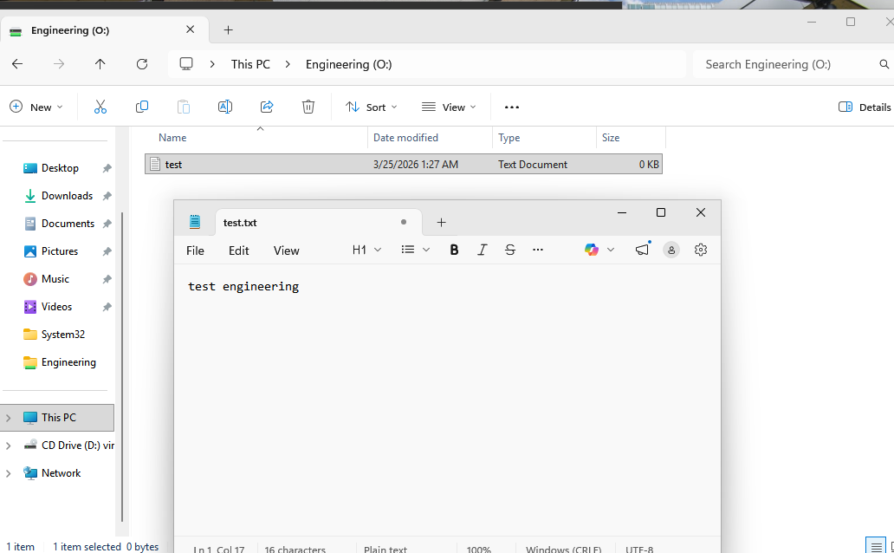


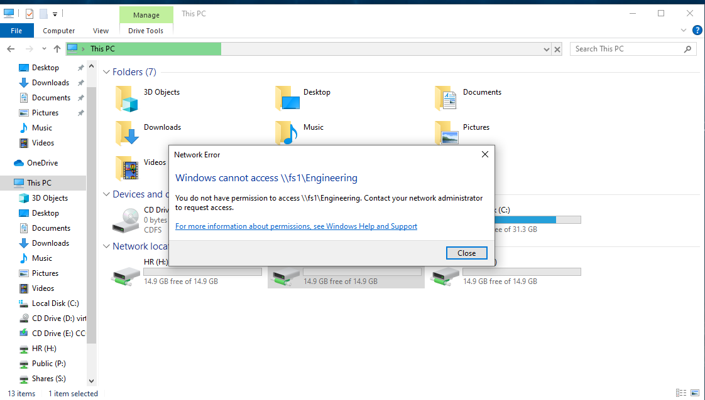

---

## Incident — Drive Mapping Failure (0x80070043)

### Summary

Drive mapping failed with error:

```
0x80070043 — The network name cannot be found
```

---

### Symptoms

- Drives not appearing in File Explorer
- Manual UNC access may still work

---

### Diagnosis

```powershell
ping FS1
nslookup FS1
Test-NetConnection FS1 -Port 445
gpresult /r
```

---

### Root Causes

- DNS resolution failure
- Incorrect UNC path
- SMB service unavailable
- GPO not applied correctly

---

### Resolution

- Verified DNS resolution of FS1
- Corrected UNC path to FQDN
- Confirmed SMB port accessibility
- Reapplied GPO

---

### Prevention

- Validate DNS before deployment
- Ensure proper OU targeting
- Monitor GPO application logs

---

## Troubleshooting Guide

### Issue: Drives not appearing

**Checks:**

```powershell
gpresult /r
whoami /groups
```

---

### Issue: Share accessible manually but not mapped

**Possible causes:**

- GPO timing issue
- Drive letter conflict
- Incorrect scope

---

### Issue: Access denied

**Checks:**

- Verify group membership
- Validate NTFS permissions
- Confirm ABE behavior

---

## Operational Behavior

- Drive mapping occurs at **user logon**
- Refreshed during **background GPO updates**
- If FS1 is unavailable:
  - Mapping may fail silently
  - Drives may appear disconnected

---

## Impact

- Centralized access to enterprise resources
- Improved user productivity
- Standardized environment
- Reduced manual configuration

---

## Risks

- Incorrect permissions may expose sensitive data
- Network dependency for access
- Drive letter conflicts

---

## Mitigation

- Apply least privilege principle
- Validate permissions before deployment
- Monitor access and logs
- Use consistent naming conventions

---

---

## Conclusion

This GPO implements a scalable, secure, and enterprise-aligned drive mapping solution using Group Policy Preferences. It demonstrates practical skills in Active Directory design, file services, and operational troubleshooting within a Windows infrastructure environment.