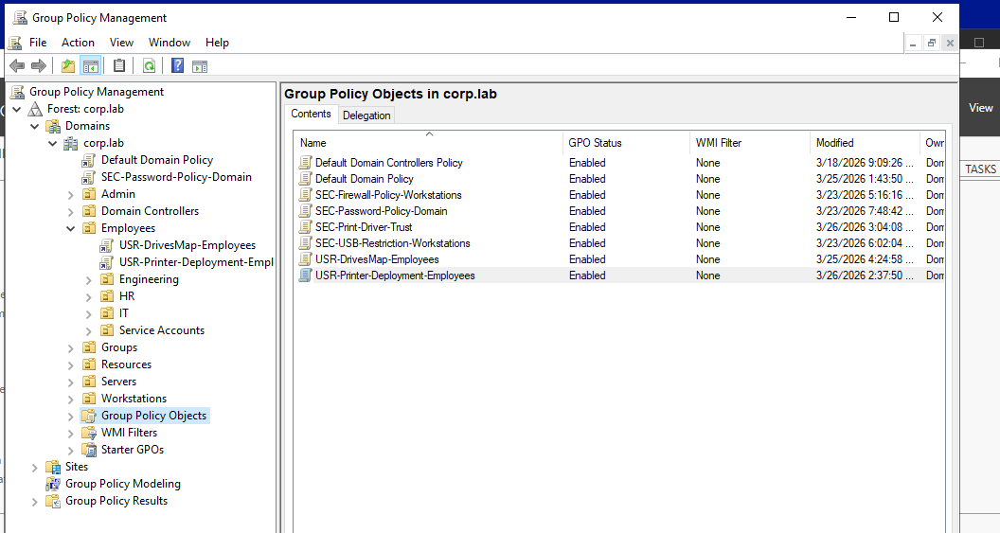
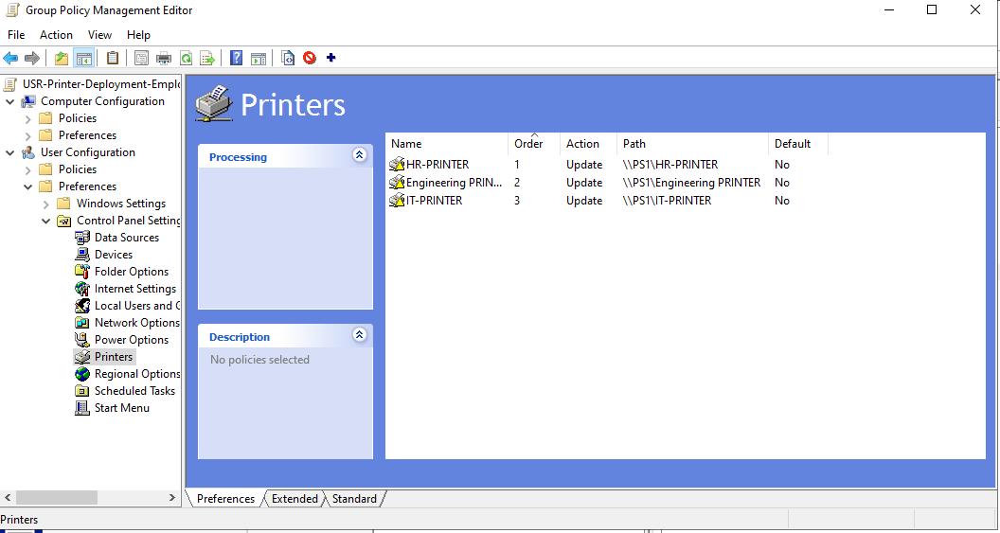
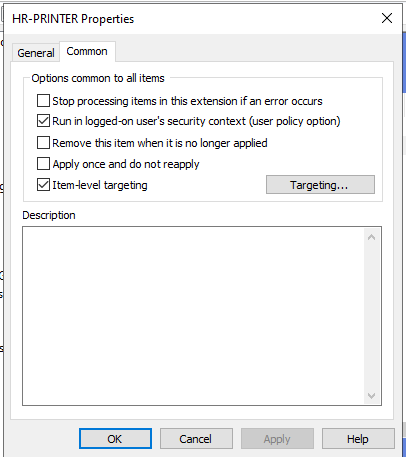
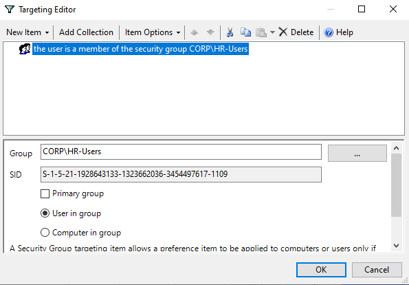
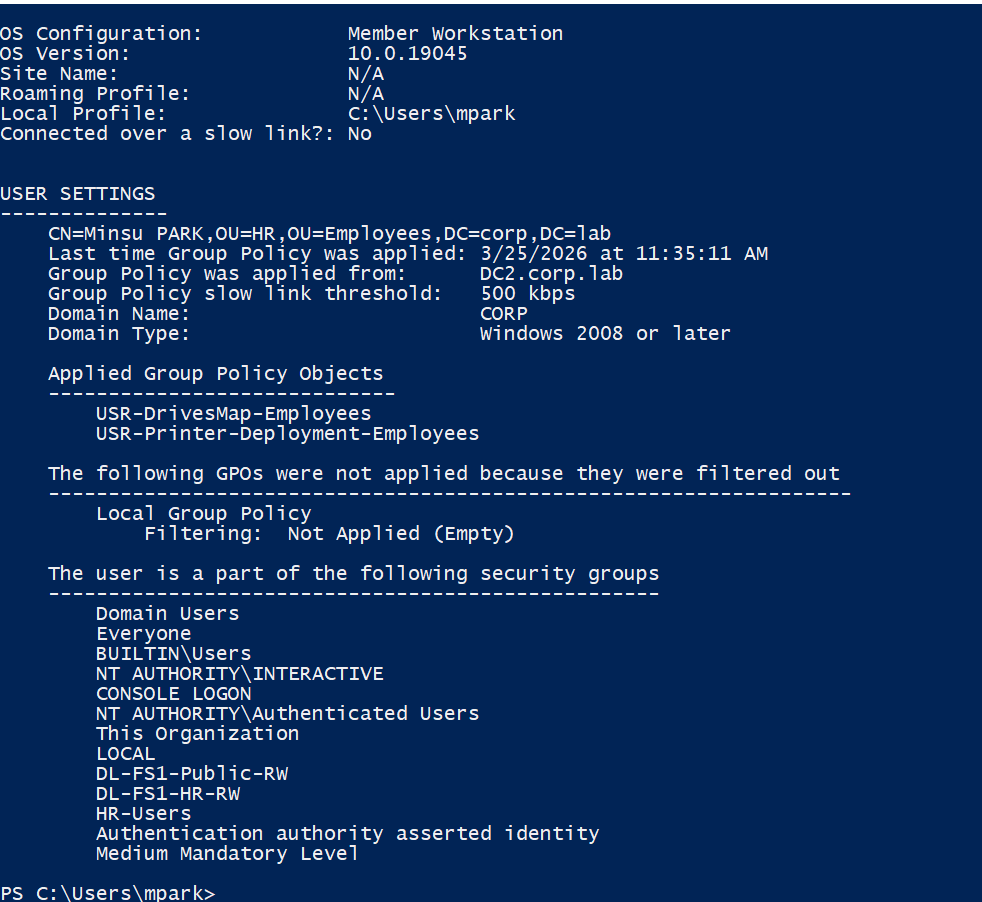

# GPO — Printer Deployment (Employees)

## Overview

This document describes the configuration and deployment of the **Printer Deployment Group Policy Object (GPO)** in the **corp.lab** domain.

The objective is to automatically assign printers to users based on their **departmental group membership**, ensuring centralized and scalable printer management.

This GPO uses **User Configuration + Preferences + Item-Level Targeting**, reflecting enterprise best practices.

---

## Prerequisites

- Printers created and shared on PS1
- Printer drivers installed and validated on PS1
- Active Directory security groups created:
  - HR-Users
  - Engineering-Users
  - IT-Users
- Clients domain-joined and able to reach \\PS1

---

## Architecture Context

corp.lab
│
├── Employees
│   ├── HR
│   ├── Engineering
│   ├── IT
│   └── USR-Printer-Deployment-Employees (linked here)

---

## GPO Path

User Configuration  
 → Preferences  
 → Control Panel Settings  
 → Printers  

---

## Printer Deployment Configuration

Three printers are deployed from the print server PS1.

| Printer Name           | Path                         | Action  | Default |
|------------------------|------------------------------|---------|---------|
| HR-PRINTER             | \\PS1\HR-PRINTER             | Update  | No      |
| Engineering-PRINTER    | \\PS1\Engineering-PRINTER    | Update  | No      |
| IT-PRINTER             | \\PS1\IT-PRINTER             | Update  | No      |

---

## Configuration Details

- Type: Shared Printer  
- Action: Update (ensures idempotent deployment)  
- Connection: \\PS1\<PrinterName>  

---

## Targeting Strategy

Item-level targeting is used to assign printers based on Active Directory security groups.

### Targeting Rules

| Printer Name         | Target Group        |
|---------------------|--------------------|
| HR-PRINTER          | HR-Users           |
| Engineering-PRINTER | Engineering-Users  |
| IT-PRINTER          | IT-Users           |

### Logic

- IF user ∈ HR-Users → Deploy HR-PRINTER  
- IF user ∈ Engineering-Users → Deploy Engineering-PRINTER  
- IF user ∈ IT-Users → Deploy IT-PRINTER  

---

## Configuration Steps

### Step 1 — Create GPO

- Open Group Policy Management  
- Create new GPO:  
  USR-Printer-Deployment-Employees  

---

### Step 2 — Link GPO

- Link GPO to:  
  Employees OU  

---

### Step 3 — Configure Printers

Navigate to:

User Configuration  
 → Preferences  
 → Control Panel Settings  
 → Printers  

- Right-click → New → Shared Printer  
- Configure:
  - Action: Update  
  - Path: \\PS1\<PrinterName>  

---

### Step 4 — Configure Item-Level Targeting

For each printer:

-  Properties → Common tab  
- Enable: Item-level targeting  
- Add condition:
  - Security Group → <Department Group>  

---

## Validation

### Verify GPO Application

gpresult /r

Expected:

- GPO appears under User Settings  
- No filtering or access errors  

---

### Verify Printer Deployment

Get-Printer

Result

- Type: Connection  

---

### User Validation

- Log in as HR user → HR-PRINTER appears  
- Log in as Engineering user → Engineering-PRINTER appears  
- Log in as IT user → IT-PRINTER appears  

---

## Troubleshooting

### Issue: Printer not deployed

Possible causes:

- User not in correct group  
- GPO not linked correctly  
- Replication delay  

Checks:

gpresult /r

---

### Issue: Wrong printer assigned

Possible causes:

- Incorrect targeting configuration  
- User belongs to multiple groups  

Checks:

- Verify AD group membership  
- Review item-level targeting rules  

---

### Issue: Printer not accessible

Possible causes:

- Incorrect share path  
- Print server unreachable  

Checks:

ping PS1  
\\PS1  

---

## Advanced Troubleshooting

### Generate detailed GPO report

gpresult /h report.html

---

### Check Group Policy logs

- Event Viewer  
→ Applications and Services Logs  
→ Microsoft  
→ Windows  
→ GroupPolicy  
→ Operational  

---

### Check Print Spooler

Get-Service Spooler

---

## Risks and Considerations

- Users in multiple groups may receive multiple printers  
- Incorrect or missing drivers can block deployment  
- Network latency may delay GPO application  
- Print server outage impacts all users  

---

## Operations Notes

- All printer management is centralized on PS1  
- Access is controlled via AD group membership  

### Adding a new department requires:

- New AD group  
- New shared printer on PS1  
- New GPO targeting rule  

---

## Best Practices

- Use a single GPO with item-level targeting  
- Use Update action for idempotency  
- Maintain consistent naming:  
  <Department>-PRINTER  
- Keep naming consistent across:
  - Print Server  
  - GPO  
  - Documentation  

---

## Impact

- Automated printer provisioning  
- Reduced manual configuration  
- Scalable and maintainable deployment model  
- Improved end-user experience  

---

## Conclusion

The USR-Printer-Deployment-Employees GPO provides:

- Centralized printer deployment  
- Role-based access control  
- Enterprise-grade automation using Group Policy  

