# WSUS Client Configuration and Targeting — corp.lab

## Overview

This document describes the configuration of **WSUS client settings via Group Policy** in the **corp.lab** domain.

The objective is to ensure that all domain-joined systems:

- Retrieve updates from the internal WSUS server (WSUS1)
- Are assigned to the correct WSUS target groups
- Follow controlled update installation schedules


---

## Scope

| Parameter              | Value                  |
|-----------------------|------------------------|
| Domain                | corp.lab               |
| WSUS Server           | WSUS1.corp.lab         |
| WSUS Port             | 8530 (HTTP)            |
| Client Types          | Workstations, Servers  |
| GPOs                  | CFG-WSUS-Workstations, CFG-WSUS-Servers |

---

## Architecture Context

WSUS client configuration is applied using **Group Policy Objects (GPOs)** linked to specific Organizational Units (OUs).

```
corp.lab
│
├── Servers
│   └── CFG-WSUS-Servers (linked here)
│
├── Workstations
│   └── CFG-WSUS-Workstations (linked here)
```

Each OU receives a **dedicated WSUS policy**, allowing differentiated behavior between servers and workstations.

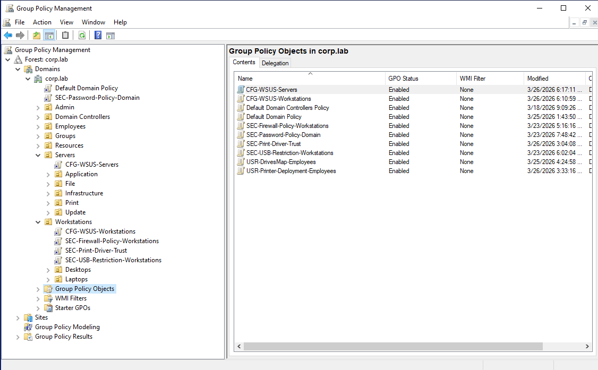

---

## GPO Configuration — Workstations

### GPO Name

CFG-WSUS-Workstations

### Path

```
Computer Configuration
→ Policies
→ Administrative Templates
→ Windows Components
→ Windows Update
```

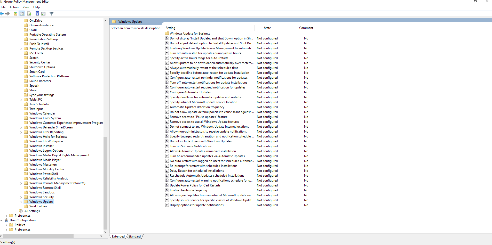

---

### Settings

#### 1. Specify Intranet Microsoft Update Service Location

- State: Enabled

```
Set the intranet update service for detecting updates:
http://wsus1.corp.lab:8530

Set the intranet statistics server:
http://wsus1.corp.lab:8530
```

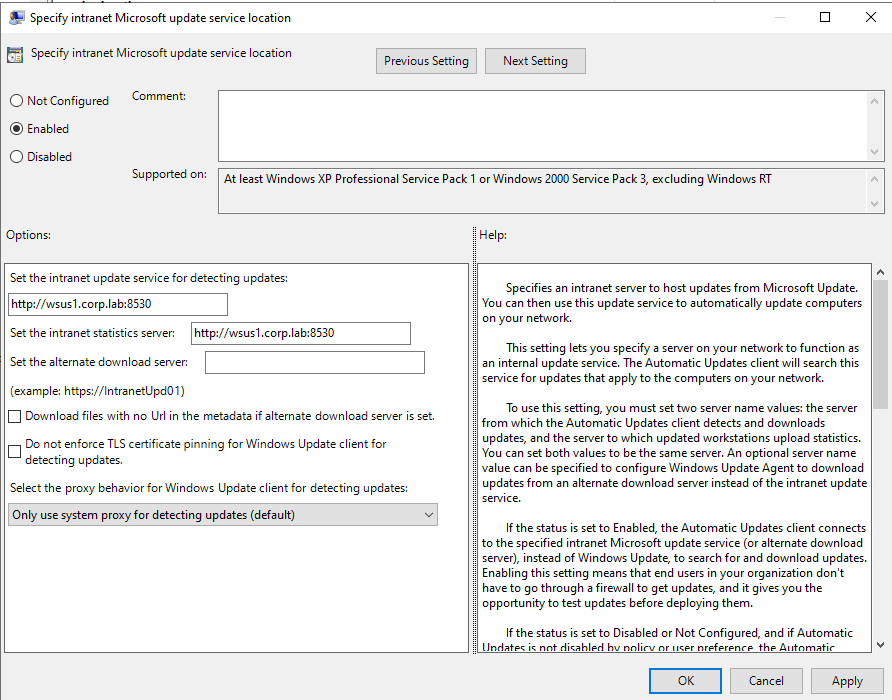

---

#### 2. Configure Automatic Updates

- State: Enabled
- Mode: 4 — Auto download and schedule the install
- Schedule:
  - Every day
  - Time: 03:00

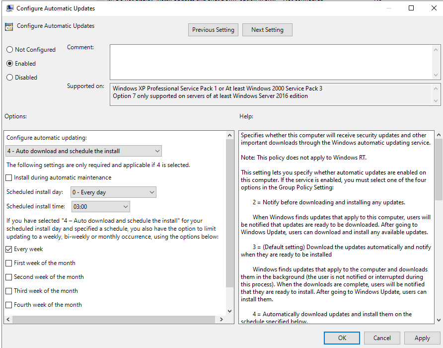

---

#### 3. Enable Client-Side Targeting

- State: Enabled
- Target group name:
  - Workstations

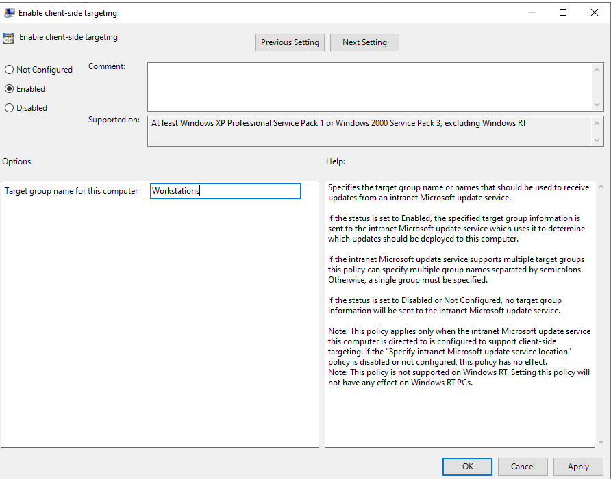

---

## GPO Configuration — Servers

### GPO Name

CFG-WSUS-Servers

### Path

```
Computer Configuration
→ Policies
→ Administrative Templates
→ Windows Components
→ Windows Update
```

---

### Settings

#### 1. Specify Intranet Microsoft Update Service Location

- State: Enabled

```
http://wsus1.corp.lab:8530
```

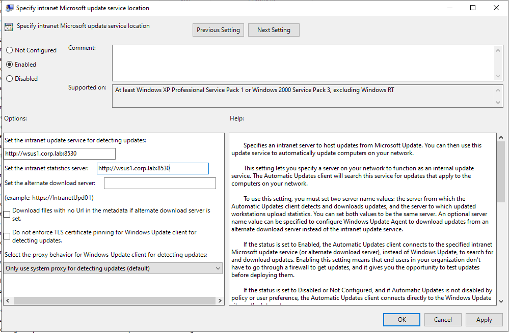

---

#### 2. Configure Automatic Updates

- State: Enabled
- Mode: 4 — Auto download and schedule the install
- Schedule:
  - Every Wednesday
  - Time: 03:00

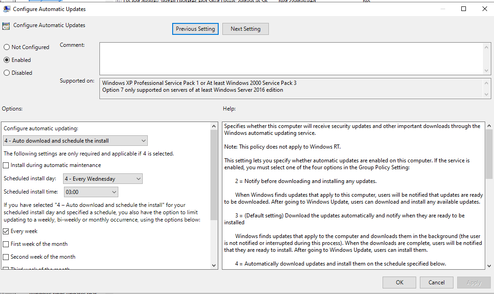

---

#### 3. Enable Client-Side Targeting

- State: Enabled
- Target group name:
  - Servers

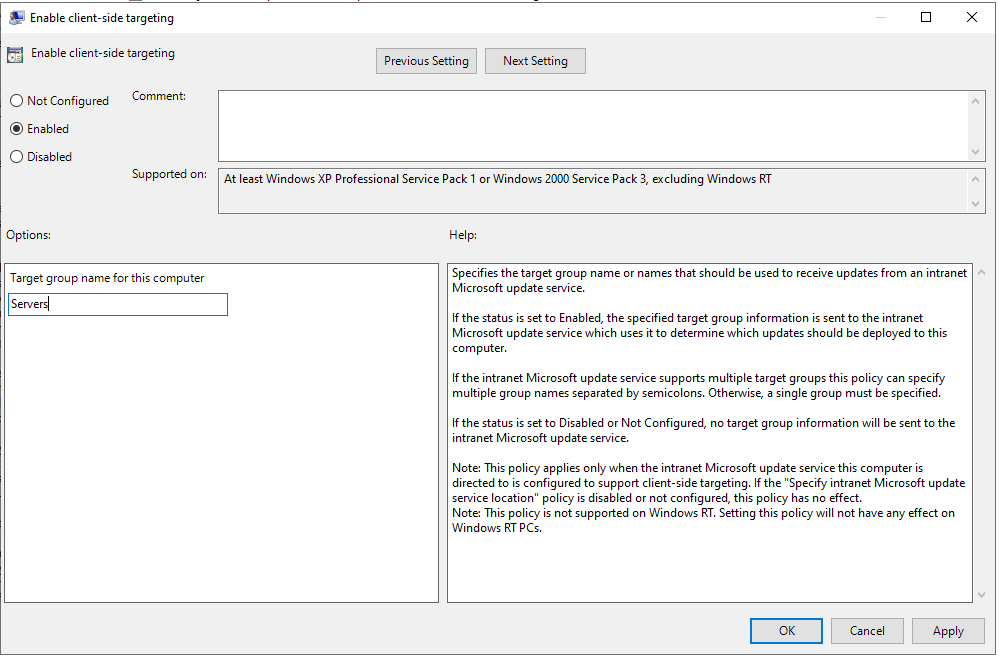

---

## WSUS Target Group Mapping

| GPO                     | WSUS Group   | Assigned Systems         |
|------------------------|-------------|--------------------------|
| CFG-WSUS-Workstations  | Workstations | Windows 10/11 clients    |
| CFG-WSUS-Servers       | Servers      | Infrastructure servers   |

---

## Validation

### Step 1 — Verify GPO Application

On client:

```powershell
gpresult /r
```

Result:

- CFG-WSUS-Workstations or CFG-WSUS-Servers appears in applied GPOs

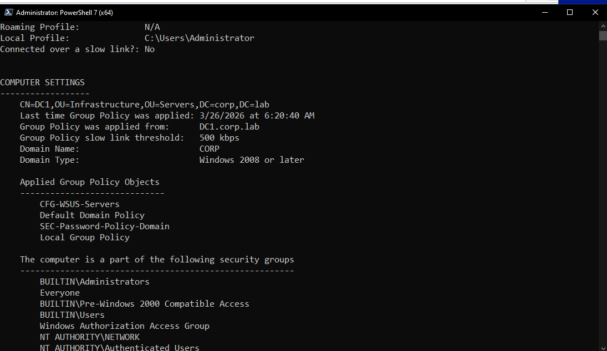

---

### Step 2 — Force Policy Update

```powershell
gpupdate /force
```

Resultat:

- Computer and user policy update successful


---

### Step 3 — Trigger Update Detection

```powershell
UsoClient StartScan
```

Expected:

- Client contacts WSUS server
- Update scan is initiated

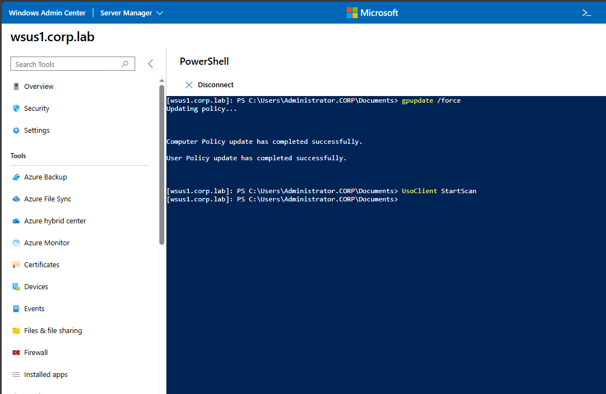

---

### Step 4 — Verify WSUS Console

Navigate to:

WSUS → Computers → Target Groups

Expected:

- Workstations appear in "Workstations"
- Servers appear in "Servers"

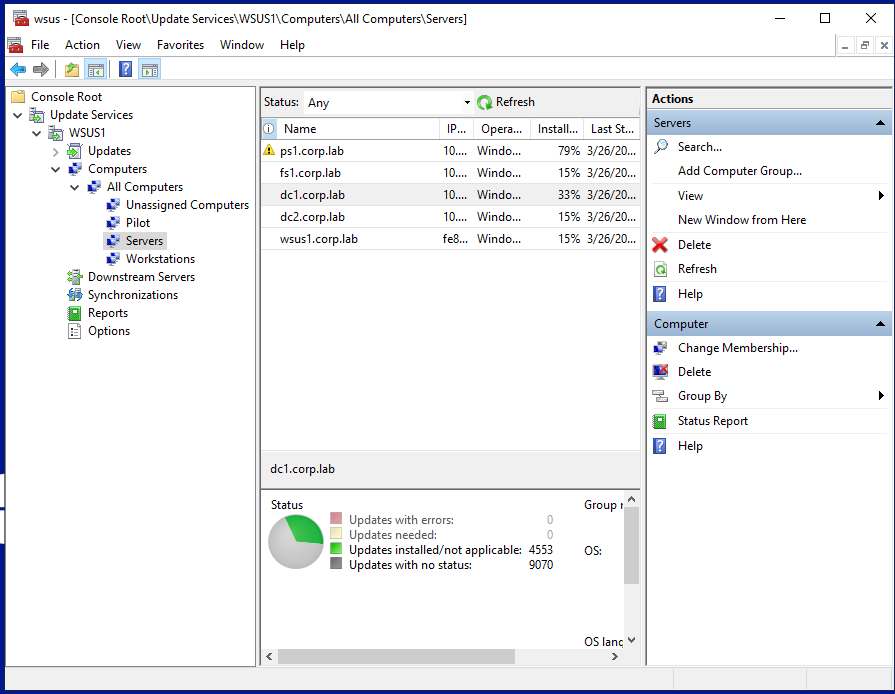

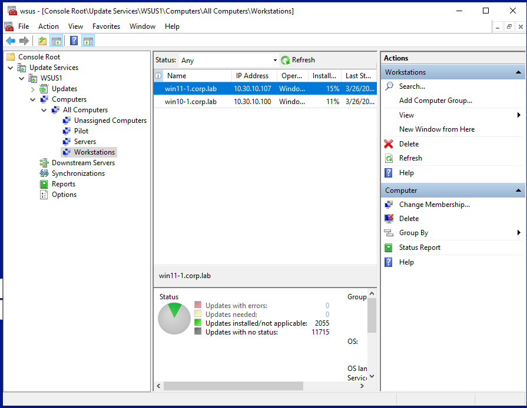

---

## Operational Behavior

- Clients no longer contact Microsoft Update directly
- All updates are retrieved from WSUS1
- Systems are automatically categorized via GPO
- Update installation follows defined schedules

---

## Benefits

- Centralized patch management
- Reduced external bandwidth usage
- Controlled update deployment
- Environment segmentation (Workstations vs Servers)

---

## Risks

| Risk                          | Mitigation                              |
|-------------------------------|------------------------------------------|
| Misconfigured GPO             | Validate with gpresult                  |
| Incorrect group assignment    | Verify client-side targeting            |
| WSUS unavailable              | Monitor WSUS service availability       |

---

## Troubleshooting

### Check WSUS Configuration

```powershell
reg query HKLM\Software\Policies\Microsoft\Windows\WindowsUpdate
```

---

### Verify WSUS Connectivity

```powershell
Test-NetConnection wsus1.corp.lab -Port 8530
```

---

### Check Windows Update Logs

```powershell
Get-WindowsUpdateLog
```

---

### Force Reporting

```powershell
UsoClient StartReport
```

---

## Future Improvements

- Implement WSUS over HTTPS (SSL)
- Introduce Pilot group integration
- Configure update deadlines via GPO
- Implement reporting dashboards
- Integrate with incident response workflows