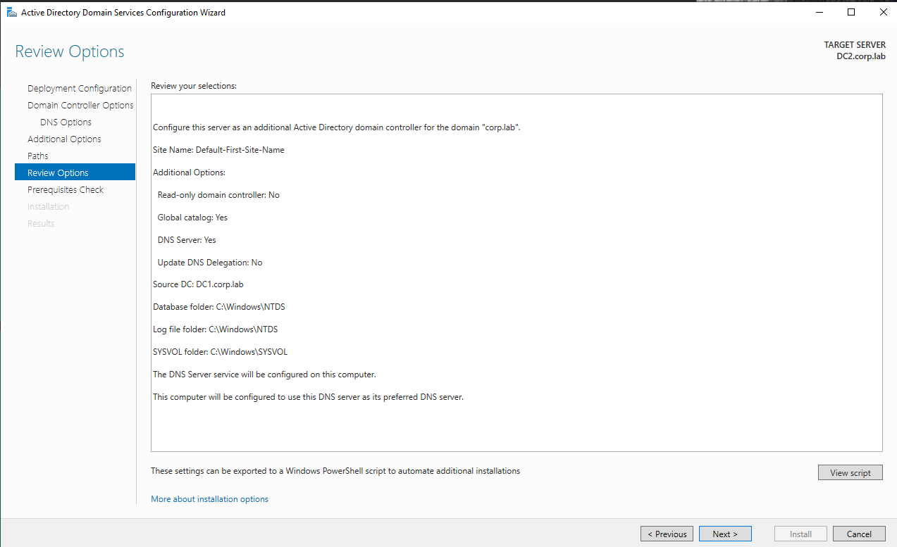
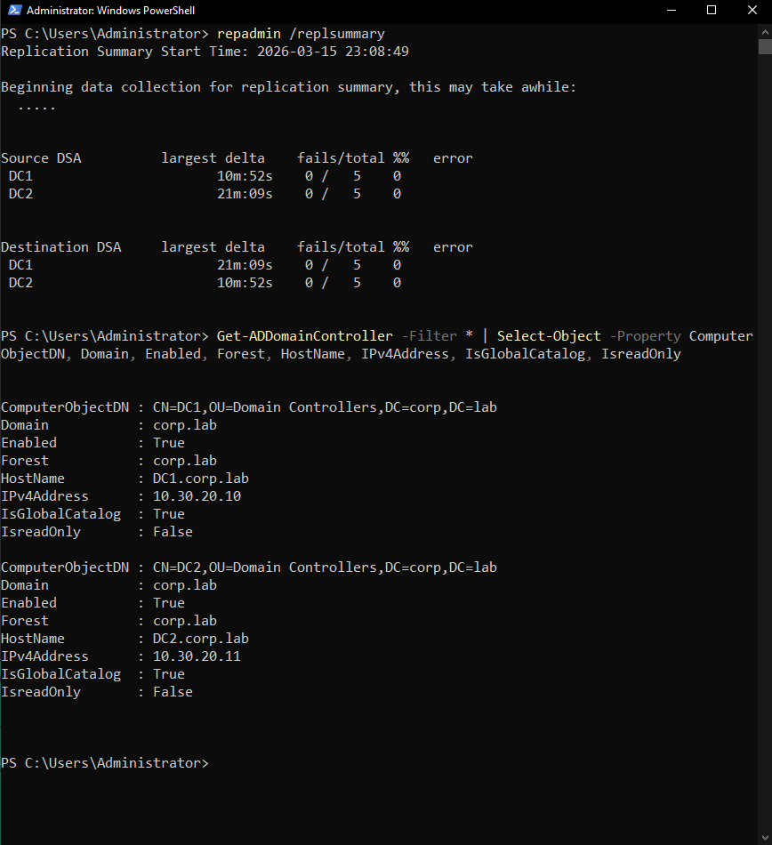
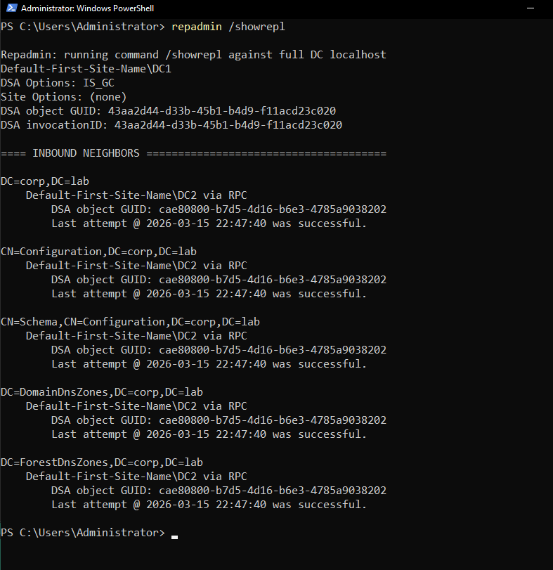
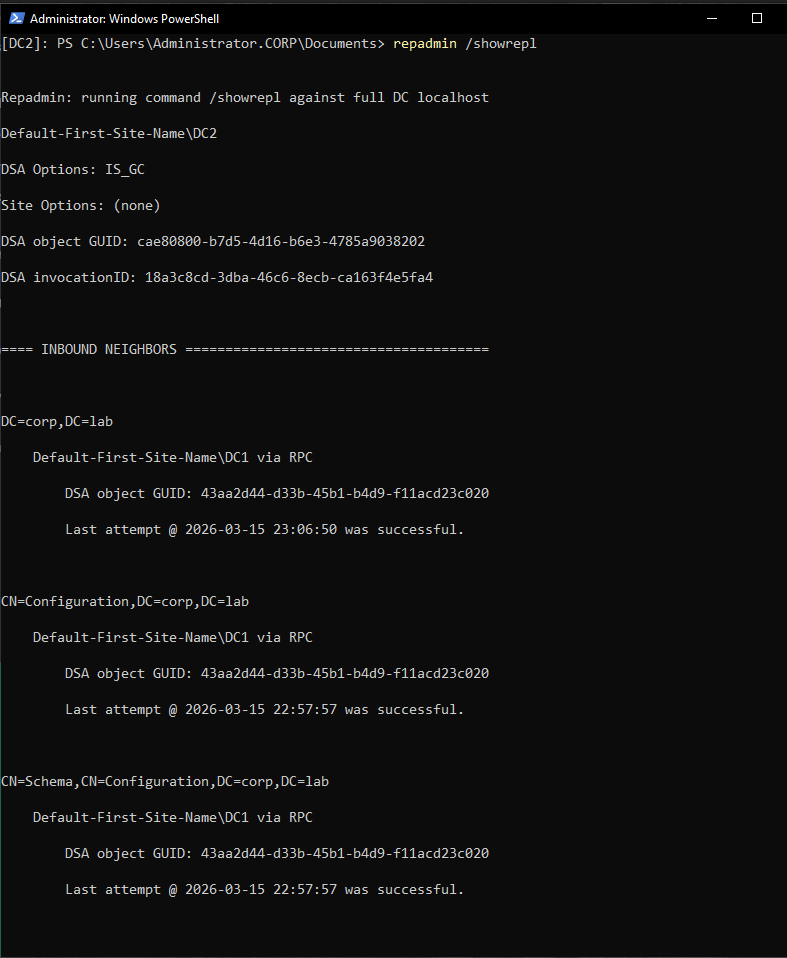
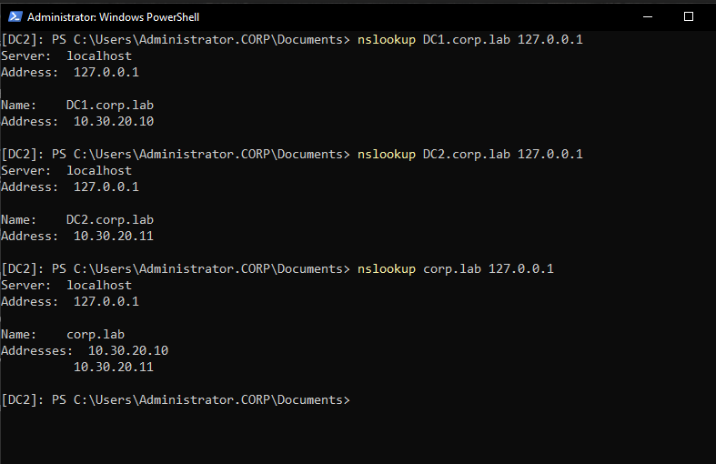
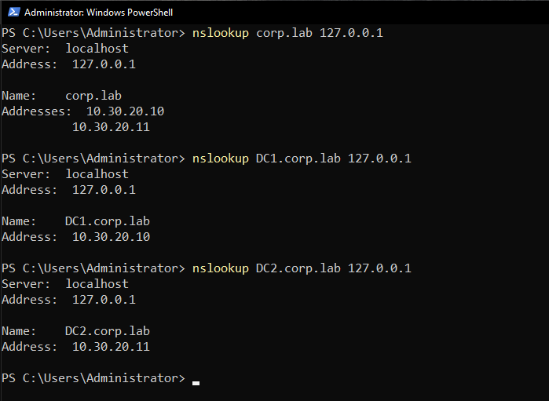
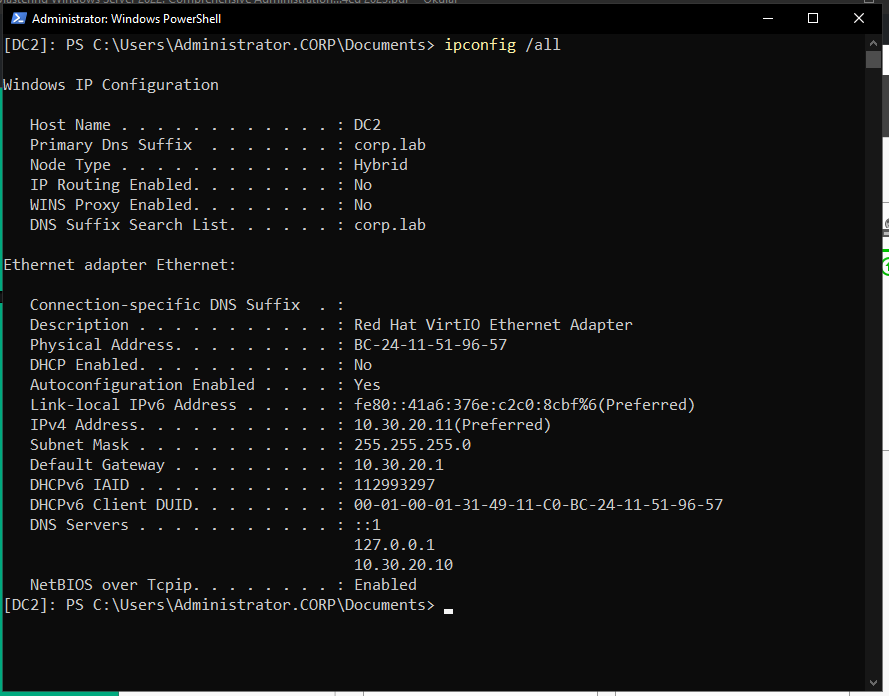
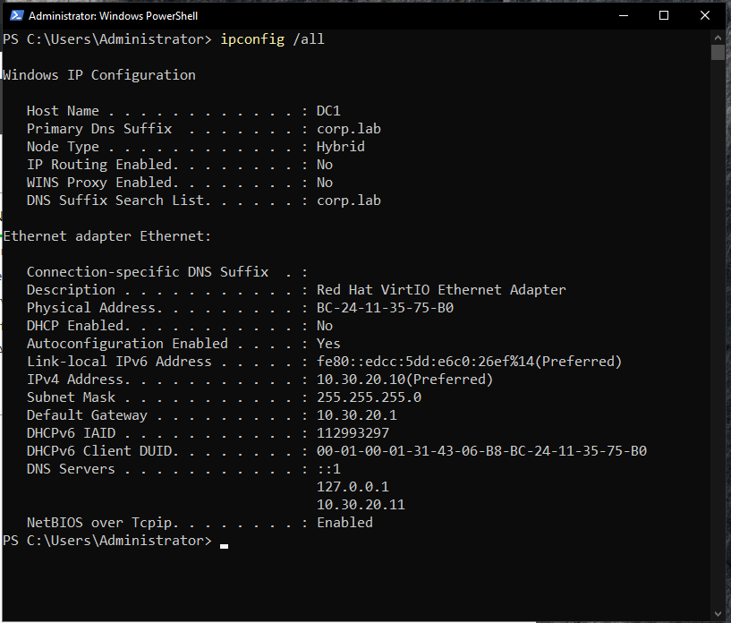
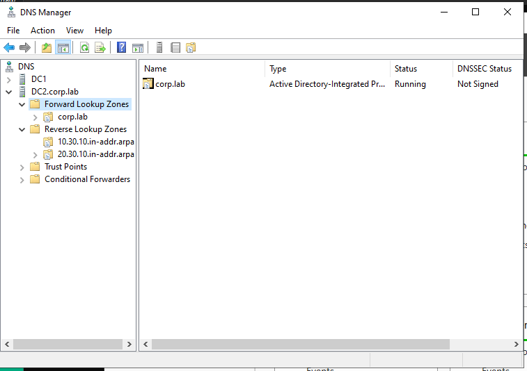
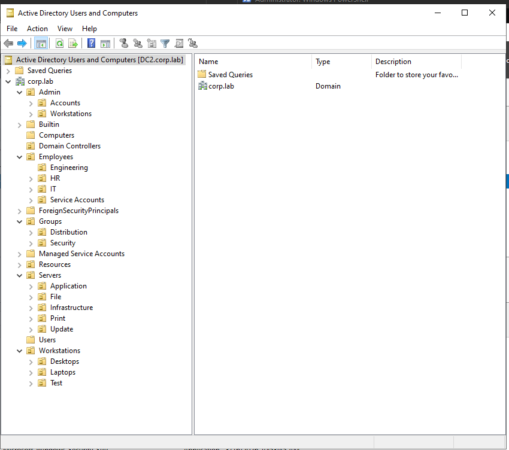

# Domain Controller Deployment — DC2

## Overview

This document describes the deployment and promotion of **DC2** as an additional domain controller in the **corp.lab Active Directory domain** within the **Enterprise Windows Infrastructure** lab environment.

Deploying multiple domain controllers is a standard enterprise practice that improves:

- directory service availability
- authentication reliability
- redundancy for critical infrastructure
- Active Directory replication resilience
- DNS service redundancy

DC2 functions as a **secondary domain controller**, participating in **multi-master replication** with DC1.

---

# Infrastructure Context

| Component | Value |
|----------|------|
| Domain | corp.lab |
| Domain Controllers | DC1, DC2 |
| Operating System | Windows Server 2022 |
| Directory Service | Active Directory Domain Services |
| DNS | Active Directory–Integrated DNS |

DC2 operates as a full domain controller and replicates the directory database from DC1.

---

# Purpose of DC2

The secondary domain controller provides several operational benefits:

### High Availability

If **DC1 becomes unavailable**, DC2 can continue to provide:

- domain authentication
- Kerberos ticket services
- DNS resolution
- directory queries

### Replication

Active Directory uses **multi-master replication**, allowing updates on any domain controller to propagate across the environment.

### Load Distribution

Multiple domain controllers allow authentication and directory queries to be distributed across servers.

---

# DC2 Deployment Process

The DC2 server was first deployed as a standard Windows Server virtual machine and joined to the **corp.lab** domain before promotion.

The following configuration steps were performed.

### 1 — Install Active Directory Domain Services

The **AD DS role** was installed on the server using Server Manager.

Role installed:

- Active Directory Domain Services

---

### 2 — Promote Server to Domain Controller

The server was promoted using the **Active Directory Domain Services Configuration Wizard**.

Promotion configuration:

| Setting | Value |
|-------|------|
| Deployment operation | Add a domain controller to an existing domain |
| Domain | corp.lab |
| Domain Controller Options | DNS Server enabled |
| Global Catalog | Enabled |
| Site Name | Default-First-Site-Name |

DC2 joins the existing Active Directory infrastructure and begins replicating directory data.

---

# Promotion Verification



# Replication Validation

After promotion, replication status was verified using **repadmin** commands.

### Replication Summary

```
repadmin /replsummary
```

This command verifies overall replication health across domain controllers.


---

### Replication Detail

Replication details were examined using:

```
repadmin /showrepl
```

This command displays inbound replication partners and status.

### DC1 Replication View



### DC2 Replication View



Successful replication confirms that the **Active Directory database is synchronized between domain controllers**.

---

# Domain Controller Discovery

The list of available domain controllers was verified using PowerShell.

Command used:

```
Get-ADDomainController -Filter *
```

This confirms both DC1 and DC2 are recognized by Active Directory.


---

# DNS Validation

Since Active Directory depends heavily on DNS, name resolution was validated from both domain controllers.

### DNS Tests Performed

```
nslookup corp.lab 127.0.0.1
nslookup DC1.corp.lab 127.0.0.1
nslookup DC2.corp.lab 127.0.0.1
```

These queries verify:

- domain DNS resolution
- domain controller DNS records
- proper DNS zone replication

---

### DNS Validation — DC2
```bash
PowerShell — nslookup DC2.corp.lab 127.0.0.1 (DC2)

PowerShell — nslookup corp.lab 127.0.0.1 (DC2)
```


---

### DNS Validation — DC1

```
PowerShell — nslookup corp.lab 127.0.0.1 (DC1)

PowerShell — nslookup DC1.corp.lab 127.0.0.1 (DC1)


PowerShell — nslookup DC2.corp.lab 127.0.0.1 (DC1)
```



---

# Network Configuration Verification

Network configuration was validated on both domain controllers.

Command used:

```
ipconfig /all
```

This confirms:

- static IP configuration
- DNS server settings
- domain membership
- proper network connectivity

### DC2 Network Configuration

```
PowerShell — ipconfig /all (DC2)
```


### DC1 Network Configuration

```

PowerShell — ipconfig /all (DC1)
```

---

# DNS Zone Replication

DNS zones were verified to ensure they replicate correctly between domain controllers.

Because the zones are **Active Directory–integrated**, they replicate automatically through the directory replication mechanism.


---

# Active Directory Structure Validation

The organizational unit structure was verified to ensure directory replication is functioning correctly.


---

# Operational Result

After deployment and verification:

- DC2 successfully joined the **corp.lab domain**
- Active Directory replication is functioning
- DNS zones replicate correctly
- Both domain controllers resolve domain records
- Directory services are redundant

The environment now operates with **two domain controllers**, improving resilience and reliability.

---

# Future Improvements

Potential improvements for enterprise environments include:

- additional domain controllers in other sites
- AD Sites and Services configuration
- replication monitoring
- domain controller health monitoring
- automated backup of AD database

---

# Related Documentation

- `identity/domain-configuration.md`
- `identity/fsmoroles.md`
- `identity/ou-design.md`
- `network/dns-architecture.md`
- `architecture/server-inventory.md`
