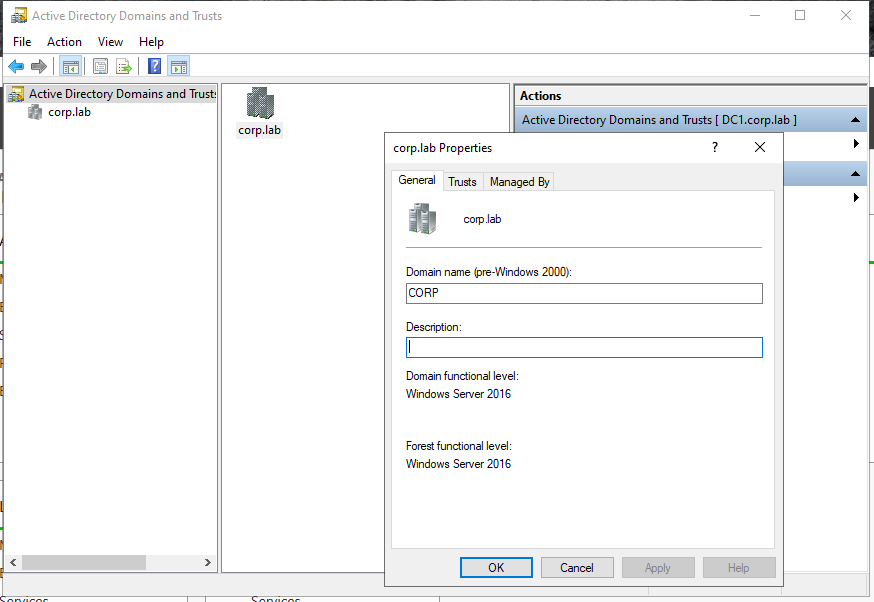
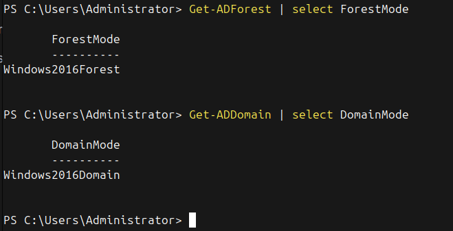
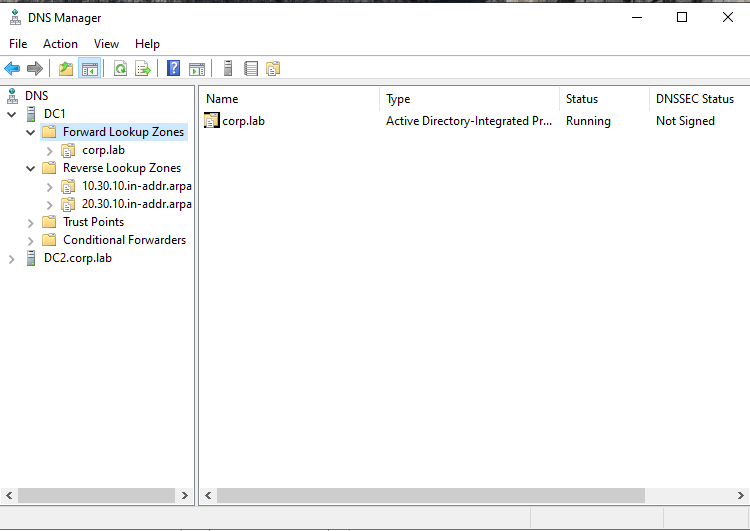
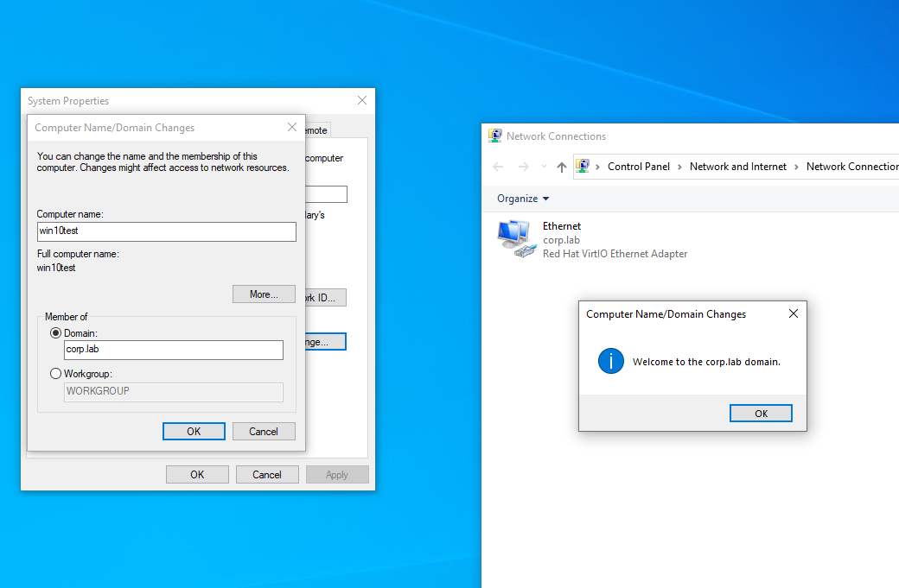
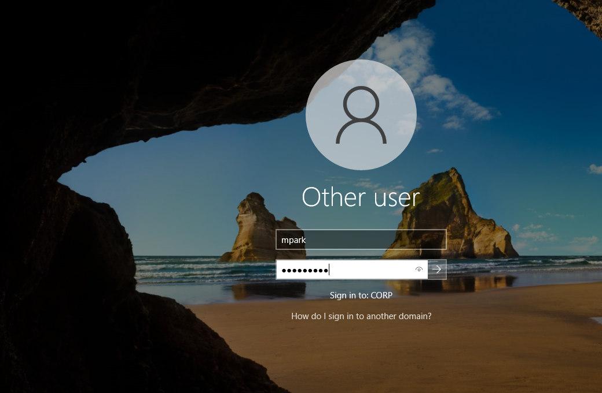

# Domain Configuration — corp.lab

## Overview

This document describes the **Active Directory domain configuration** implemented in the **Enterprise Windows Infrastructure** lab environment.

The domain forms the **central identity boundary** of the infrastructure. It provides authentication, authorization, service discovery, and centralized management for all domain-joined systems.

All servers and client workstations in the lab authenticate against the **corp.lab Active Directory domain**.

The domain configuration follows common enterprise practices used in production enterprise environments.

---

# Domain Information

| Parameter | Value |
|----------|------|
| Domain Name | corp.lab |
| NetBIOS Name | CORP |
| Forest Name | corp.lab |
| Forest Functional Level | Windows Server 2016 |
| Domain Functional Level | Windows Server 2016 |
| Domain Controllers | DC1, DC2 |
| DNS Integration | Active Directory–Integrated DNS |
| Authentication Protocol | Kerberos |
| Directory Service | Active Directory Domain Services |

---

# Domain Purpose

The **corp.lab domain** provides centralized infrastructure services including:

- user authentication
- computer authentication
- authorization for resources
- Group Policy enforcement
- service discovery through DNS
- centralized identity management

All infrastructure components rely on the domain for identity and access control.

Examples include:

- file share permissions
- printer deployment
- Group Policy configuration
- Windows Update management through WSUS
- access to internal infrastructure services

---

# Domain Controllers

The domain is managed by two domain controllers.

| Server | Role | Operating System | Notes |
|------|------|------|------|
| DC1 | Primary Domain Controller | Windows Server 2022 | Hosts AD DS and DNS |
| DC2 | Secondary Domain Controller | Windows Server 2022 | Provides redundancy |

Both domain controllers host:

- Active Directory Domain Services
- DNS Server

This configuration provides:

- authentication redundancy
- directory replication
- DNS high availability



---

# Functional Level Configuration

The **Active Directory forest and domain functional levels** define the feature set available within the directory infrastructure.

The **corp.lab environment** operates at the following levels:

| Scope | Functional Level |
|------|------------------|
| Forest Functional Level | Windows Server 2016 |
| Domain Functional Level | Windows Server 2016 |

These levels enable modern Active Directory features while maintaining compatibility with current enterprise environments.

Functional levels determine support for features such as:

- advanced replication improvements
- modern Kerberos authentication capabilities
- improved security controls
- enhanced domain controller management

---

# Functional Level Verification

The functional levels can be verified using PowerShell.

### Forest Functional Level

```
Get-ADForest | Select ForestMode
```

Example output:

```
ForestMode
----------
Windows2016Forest
```

### Domain Functional Level

```
Get-ADDomain | Select DomainMode
```

Example output:

```
DomainMode
----------
Windows2016Domain
```

These commands confirm the operational configuration of the Active Directory environment.



---

# DNS Integration

Active Directory relies heavily on **DNS** for service discovery.

The DNS infrastructure is **Active Directory–integrated**, meaning that:

- DNS zones are stored inside the Active Directory database
- DNS records replicate automatically between domain controllers
- domain clients automatically discover domain services

Primary DNS zone:

```
corp.lab
```

Reverse lookup zones are configured for the infrastructure networks.

Example networks:

```
10.30.10.0/24 → Infrastructure Servers
10.30.20.0/24 → Client Workstations
```


---

# Time Synchronization

Kerberos authentication requires accurate time synchronization between systems.

Active Directory uses a hierarchical time synchronization model:

```
External Time Source
        │
        │
PDC Emulator (Domain Controller)
        │
        │
Other Domain Controllers
        │
        │
Domain Member Servers
        │
        │
Client Workstations
```

This hierarchy ensures reliable Kerberos authentication across the domain.

---

# Domain Join Process

Servers and workstations must join the domain before accessing centralized services.

Typical domain join procedure:

1. Configure system DNS to point to a domain controller.
2. Join the **corp.lab** domain.
3. Restart the system.
4. Authenticate using domain credentials.

After joining the domain, systems can:

- authenticate with Active Directory accounts
- receive Group Policy configuration
- access domain resources
- participate in centralized security policies




---

# Domain Authentication

Authentication within the domain is handled using **Kerberos**.

Kerberos provides:

- secure ticket-based authentication
- mutual authentication between systems
- protection against credential replay attacks

Legacy protocols such as **NTLM** may still be available for compatibility but Kerberos remains the preferred authentication method.

---

# Active Directory Replication

Active Directory uses **multi-master replication** between domain controllers.

Changes made on one domain controller replicate automatically to others.

Replicated directory objects include:

- user accounts
- group memberships
- computer objects
- organizational units
- Group Policy objects
- DNS records

This ensures directory consistency across the infrastructure.

---

# Domain Naming Design

The environment uses the internal namespace:

```
corp.lab
```

This namespace represents an isolated internal directory used for infrastructure simulation.

---

# Systems Joined to the Domain

The following systems join the **corp.lab** domain.

### Domain Controllers

- DC1
- DC2

### Core Infrastructure Servers

- FS1 — File Server
- PS1 — Print Server
- WSUS1 — Patch Management
- APP1 — Intranet Web Server

### Operations Servers

- HELPDESK1 — Ticketing System
- LOG1 — Centralized Logging
- BACKUP1 — Backup Infrastructure

### Client Systems

- WIN10-01
- WIN11-01

---

# Related Documentation

```
identity/active-directory-overview.md
identity/ou-design.md
identity/groups-and-permissions.md
identity/fsmo-roles.md
network/dns-architecture.md
group-policy/policy-architecture.md
```

These documents together describe the complete **identity architecture of the Enterprise Windows Infrastructure environment**.

---

# Summary

The **corp.lab domain** forms the identity foundation of the **Enterprise Windows Infrastructure** lab environment.

It enables:

- centralized authentication
- directory-based identity management
- Group Policy enforcement
- enterprise service integration
- hybrid identity capabilities

This architecture reflects identity infrastructures commonly deployed in enterprise IT environments.
