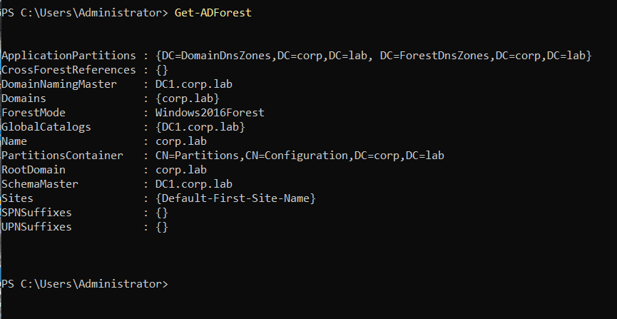

# FSMO Roles — corp.lab

## Overview

This document describes the **Flexible Single Master Operations (FSMO) roles** implemented in the **Enterprise Windows Infrastructure** lab environment.

FSMO roles are special **Active Directory domain controller responsibilities** that must be handled by **a single domain controller at a time** in order to prevent conflicts in multi-master replication.

Although Active Directory allows multiple domain controllers to update directory data simultaneously, certain operations require a **single authoritative controller**. These responsibilities are assigned through FSMO roles.

There are **five FSMO roles** in every Active Directory environment:

- Schema Master
- Domain Naming Master
- PDC Emulator
- RID Master
- Infrastructure Master

---

# Domain Context

| Parameter | Value |
|----------|------|
| Domain Name | corp.lab |
| NetBIOS Name | CORP |
| Forest Functional Level | Windows Server 2016 |
| Domain Functional Level | Windows Server 2016 |
| Domain Controllers | DC1 |

At the current stage of the lab environment, **all FSMO roles are hosted on the primary domain controller DC1**.

This configuration is expected because the infrastructure currently contains **a single domain controller**.


---

# FSMO Role Categories

FSMO roles are divided into **two categories** depending on their scope.

## Forest-Wide Roles

Forest-wide roles exist **once per Active Directory forest**.

| Role | Function |
|-----|----------|
| Schema Master | Controls modifications to the Active Directory schema |
| Domain Naming Master | Controls the addition and removal of domains in the forest |

---

## Domain-Wide Roles

Domain-wide roles exist **once per Active Directory domain**.

| Role | Function |
|-----|----------|
| PDC Emulator | Handles password updates, time synchronization, and legacy compatibility |
| RID Master | Allocates RID pools used to generate security identifiers (SIDs) |
| Infrastructure Master | Maintains references to objects in other domains |

---

# Current FSMO Role Holders

The FSMO role distribution for the **corp.lab** domain was verified using the following command.

```powershell
netdom query fsmo
```


### Command Output Interpretation

| FSMO Role | Role Holder |
|-----------|-------------|
| Schema Master | DC1.corp.lab |
| Domain Naming Master | DC1.corp.lab |
| PDC Emulator | DC1.corp.lab |
| RID Master | DC1.corp.lab |
| Infrastructure Master | DC1.corp.lab |

Because the lab currently contains only **one domain controller**, all FSMO roles are expected to reside on **DC1**.


---

# Forest FSMO Verification

Forest-level FSMO roles were verified using PowerShell.

```powershell
Get-ADForest
```


### Relevant Output Parameters

| Parameter | Value |
|-----------|------|
| Forest | corp.lab |
| DomainNamingMaster | DC1.corp.lab |
| SchemaMaster | DC1.corp.lab |
| GlobalCatalogs | DC1.corp.lab |

This confirms that **DC1 holds the forest-wide FSMO roles**.


---

# FSMO Role Responsibilities

## Schema Master

The **Schema Master** controls updates to the **Active Directory schema**.

The schema defines:

- object classes
- attribute definitions
- directory structure rules

Schema updates are rare and typically occur when installing enterprise software such as:

- Microsoft Exchange
- System Center
- Azure AD Connect

---

## Domain Naming Master

The **Domain Naming Master** manages the addition or removal of domains in the forest.

Operations requiring this role include:

- creating a new child domain
- removing an existing domain
- modifying the forest structure

---

## PDC Emulator

The **PDC Emulator** is one of the most important FSMO roles in most environments.

Key responsibilities include:

- password change replication
- account lockout processing
- domain time synchronization
- Group Policy compatibility
- legacy Windows system support

All domain controllers synchronize their system time with the **PDC Emulator**, making it the **primary time authority of the domain**.

---

## RID Master

The **RID Master** allocates **Relative Identifier (RID) pools** to domain controllers.

RIDs are used to generate **unique Security Identifiers (SIDs)** for objects such as:

- users
- groups
- computers

Without available RID pools, domain controllers cannot create new security principals.

---

## Infrastructure Master

The **Infrastructure Master** maintains object reference integrity between domains.

Its primary responsibility is to update references when objects from other domains are renamed or moved.

In a **single-domain environment**, this role has minimal operational impact.

---

# FSMO Failure Considerations

If a domain controller hosting FSMO roles becomes unavailable, different services may be affected depending on the role.

| Role | Impact if Unavailable |
|-----|-----------------------|
| Schema Master | Schema modifications cannot occur |
| Domain Naming Master | New domains cannot be added to the forest |
| PDC Emulator | Password changes and time synchronization may be disrupted |
| RID Master | Creation of new users, groups, and computers may eventually fail |
| Infrastructure Master | Cross-domain object references may not update |

Proper infrastructure design typically includes **multiple domain controllers** to ensure redundancy.

---

# Future FSMO Design (When DC2 Is Deployed)

When the secondary domain controller **DC2** is deployed, FSMO roles may be redistributed to improve redundancy and load balancing.

A typical enterprise distribution could be:

| FSMO Role | Recommended Server |
|----------|--------------------|
| Schema Master | DC1 |
| Domain Naming Master | DC1 |
| RID Master | DC1 |
| PDC Emulator | DC2 |
| Infrastructure Master | DC2 |

This distribution helps balance critical responsibilities between controllers.

---

# FSMO Role Verification Commands

Administrators can verify FSMO roles using the following commands.

### Domain FSMO Roles

```powershell
netdom query fsmo
```

### Forest FSMO Roles

```powershell
Get-ADForest
```

### Domain Information

```powershell
Get-ADDomain
```

These commands are commonly used during **Active Directory troubleshooting and infrastructure audits**.


---

# Conclusion

The **corp.lab Active Directory domain** currently operates with a **single domain controller (DC1)** hosting all FSMO roles.

This configuration is expected for a single-domain-controller environment.

As the infrastructure evolves and additional domain controllers such as **DC2** are introduced, FSMO roles may be redistributed to improve redundancy and operational resilience.
