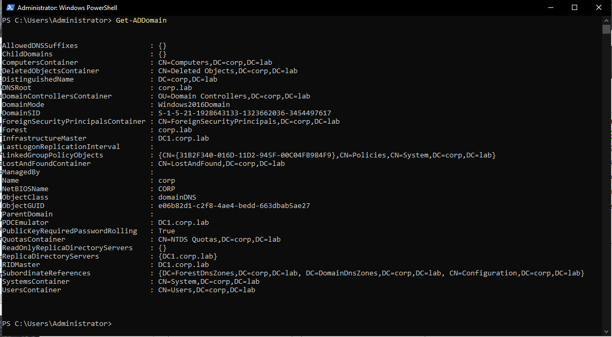
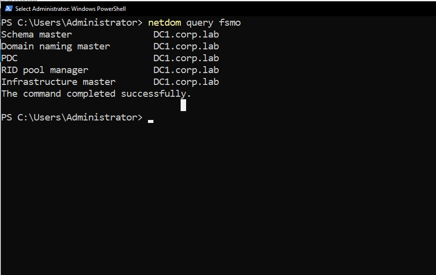
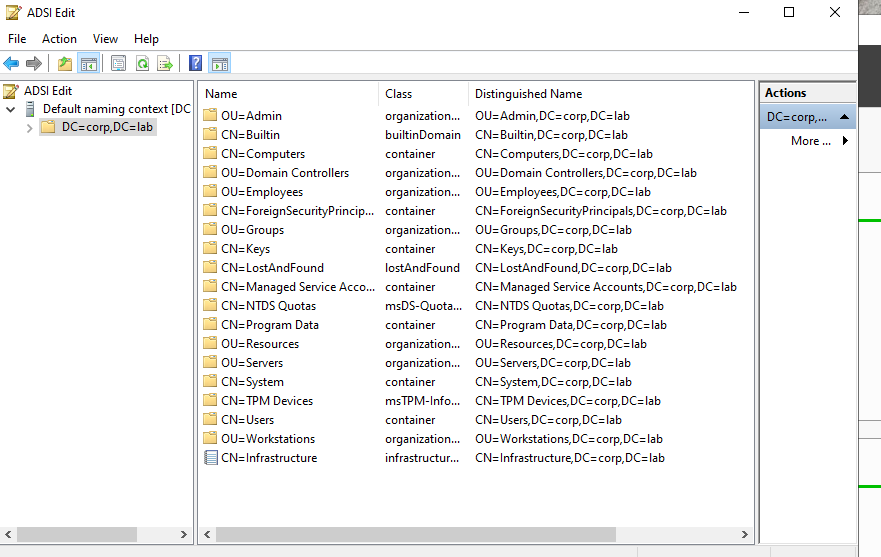
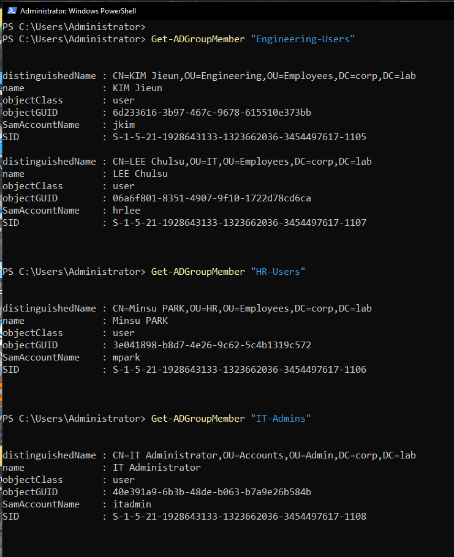
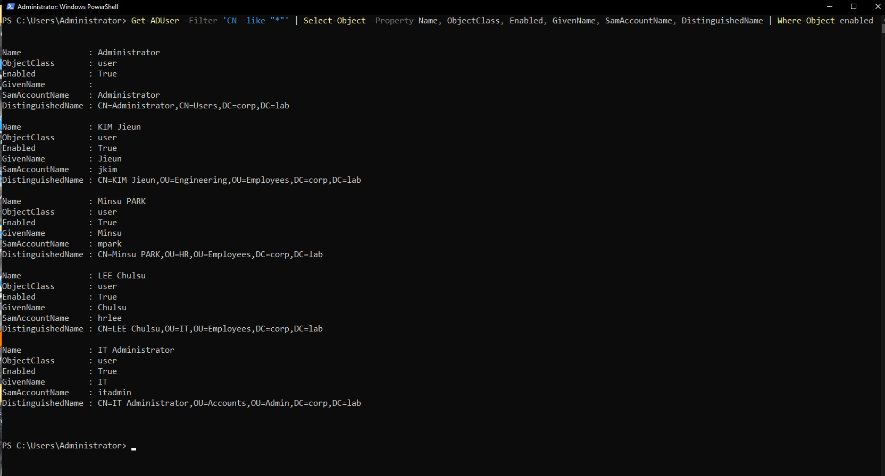
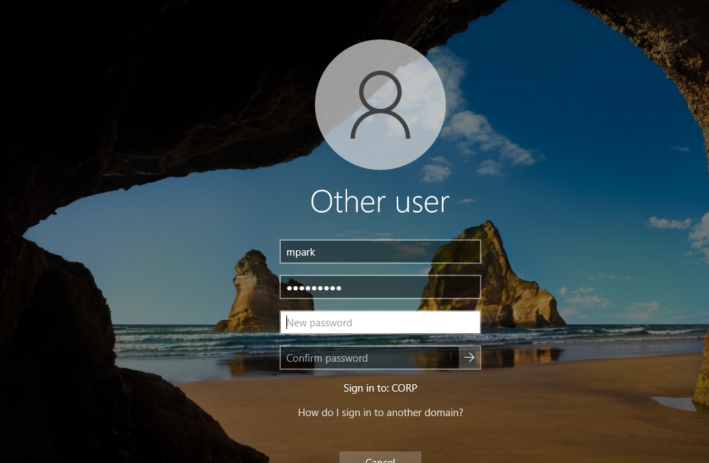
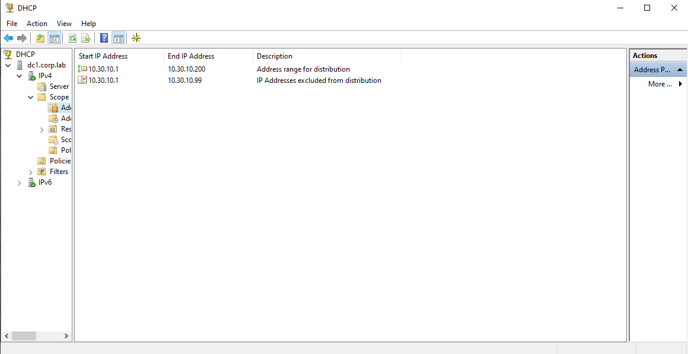

# OU Design — corp.lab

## Overview

This document describes the **Organizational Unit (OU) design** implemented in the **Enterprise Windows Infrastructure** lab environment.

Organizational Units provide a structured way to organize objects inside **Active Directory** and enable administrators to:

- logically organize directory objects
- apply **Group Policy** in a controlled way
- delegate administrative tasks
- separate infrastructure components
- simplify operational management

The OU design implemented in this environment follows **common enterprise Active Directory design practices** used in production corporate infrastructures.

---

# Domain Context

| Parameter | Value |
|----------|------|
| Domain Name | corp.lab |
| NetBIOS Name | CORP |
| Directory Service | Active Directory Domain Services |
| Domain Controllers | DC1, DC2 |

Distinguished naming context:

```
DC=corp,DC=lab
```

---

# Domain Verification

The Active Directory domain configuration can be verified using PowerShell.

### Command

```powershell
Get-ADDomain
```



---

# FSMO Role Verification

Flexible Single Master Operation (FSMO) roles can be verified using:

```powershell
netdom query fsmo
```


---

# Active Directory Naming Context

The Active Directory naming context structure can be inspected using **ADSI Edit**.


---

# OU Design Principles

The OU structure follows several enterprise design principles.

## Separation of Object Types

Objects are organized into logical categories:

- administrative accounts
- servers
- workstations
- employees
- resources
- security groups

This separation allows different **Group Policies**, **permissions**, and **administrative controls** to be applied.

---

## Group Policy Targeting

Organizational Units allow **Group Policy Objects (GPOs)** to be targeted precisely.

Example:

| Policy | Target OU |
|------|------|
Workstation Security Baseline | Workstations |
Server Hardening Policy | Servers |
Printer Deployment | Employees |
Administrative Restrictions | Admin |

This ensures policies affect **only intended systems**.

---

## Administrative Delegation

OUs can also support **administrative delegation**.

Examples include:

- HR administrators managing HR user accounts
- IT administrators managing infrastructure servers

Although delegation is not implemented in this lab, the OU design supports it.

---

# OU Structure

The following Organizational Unit hierarchy exists inside **corp.lab**.

```
corp.lab
│
├── Admin
│   ├── Accounts
│   └── Workstations
│
├── Servers
│   ├── Infrastructure
│   ├── File
│   ├── Print
│   ├── Update
│   └── Application
│
├── Workstations
│   ├── Desktops
│   ├── Laptops
│   └── Test
│
├── Resources
│   ├── Printers
│   └── Shared Folders
│
├── Employees
│   ├── HR
│   ├── Engineering
│   ├── IT
│   └── Service Accounts
│
└── Groups
    ├── Security
    └── Distribution
```


---

# Administrative OU

## Admin

The **Admin OU** contains privileged administrative objects used to manage the infrastructure.

Sub-OUs:

| OU | Purpose |
|----|------|
Accounts | Administrative user accounts |
Workstations | Administrative management computers |

Example administrative account:

| Account | Description |
|------|------|
IT Administrator | Domain administrative account |

Example Distinguished Name:

```
CN=IT Administrator,OU=Accounts,OU=Admin,DC=corp,DC=lab
```

Administrative accounts are separated from normal users to allow **stronger security controls**.

---

# Server OU

## Servers

The **Servers OU** contains all domain-joined infrastructure servers.

Sub-OUs:

| OU | Purpose |
|----|------|
Infrastructure | Core infrastructure servers |
File | File servers |
Print | Print servers |
Update | Patch management servers |
Application | Application servers |

Example server placement:

| Server | OU |
|------|------|
DC1 | Infrastructure |
DC2 | Infrastructure |
FS1 | File |
PS1 | Print |
WSUS1 | Update |
APP1 | Application |

This separation allows different policies to be applied depending on server role.

Examples include:

- server security baseline
- auditing policies
- patch management policies

---

# Workstation OU

## Workstations

The **Workstations OU** contains domain-joined client computers.

Sub-OUs:

| OU | Purpose |
|----|------|
Desktops | Standard desktop systems |
Laptops | Portable devices |
Test | Testing machines |

Example workstation placement:

| Computer | OU |
|------|------|
WIN10-01 | Desktops |
WIN11-01 | Laptops |

Typical workstation policies include:

- Windows firewall configuration
- endpoint security controls
- device restrictions
- software deployment

---

# Resources OU

## Resources

The **Resources OU** organizes shared infrastructure resources.

Sub-OUs:

| OU | Purpose |
|----|------|
Printers | Network printers |
Shared Folders | Shared storage resources |

This separation simplifies management of shared infrastructure services.

---

# Employees OU

## Employees

The **Employees OU** contains standard user accounts.

Sub-OUs:

| OU | Purpose |
|----|------|
HR | Human resources department |
Engineering | Engineering department |
IT | IT department users |
Service Accounts | Application service accounts |

Example users:

| User | Department |
|------|------|
mpark | HR |
jkim | Engineering |
hrlee | IT |

Example Distinguished Name:

```
CN=PARK MINSU,OU=HR,OU=Employees,DC=corp,DC=lab
```

Departmental OUs enable:

- department-specific Group Policies
- easier user management
- access control for departmental resources

---

# Group Management

Security groups are stored inside the **Groups OU**.

Sub-OUs:

| OU | Purpose |
|----|------|
Security | Permission-based groups |
Distribution | Email distribution groups |

Example security groups created in the lab:

| Group | Purpose |
|------|------|
HR-Users | HR department users |
Engineering-Users | Engineering department users |
IT-Admins | IT administrative group |

Example Distinguished Name:

```
CN=Engineering-Users,OU=Security,OU=Groups,DC=corp,DC=lab
```

---

# Group Verification

Group membership can be verified using PowerShell.

### Example commands

```powershell
Get-ADGroupMember "Engineering-Users"
Get-ADGroupMember "HR-Users"
Get-ADGroupMember "IT-Admins"
```



---

# User Verification

User accounts and their OU placement can be verified with:


---

# Client Domain Join Verification

The domain join process can be observed from a Windows client.


---

# User Login Verification

After joining the domain, users authenticate using domain credentials.




---

# DHCP Configuration

DHCP services distribute IP addresses to client systems.



---

# Router Configuration

The VyOS router forwards DHCP requests between networks using **DHCP relay**.


---

# Benefits of the OU Design

The implemented OU design provides several operational advantages.

## Structured Directory Organization

Objects are grouped logically by function, improving administrative clarity.

## Controlled Policy Deployment

Group Policies can be applied only where necessary.

## Security Separation

Administrative accounts are isolated from standard user accounts.

## Infrastructure Scalability

The structure allows the infrastructure to grow without redesigning the directory.

---

# Verification

The OU structure can be verified using PowerShell.

```powershell
Get-ADOrganizationalUnit -Filter *
```

This command lists all Organizational Units present in the **corp.lab** domain.
