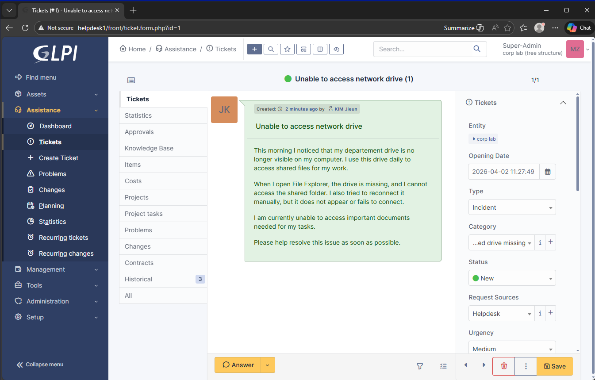
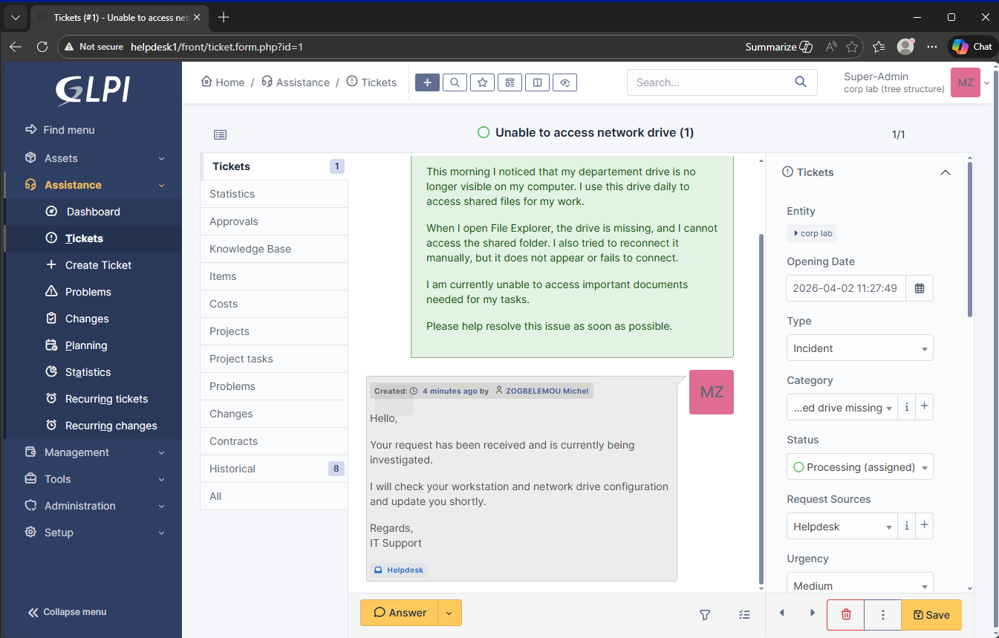
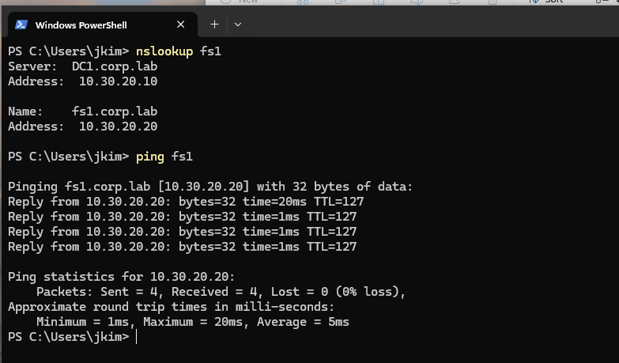
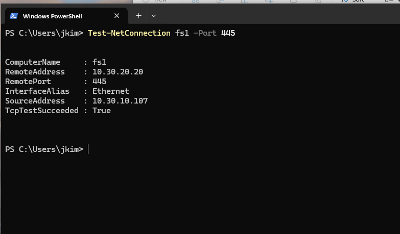
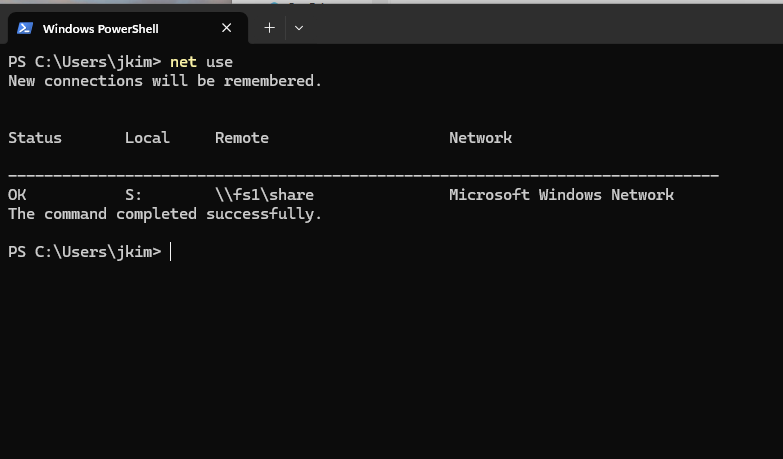
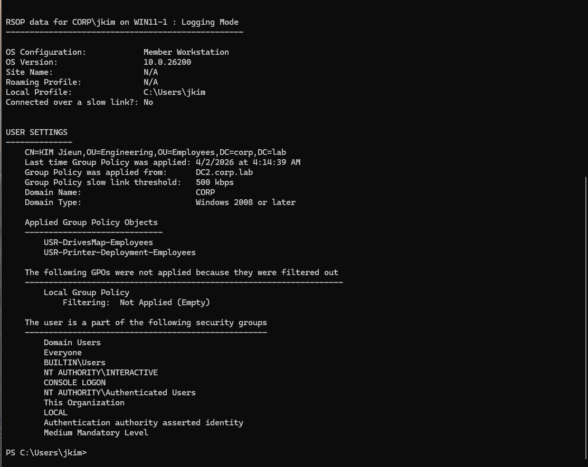
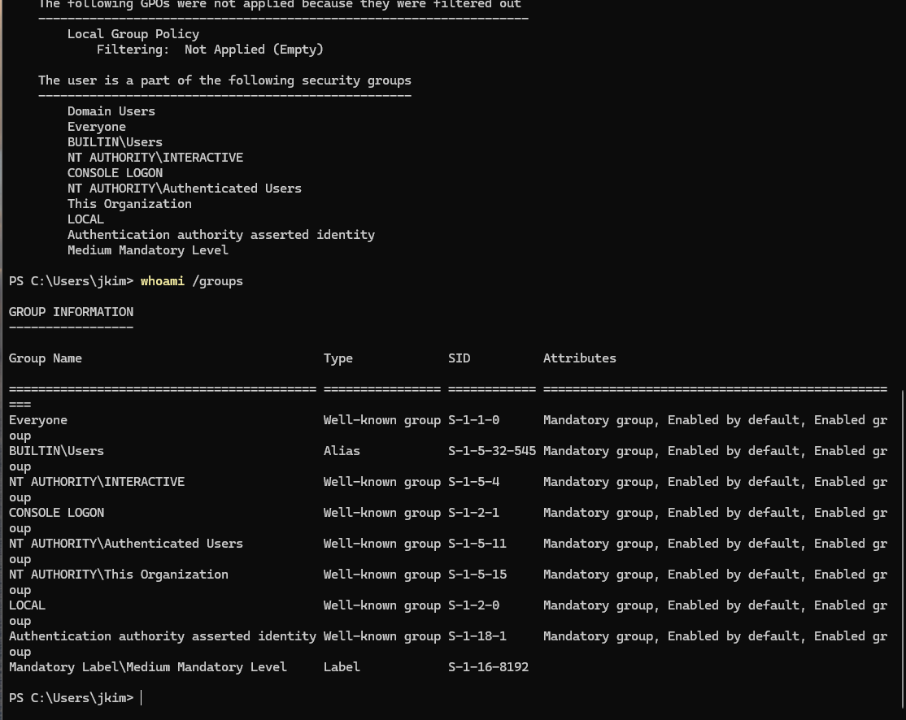
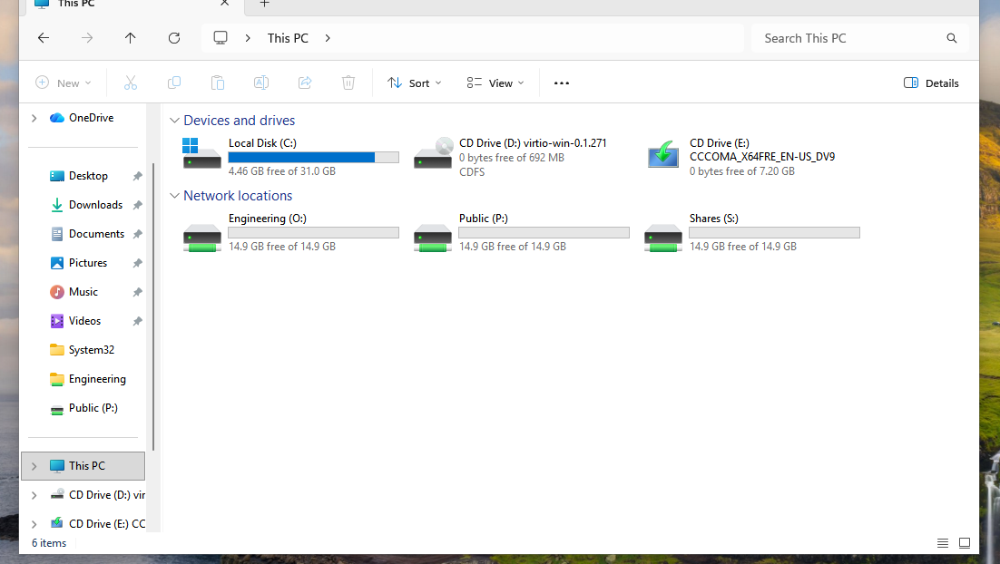
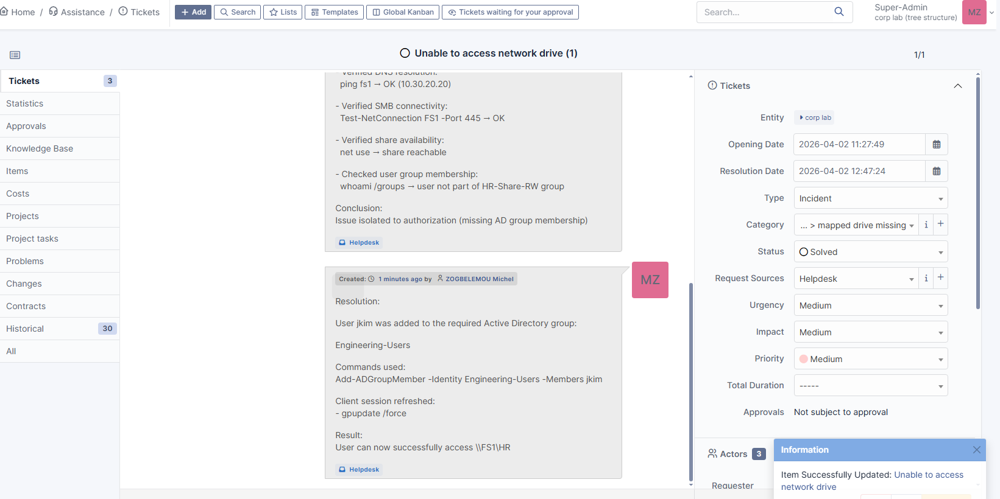
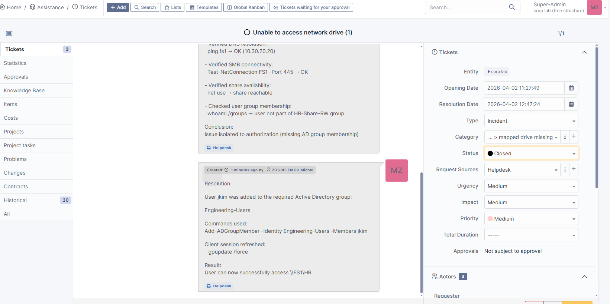

# Incident Report — Missing Network Drive Access

## Overview

This document describes the investigation and resolution of a user-reported issue where a mapped network drive was missing on a workstation in the corp.lab environment.

The incident was handled through the GLPI helpdesk platform using a structured troubleshooting approach.

---

## Incident Summary

| Parameter        | Value                              |
|-----------------|------------------------------------|
| Ticket ID       | 1                                  |
| Title           | Unable to access network drive      |
| User            | jkim (Engineering Department)       |
| Priority        | Medium                             |
| Category        | File Share / Mapped Drive Missing   |
| Status          | Solved                             |

---

## User Report

The user reported:

- Network drive missing from File Explorer  
- Unable to reconnect manually  
- Unable to access shared files required for daily work  

---

## Initial Helpdesk Response

The ticket was acknowledged and assigned.

Response sent:

Hello,  
Your request has been received and is currently being investigated.  
I will check your workstation and network drive configuration and update you shortly.  

Regards,  
IT Support  

---

## Investigation Process

### Step 1 — Network connectivity and DNS Resolution

Command:

nslookup fs1
ping fs1

Result:

- fs1.corp.lab resolved correctly  
- IP: 10.30.20.20  
- No packet loss  

Conclusion:

DNS is working correctly.

---

### Step 2 — SMB Connectivity

Command:

Test-NetConnection FS1 -Port 445

Result:

- Port 445 reachable  

Conclusion:

SMB service is accessible and not blocked.

---

### Step 3 — Share Accessibility

Command:

net use

Result:

- Network shares reachable manually  

Conclusion:

File server and shares are operational.

---

### Step 4 — Group Policy Verification

Command:

gpresult /r /scope user

Findings:

- GPOs applied:
  - USR-DrivesMap-Employees  
  - USR-Printer-Deployment-Employees  

Conclusion:

Drive mapping policy is correctly applied.

---

### Step 5 — User Group Membership

Command:

whoami /groups

Findings:

- User is NOT part of the required Active Directory group  

Conclusion:

Issue is related to authorization (not network or GPO).

---

## Root Cause

The issue was caused by missing Active Directory group membership.

The user was not part of the security group required to access the shared folder.

---

## Resolution

### Action Taken

User added to the correct Active Directory group:

Add-ADGroupMember -Identity Engineering-Users -Members jkim

---

### Client Policy Refresh

gpupdate /force

---

## Validation

After applying the fix:

- Network drives appeared correctly  
- User successfully accessed the shared folder  

Path:

\\FS1\HR

---

## Ticket Closure

- Ticket status updated to Solved  
- Resolution documented in GLPI  
- User confirmed access restored  

---

## Key Takeaways

### Technical

- DNS and network must be validated first  
- SMB connectivity confirms service availability  
- GPO application does not guarantee access  
- Authorization depends on Active Directory group membership  

### Operational

- Structured troubleshooting reduces resolution time  
- Clear communication improves user experience  
- Proper documentation ensures reproducibility  

---

## Skills Demonstrated

- Active Directory group management  
- Group Policy troubleshooting  
- SMB and file server validation  
- Windows troubleshooting methodology  
- Helpdesk workflow using GLPI  
- Incident documentation  

---

## Improvement / Prevention

- Validate group membership during user onboarding  
- Create a checklist for mapped drive access  
- Automate group assignment using PowerShell  

---

## Architecture Context

User Workstation (WIN11-01)  
        ↓  
Group Policy (Drive Mapping)  
        ↓  
Active Directory (Authorization via Groups)  
        ↓  
File Server (FS1)  
        ↓  
Shared Folder Access  

---