# Incident Report — Printer Not Deployed (HR Printer)

## Overview

This document describes the investigation and resolution of an incident where the **HR network printer was not deployed** on a user workstation within the **corp.lab** domain.

The issue was reported through the **GLPI helpdesk system** and handled following a standard troubleshooting workflow.

---

## Incident Summary

| Parameter           | Value                                  |
|--------------------|----------------------------------------|
| Ticket ID          | #2                                     |
| Title              | Missing HR printer on workstation      |
| User               | Park Minsu                            |
| Workstation        | WIN10-01                              |
| Category           | Printer not deployed                  |
| Impact             | Medium                                |
| Urgency            | Medium                                |
| Status             | Resolved                              |

---

## User Description

The user reported:

- HR printer not visible in devices
- Printer not available during print operations
- Other network resources functioning correctly


---

## Initial Hypothesis

Based on the symptoms:

- Network connectivity likely functional
- DNS resolution likely functional
- Possible causes:
  - GPO not applied
  - Security group mismatch
  - Printer deployment filtering issue

---

## Investigation Steps

### 1. Network Connectivity Validation

#### DNS Resolution

```powershell
nslookup ps1
```

Result:
- ps1.corp.lab resolved correctly

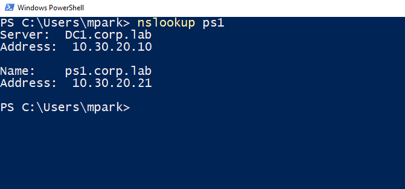

---

#### Network Reachability

```powershell
ping ps1
```

Result:
- Successful replies

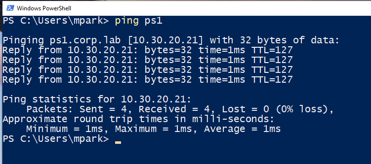

---

#### SMB Port Connectivity

```powershell
Test-NetConnection ps1 -Port 445
```

Result:
- TcpTestSucceeded: True

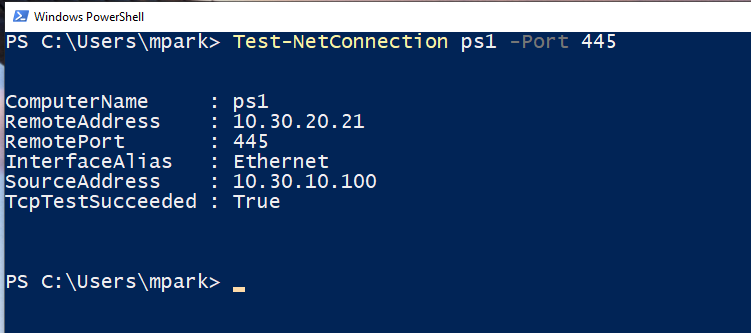

---

### 2. File Share Validation

```powershell
net use
```

Result:
- Existing network shares accessible

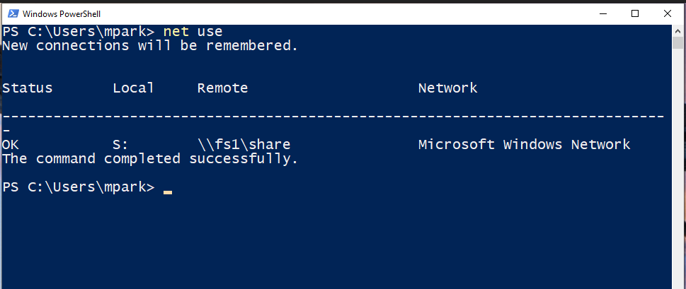

---

### 3. Group Policy Validation

```powershell
gpresult /r
```

Observation:

- GPO `USR-Printer-Deployment-Employees` applied
- No filtering error at GPO level

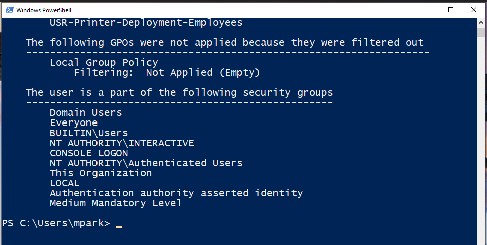

---

### 4. User Group Membership Check

```powershell
whoami /groups
```

Observation:

- User NOT member of `HR-Users` group

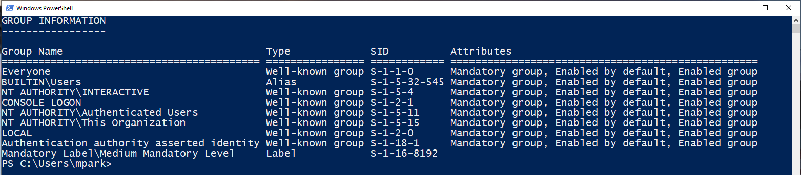

---

## Root Cause

The printer deployment GPO was correctly applied, but:

> The printer was deployed using **Item-Level Targeting based on Active Directory group membership**, and the user was **not part of the required `HR-Users` security group**.

---

## Resolution

### 1. Add User to Required Group

```powershell
net group HR-Users mpark /add /domain
```

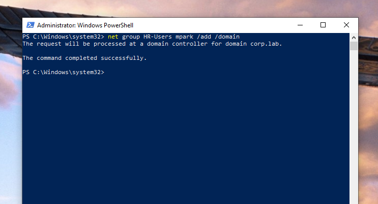

---

### 2. Refresh Group Policy

```powershell
gpupdate /force
```

---

### 3. Validate Group Membership

```powershell
whoami /groups
```

Result:
- User now member of `HR-Users`

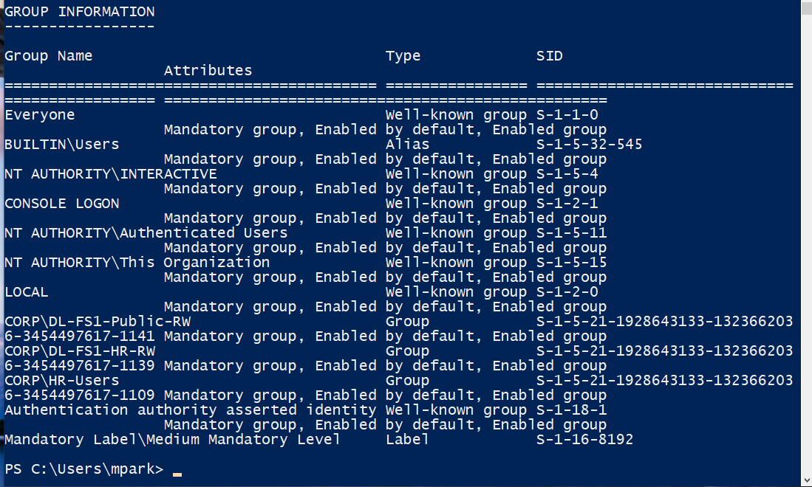

---

### 4. Validate Printer Deployment

```powershell
Get-Printer
```

Result:
- `\\PS1\HR-PRINTER` successfully deployed

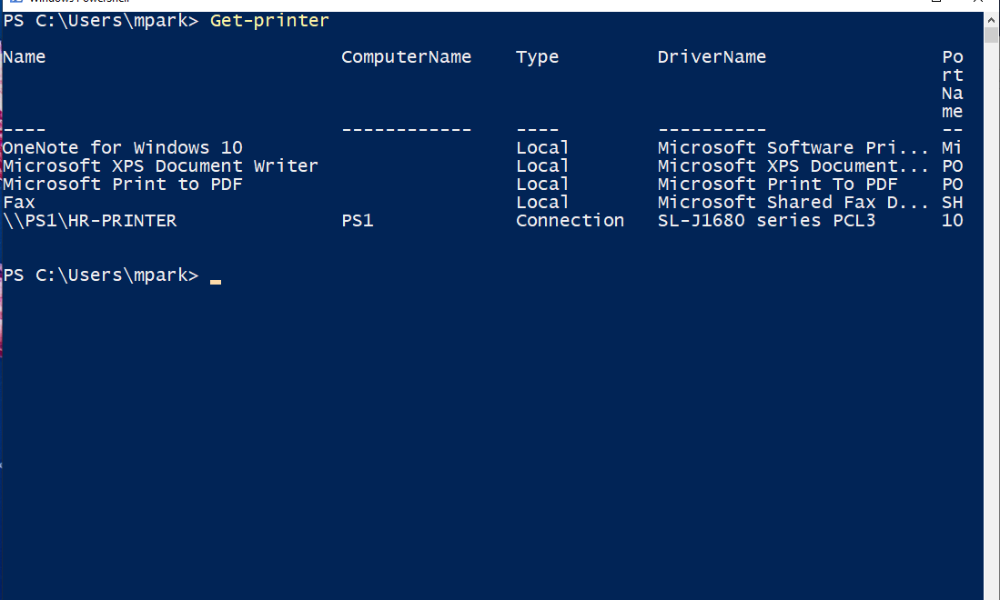


---

## Result

The HR printer was successfully deployed to the user workstation after correcting group membership.

The incident was resolved and the ticket closed in GLPI.

📸 Screenshot Placeholder:

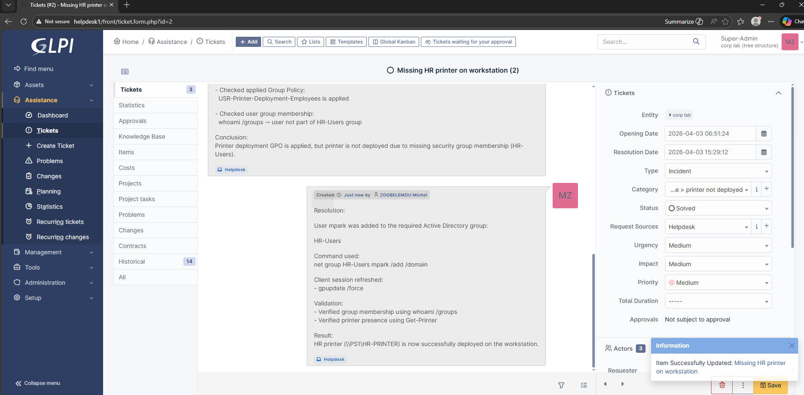

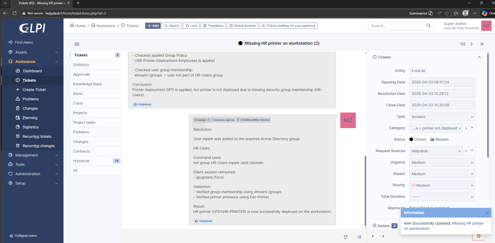


---

## Technical Analysis

### Why It Happened

- Printer deployment relies on:
  - GPO linkage (correct)
  - Security filtering (correct)
  - Item-level targeting (critical)

- Missing group membership prevented GPO preference from applying

---

## Prevention Measures

- Implement onboarding checklist:
  - Ensure users are assigned to correct departmental groups

- Periodic validation:
  - Audit group membership vs department

- Improve monitoring:
  - Add logging or reporting for GPO deployment failures

---

## Operational Takeaways

This incident demonstrates:

- Proper layered troubleshooting methodology
- Importance of:
  - DNS validation
  - Network validation
  - GPO validation
  - Identity (group membership)

- Real-world enterprise issue:
  > Configuration is correct, but identity is wrong

---

## Skills Demonstrated

- Active Directory group management
- GPO troubleshooting (User Configuration + Preferences)
- Network diagnostics (DNS, ICMP, SMB)
- Windows PowerShell troubleshooting
- Incident handling using GLPI
- Root cause analysis

---

## Conclusion

This incident highlights a common enterprise scenario where **access control (group membership)** directly impacts service delivery.

The resolution confirms that:

- Infrastructure was correctly configured
- Issue originated from identity misalignment
- Proper troubleshooting methodology leads to fast resolution
