# FS1 File Server Deployment — corp.lab

## Overview

This document describes the deployment, configuration, and validation of the **FS1 File Server** in the **corp.lab** environment.

The objective is to provide **secure, role-based file sharing** using:

- Active Directory group-based access control (AGDLP)
- NTFS permissions
- SMB shares
- Departmental data isolation

---

## Architecture Context

This deployment follows a structured enterprise design:

- Dedicated data volume (F:)
- Department-based folder structure
- Access controlled via nested Active Directory groups
- No direct user permission assignment

---

## Active Directory Design

### Department Groups (Global)

- HR-Users  
- Engineering-Users  
- IT-Admins  

### Resource Groups (Domain Local)

- DL-FS1-HR-RW  
- DL-FS1-Engineering-RW  
- DL-FS1-Public-RW  
- DL-FS1-IT-RW  

### Group Nesting (AGDLP Model)

- HR-Users → DL-FS1-HR-RW  
- Engineering-Users → DL-FS1-Engineering-RW  
- IT-Admins → DL-FS1-IT-RW  

This follows:

**Accounts → Global Groups → Domain Local Groups → Permissions** 
---

## File System Structure

All data is stored on a dedicated 15 GB partition:

F:\Shares
├── HR
├── Engineering
├── Public
└── IT


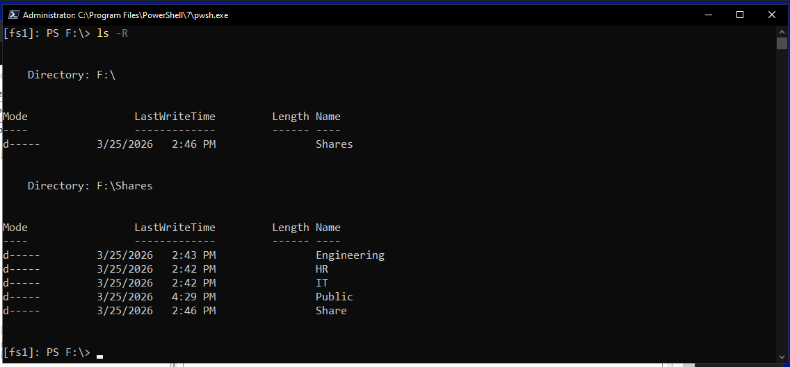

---

## Deployment Procedure

### Step 1 — Install File Server Role

Installed via Server Manager.

Expected result:

- File Server role installed
- FS1 ready to host SMB shares

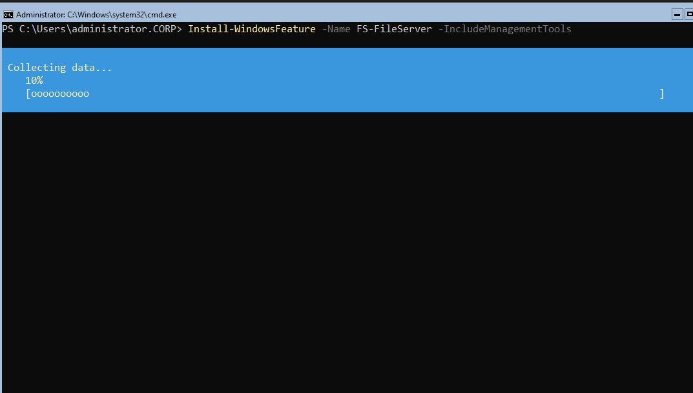


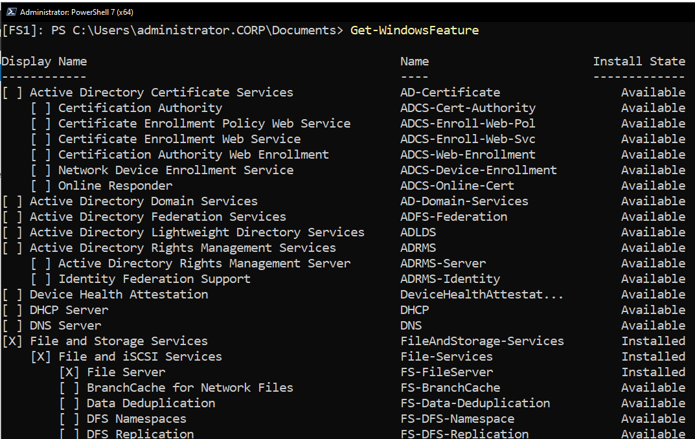

---

### Step 2 — Prepare Data Volume

- Assign 15 GB partition as F:
- Create folders:
```text
F:\Shares\HR
F:\Shares\Engineering
F:\Shares\Public
F:\Shares\IT
```


result:

- All departmental folders exist


---

### Step 3 — Create Resource Groups

Created in Active Directory:

- DL-FS1-HR-RW  
- DL-FS1-Engineering-RW  
- DL-FS1-Public-RW  
- DL-FS1-IT-RW  

result:

- Groups visible in ADUC

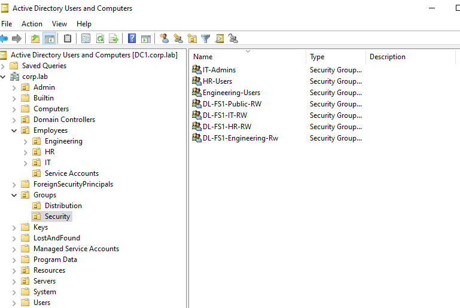

---

### Step 4 — Configure Group Nesting

- Add department groups into resource groups

result:

- Access controlled via group nesting

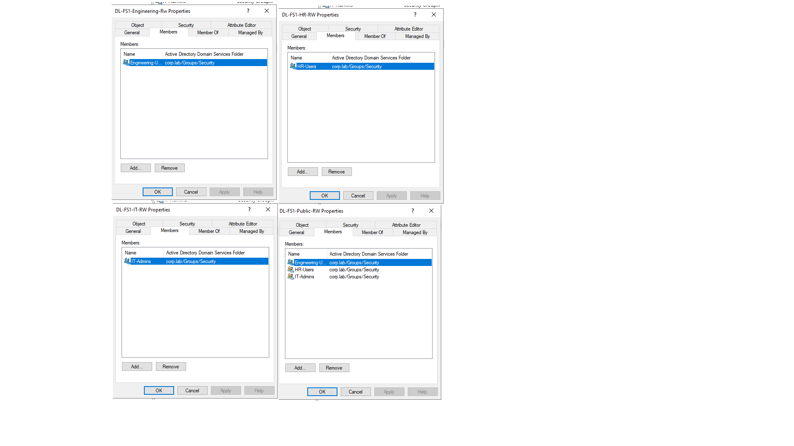
---

### Step 5 — Configure NTFS Permissions

Principles:

- No direct user permissions
- Only resource groups assigned

Example — HR:

| Principal        | Permission   |
|------------------|-------------|
| SYSTEM           | Full Control |
| Administrators   | Full Control |
| DL-FS1-HR-RW     | Modify       |

(Same model for all departments)

[Screenshot Placeholder: NTFS permissions]

---

### Step 6 — Create SMB Shares

Shares created:

| Share Name  | Path                  | Description              |
|-------------|----------------------|--------------------------|
| HR          | F:\Shares\HR         | HR data                  |
| Engineering | F:\Shares\Engineering| Engineering data         |
| Public      | F:\Shares\Public     | Shared data              |
| IT          | F:\Shares\IT         | IT administrative data   |

Expected result:

- Shares accessible over network

[Screenshot Placeholder: Share creation]

---

### Step 7 — Configure Share Permissions

Principles:

- Assign to Everyone
- Keep broad access

Example:

| Principal        | Permission   |
|------------------|-------------|
| everyone    | Full Control |

Final access = **Share + NTFS permissions**

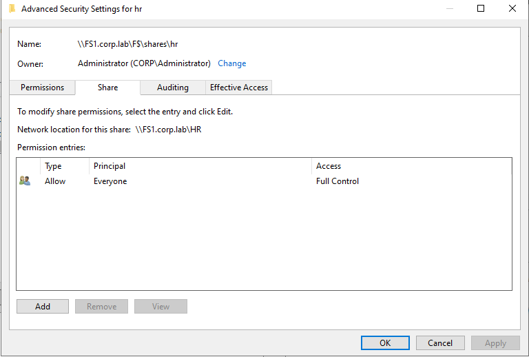

---

## Access-Based Enumeration (ABE)

ABE can be enabled to:

- Hide unauthorized shares/folders
- Improve UX
- Enforce least privilege

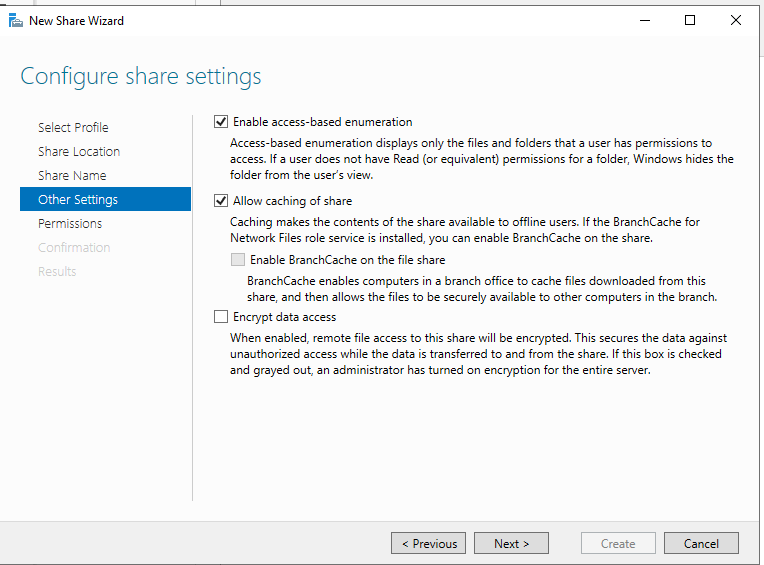

---

## Validation

### Test 1 — HR User

- Access: \\FS1\HR
- Create file
- Attempt \\FS1\Engineering

Result:

- HR access → success
- File creation → success
- Engineering access → denied


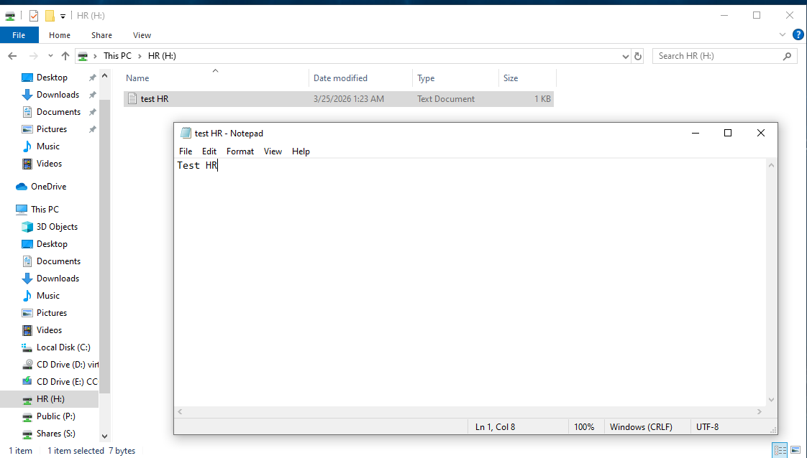

---

### Test 2 — Engineering User

- Access: \\FS1\Engineering
- Create file
- Attempt \\FS1\HR

Expected:

- Engineering access → success
- HR access → denied

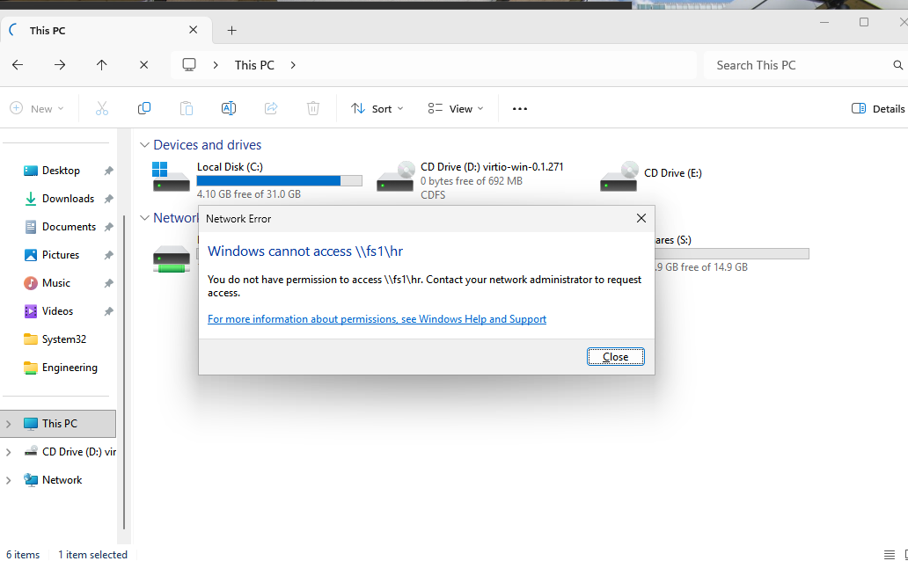


---

### Test 3 — Public Share

- Access: \\FS1\Public
- Create file

Expected:

- Access allowed for authorized users

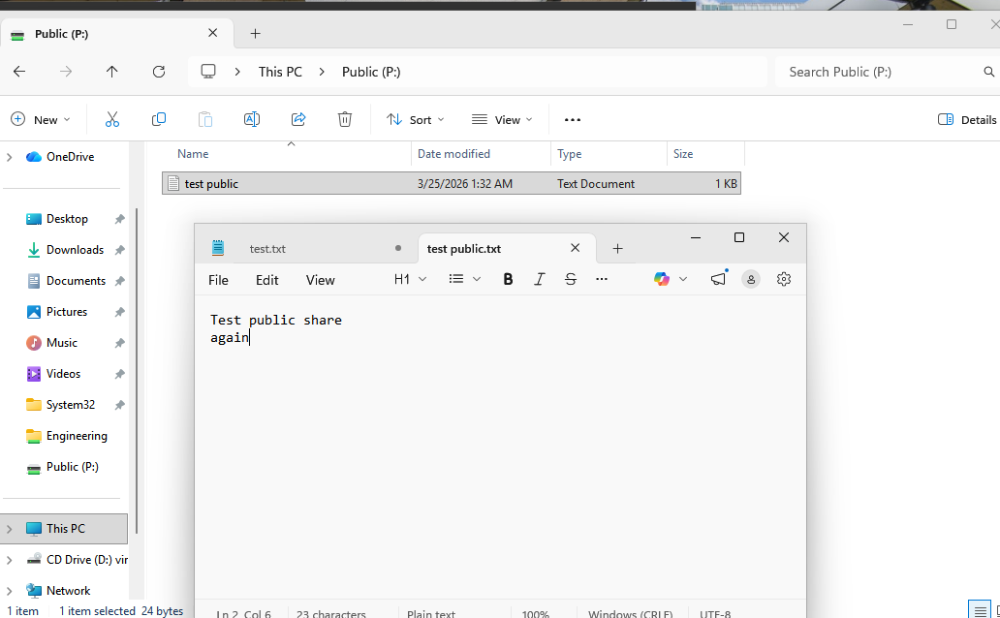

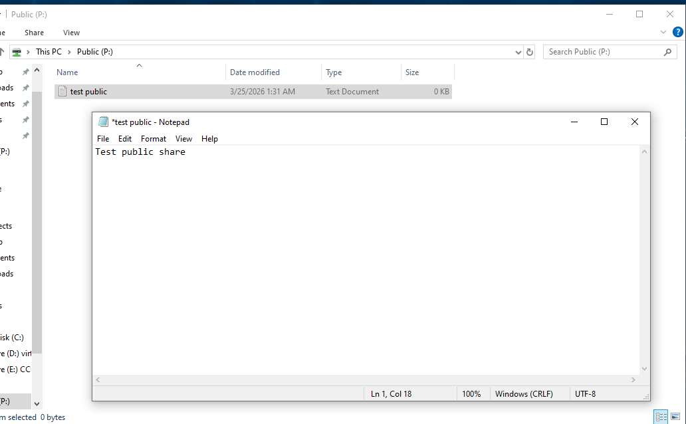

---

---

## Conclusion

The FS1 file server has been successfully deployed as a secure, enterprise-grade file service within the corp.lab environment.

The design ensures:

- Scalable access control
-  Strong security boundaries
- Maintainability and auditability
- Alignment with enterprise best practices