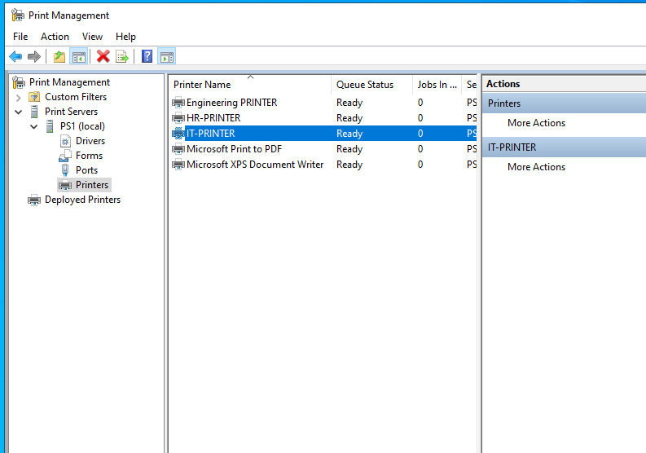
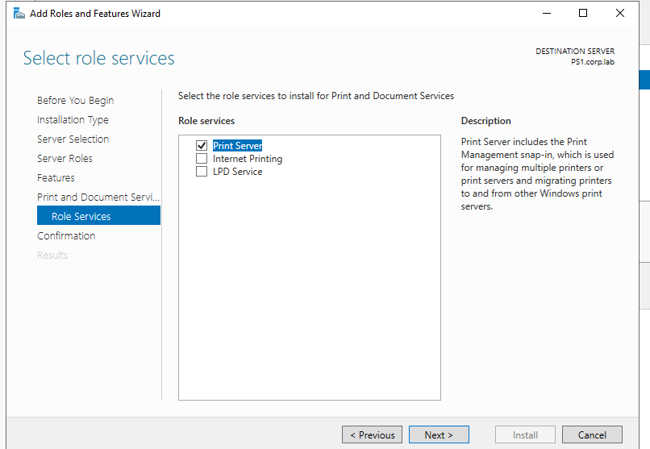
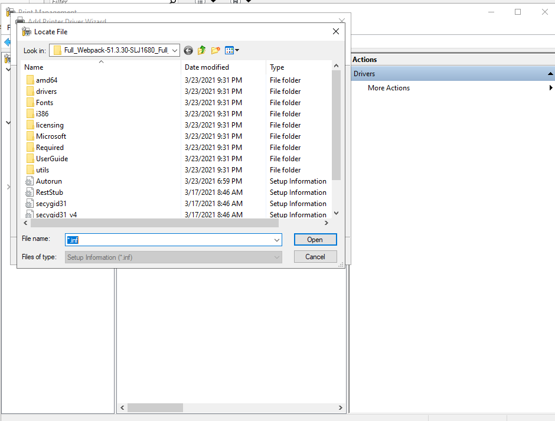
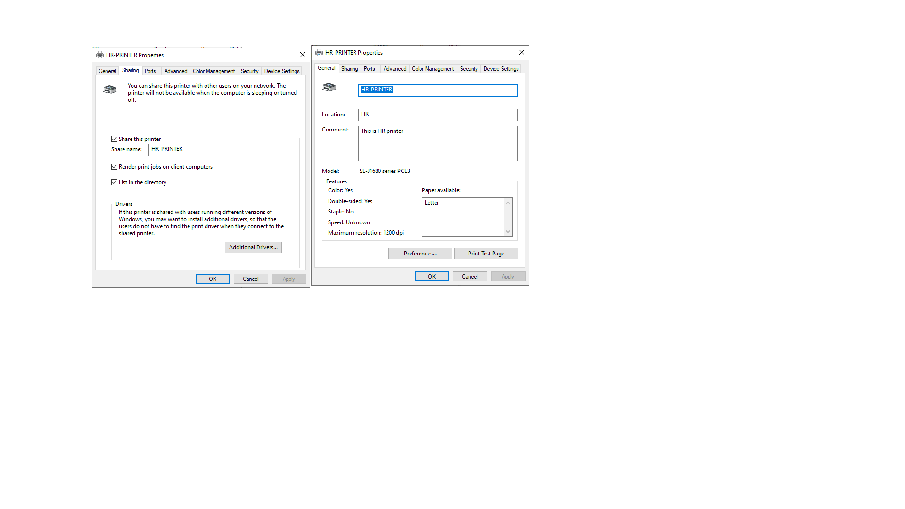
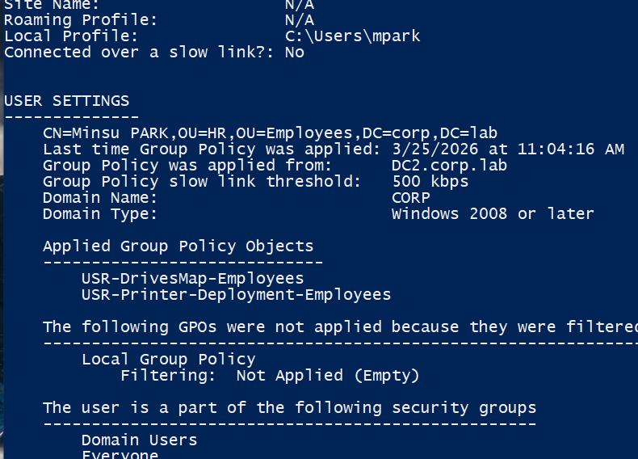
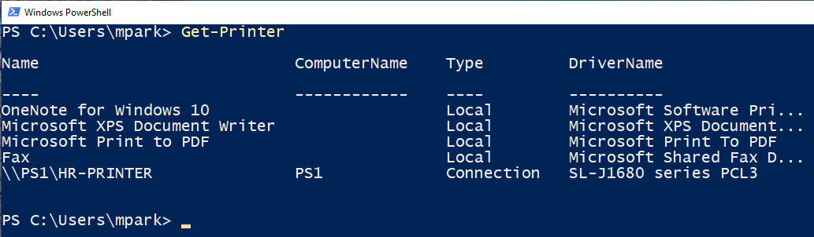
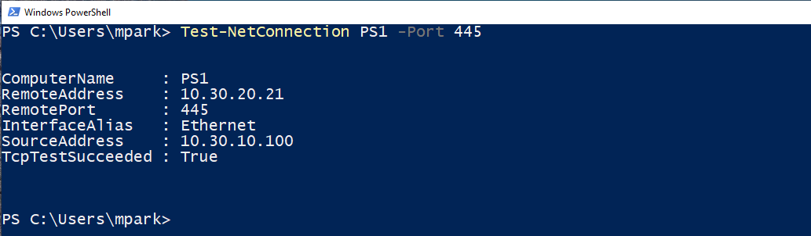
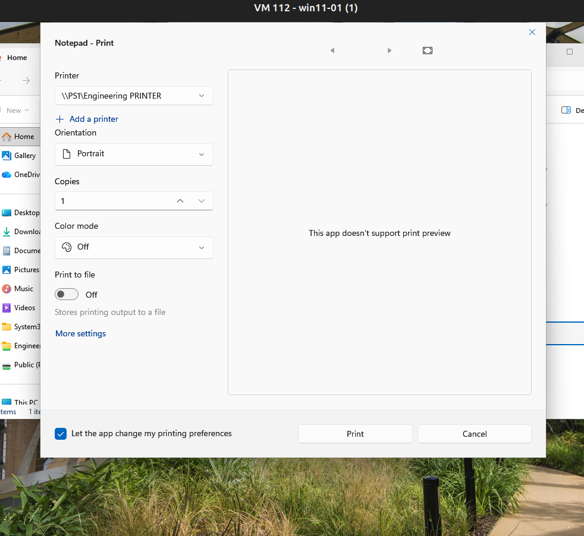

# Print Server Deployment — PS1

## Overview

This document describes the deployment, configuration, and validation of the **Print Server infrastructure** in the **corp.lab** domain.

The objective of this implementation is to provide a **centralized, automated, and role-based printing system** using:

- Windows Server 2022 Print Server (PS1)
- Active Directory integration
- Group Policy–based deployment (user configuration)
- Department-based printer assignment

This setup simulates a **real enterprise printing environment**, focusing on scalability, maintainability, and automation.

---

## Infrastructure Context

| Parameter    | Value                |
|-------------|---------------------|
| Server Name | PS1                 |
| Domain      | corp.lab            |
| Role        | Print Server        |
| OS          | Windows Server 2022 |
| Network     | 10.30.20.0/24       |

PS1 is a **member server** responsible for:

- Hosting shared printers
- Managing printer drivers
- Handling print jobs via the Print Spooler service
- Distributing printers through Group Policy

---

## Architecture

User (HR / Engineering / IT)
        ↓
Active Directory Group Membership
        ↓
GPO (USR-Printer-Deployment-Employees)
        ↓
\\PS1\Printer Share
        ↓
Print Spooler Service (PS1)
        ↓
Client Printer Connection

The architecture ensures that printer access is dynamically assigned based on user group membership.

---

## Printer Configuration

Three departmental printers are configured on PS1.

| Printer Name         | Share Path                   | Department   |
|---------------------|------------------------------|--------------|
| HR-PRINTER          | \\PS1\HR-PRINTER             | HR           |
| ENGINEERING-PRINTER | \\PS1\ENGINEERING-PRINTER    | Engineering  |
| IT-PRINTER          | \\PS1\IT-PRINTER             | IT           |

Each printer is configured with:

- Installed driver (vendor-provided `.inf`)
- Dedicated port configuration
- SMB sharing enabled
- Published in Active Directory
- Client-side rendering enabled

---

## Print Server Setup

### Role Installation

The following role was installed:

- Print and Document Services → Print Server

---

### Driver Management

Printer drivers were manually installed using vendor-provided `.inf` files.

Key considerations:

- Drivers are pre-installed on PS1 to avoid client-side prompts
- Compatible drivers are used for Windows 10 and Windows 11 clients
- Driver consistency is maintained across all printers

---

### Printer Creation

Each printer was configured with:

- Assigned driver
- Configured TCP/IP or local port
- Defined share name
- Location and description metadata

---

## Group Policy Integration

Printers are deployed using the following GPO:

| Parameter | Value                              |
|----------|------------------------------------|
| GPO Name | USR-Printer-Deployment-Employees    |
| Scope    | Employees OU                       |
| Type     | User Configuration                 |
| Method   | Group Policy Preferences           |

Deployment characteristics:

- Single GPO used for all printers
- User-based configuration
- Item-level targeting based on security groups

Detailed GPO configuration is documented separately.

---

## Deployment Logic

Printer assignment is based on Active Directory group membership.

| Printer Name         | Target Group         |
|---------------------|----------------------|
| HR-PRINTER          | HR-Users             |
| ENGINEERING-PRINTER | Engineering-Users    |
| IT-PRINTER          | IT-Users             |

### Logic

- IF user ∈ HR-Users → Deploy HR-PRINTER  
- IF user ∈ Engineering-Users → Deploy ENGINEERING-PRINTER  
- IF user ∈ IT-Users → Deploy IT-PRINTER  

---

## Validation

### GPO Application

Command:
gpresult /r

Result:

- GPO appears under User Settings
- No filtering errors

---

### Printer Deployment Verification

Command:
Get-Printer

Expected result:

- Printer appears as:
  - \\PS1\<PrinterName>
  - Type: Connection

---

### Network Connectivity

Command:
Test-NetConnection PS1 -Port 445

result:

- Successful TCP connection on SMB port 445

---

## User Experience

On client systems:

- Printers appear automatically after login
- Accessible from print dialog
- No manual configuration required

---

## Troubleshooting

### Issue: Printer not appearing

Possible causes:

- GPO not applied
- Incorrect OU linkage
- User not in correct security group

Verification:

Command:
gpresult /r

---

### Issue: Printer not accessible

Possible causes:

- Incorrect share name
- DNS resolution failure
- SMB connectivity issue
- Print Spooler service stopped

Verification:

Command:
ping PS1
Test-NetConnection PS1 -Port 445
Get-Service Spooler

---

### Issue: Stuck print jobs

Verification:

Command:
Get-PrintJob

Resolution:

Command:
Get-PrintJob | Remove-PrintJob
Restart-Service Spooler

---

## Operations

### Restart Print Spooler

Command:
Restart-Service Spooler

### List Printers

Command:
Get-Printer

### Monitor Print Queue

Command:
Get-PrintJob

### Clear Print Queue

Command:
Get-PrintJob | Remove-PrintJob

---

## Security Considerations

- Printer access is controlled via Active Directory security groups
- Only authorized users can access department printers
- Administrative permissions are restricted to IT staff
- Driver installation is controlled at the server level

---

## Impact

- Centralized printer management
- Automated user provisioning
- Reduced manual configuration
- Improved scalability and consistency
- Alignment with enterprise IT practices

---

## Future Improvements

- Replace simulated printers with physical or network printers
- Implement printer usage auditing
- Configure print quotas
- Introduce high availability (secondary print server)
- Centralize logging for print activity

---

## Conclusion

The print server infrastructure in **corp.lab** demonstrates:

- Active Directory integration
- Automated deployment via Group Policy
- Role-based access control
- Operational management of print services