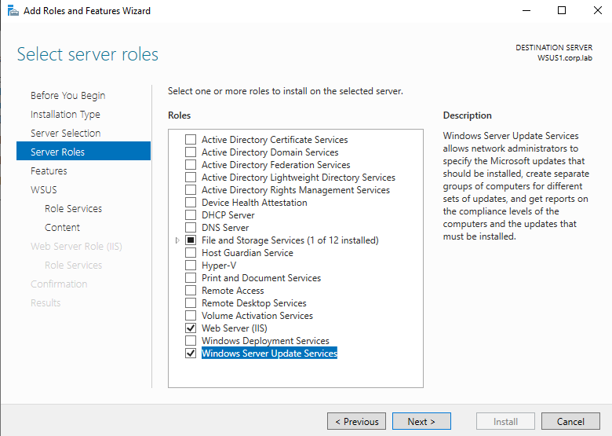
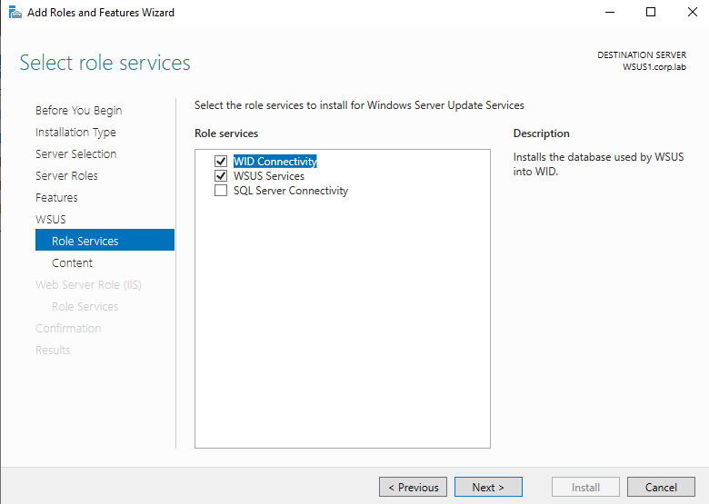
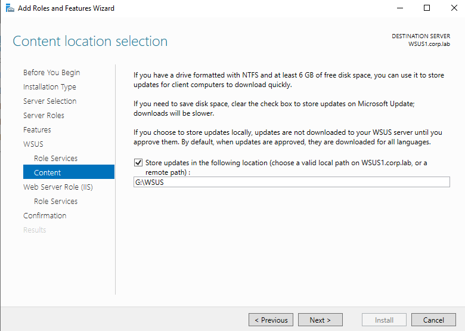
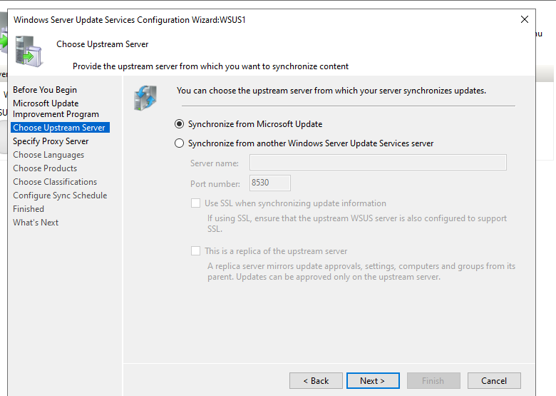
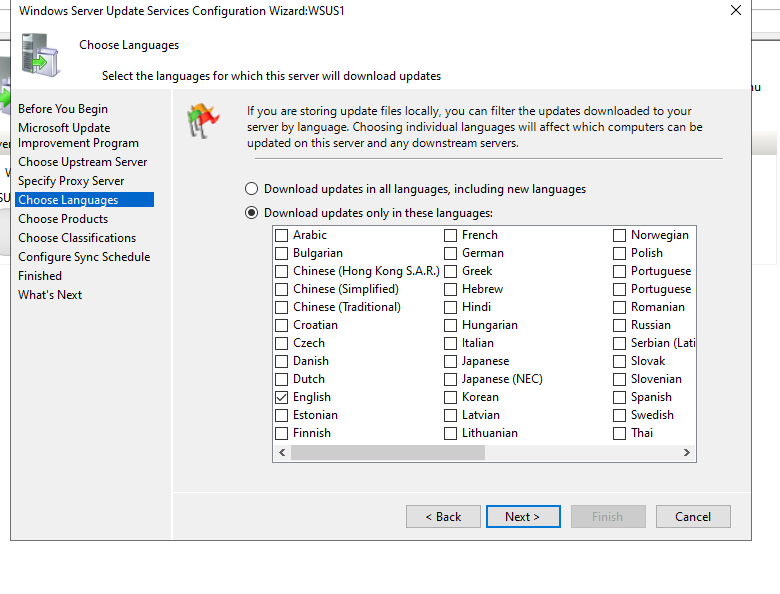
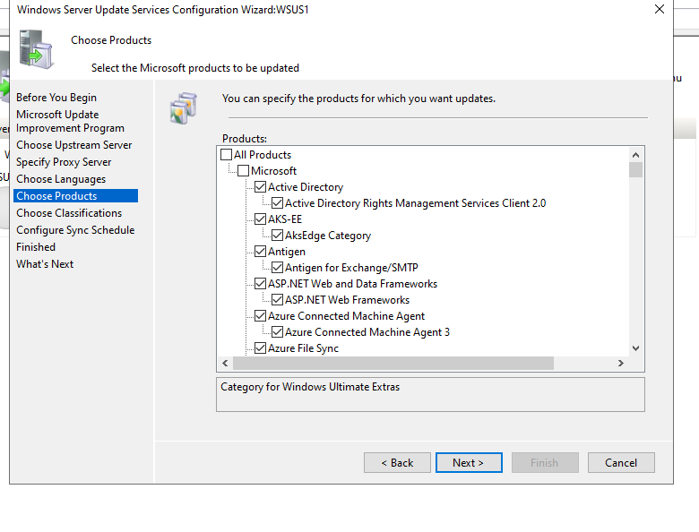
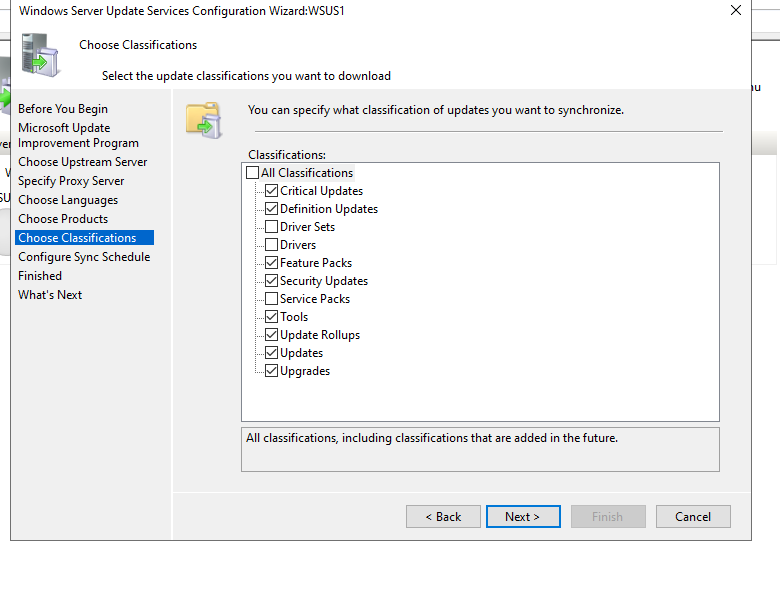
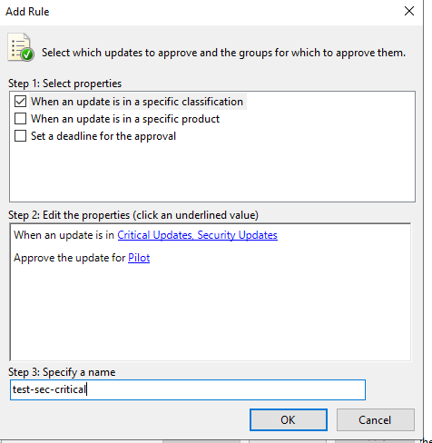

# WSUS Infrastructure — Patch Management Platform

## Overview

This document describes the deployment, configuration, and validation of the Windows Server Update Services (WSUS) platform in the corp.lab domain.

The purpose of this system is to provide a centralized update management service that enables controlled distribution, approval, and monitoring of Microsoft updates across the infrastructure.

---

## Infrastructure Context

| Parameter        | Value                     |
|-----------------|--------------------------|
| Server Name     | WSUS1                    |
| Domain          | corp.lab                 |
| Role            | WSUS Server              |
| OS              | Windows Server 2022      |
| Database        | Windows Internal Database (WID) |
| Content Path    | G:\WSUS                  |
| Port            | 8530 (HTTP)              |

WSUS1 operates as a central update authority, replacing direct communication with Microsoft Update for internal systems.

---

## Architecture

    Microsoft Update
            │
            ▼
        WSUS1
            │
    ┌───────┼────────┬
    │       │        │        
  Pilot  Workstations Servers

WSUS synchronizes updates from Microsoft and distributes them internally based on approval policies.

---

## Installation

### Roles and Features

The following components were installed:

- Windows Server Update Services
- Web Server (IIS)
- .NET Framework 4.8
- WID Connectivity

---

### Database Configuration

- Database Type: Windows Internal Database (WID)

Rationale:

- Simplified deployment
- Suitable for small to medium environments
- No external SQL dependency

---

### Content Storage

- Update storage location: G:\WSUS

Rationale:

- Separation of OS and update content
- Prevents system disk exhaustion
- Improves storage management

---

## Initial Configuration

### Upstream Server

- Source: Microsoft Update

---

### Proxy Configuration

- No proxy configured

---

### Language Selection

- Selected: English

Rationale:

- Reduces synchronization size
- Matches lab systems

---

### Product Selection

Configured products:

- Windows 10
- Windows Server 2016
- Windows Server 2019
- Windows Server 2022
- Windows Server 2025

Rationale:

- Align with deployed systems only
- Avoid unnecessary update downloads

---

### Classification Selection

Enabled:

- Critical Updates
- Security Updates
- Updates
- Update Rollups
- Feature Packs

Disabled:

- Drivers
- Driver Sets

Rationale:

- Prevent unstable driver deployment
- Focus on OS security and stability

---

### Synchronization Schedule

- Mode: Automatic
- Frequency: 2 times per day
- Start time: 03:00 AM

Rationale:

- Ensures up-to-date metadata
- Minimizes peak network usage

---

## WSUS Organization

### Computer Groups

The WSUS server organizes clients into logical groups:

| Group        | Purpose                         |
|--------------|--------------------------------|
| Pilot        | Update testing and validation   |
| Workstations | End-user systems               |
| Servers      | Critical infrastructure systems |

---

## Update Approval Strategy

### Auto-Approval Rules

Defined rules:

Pilot Group:
- Name: test-sec-critical
- Scope: Critical Updates + Security Updates

Workstations:
- Name: Workstation-sec-and-critical
- Scope: Critical Updates + Security Updates

Optional Baseline:
- Critical + Security Updates → All Computers

Rationale:

- Pilot group validates updates before broader deployment
- Reduces risk of production impact

---

## Verification

### WSUS Console

- Synchronization completed successfully
- No errors reported

---

### Client Registration

- Systems appear in WSUS console
- Proper grouping observed (Pilot / Workstations / Servers)

---

### Update Status

- Installation percentages tracked
- Compliance visible per machine

---

## Validation Commands

Trigger update scan:

    usoclient StartScan

Verify connectivity:

    Test-NetConnection wsus1.corp.lab -Port 8530

---

## Troubleshooting

### Clients not appearing

Check:

    gpresult /r

Verify:

- Network connectivity
- WSUS reachability
- Correct group assignment

---

### Updates not downloading

Check:

- Synchronization completed
- Correct classifications selected
- Approval rules applied

---

### Logs

    C:\Windows\WindowsUpdate.log

---

## Impact

### Benefits

- Centralized update management
- Reduced external bandwidth usage
- Controlled rollout strategy
- Improved compliance visibility

---

### Risks

- Disk usage growth on WSUS server
- Misconfigured approvals
- Delayed updates if not monitored

---

### Mitigation

- Regular WSUS cleanup
- Monitoring disk usage
- Pilot validation before production rollout

---

## Operations

### Maintenance Tasks

- Run WSUS Cleanup Wizard periodically
- Review synchronization status
- Monitor update approvals
- Validate client compliance

---

## Conclusion

The WSUS platform provides a production-like patch management system demonstrating:

- Centralized update lifecycle control
- Controlled deployment strategy
- Risk mitigation through staged rollout
- Operational monitoring and validation

